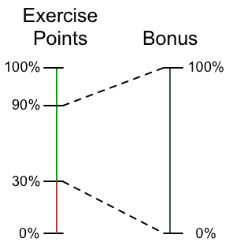

+~slide
+~header
Software Engineering 
===
Design &  Construction
---

~+

---

**Winter Semester 2013/2014**
                        
**Department of Computer Science**  
**Technische Universität Darmstadt**

Dr. Michael Eichberg

~+

##Content
The goal of this lecture is to teach you fundamental software design principles that will foster your understanding of the intricacy when designing and developing software. It will help you to become a better software engineer. 

+~[Main Topics]slide
Main Topics
===

* Understanding Software Design and Development
* Software Design Principles
* Software Design Patterns
* Advanced Programming Language Features

~+

+~[Goals of the Lecture]slide
Goals of the Lecture (Learning Outcomes)
===

* To be able to produce “good” designs; i.e. to produce code that is, e.g., reusable, maintainable, comprehensible, ...
* To learn to judge the design of existing pieces of software
* To get familiar with advanced programming language features and to learn when to apply them
* To get a deeper and thorough understanding of design patterns
* To understand the relation between software design and programming languages/  
  To understand why improvements of programming languages are important/  
  To understand programming language concepts w.r.t. supporting high-level design

~+

After successfully completing this lecture you should be able to develop software that is well designed and which uses (advanced) programming language features to support the design.

#Organization

##Exam
+~[Organization]slide
Organization 
===
Exam
---

* We will have a **written exam** on **February 18th, 2014**.  
  The exam will start at **2:00pm** and will last 90 minutes.  
  The exam will be **in S206/030**.
* It will be an open-book exam.

~+

The exam will take 90 minutes and will be an open book exam; i.e., you are allowed to use any written material, but no electronic devices.

To get an idea how an exam could look like take a look at this [Old Exam](OldExam.pdf). Please note, that we are currently moving the whole lecture towards Scala and, therefore, this year's exam may have a stronger Scala focus. Furthermore, material that was included in the old exam, but which is not taught as part of this year's lecture will not be part of the exam. 

##Exercise and Bonus

+~slide
Organization 
===
Exercise
---
* We will have between 10 and 12 Exercises.
* By doing the exercises you can get a bonus for the exam.  
  

~+

We will have one exercise per week (starting with the second week) and doing the exercises is highly recommended. The exercises are considered to be an essential part of this lecture and will help you to foster your understanding of software design (principles).
The programming languages that are used for the exercises and for the lecture is Java 7 and Scala 2.10 (<http://www.scala-lang.org>).  

The content of the exercise is relevant for the final exam. 

The exercises are organized by **Sven Amann** and **Dr. Ingo Maier** and are supported by tutors.

By successfully completing the exercise, you can get a maximum bonus that is equal to one full grade. You need to get at least 30% of all possible exercise points to get some bonus. I.e., just completing one exercise is not sufficient. To get the full bonus, you just need to get at least 90% of all possible exercise points. The maximum bonus is equivalent to one full grade.

_The bonus cannot be used to pass the exam._

This bonus system complies with the regulations defined in the "4. Novelle der APB §25(2) vom 2.10.2012".

