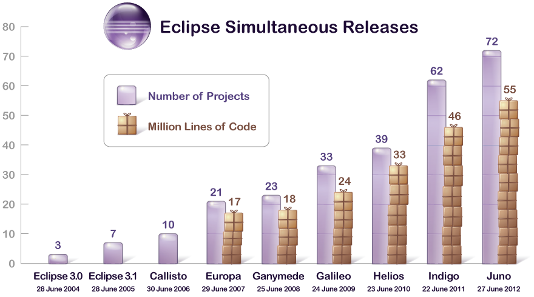

#The Birth of Software Engineering

+~[The Birth of Software Engineering]slide
 
Software Engineering Timeline 
===

**Impressions from the NATO Software Engineering Conferences**


<svg id="Software-Engineering-Timeline" class="timeline">
</svg>  
<script type="text/javascript">
	Timeline.draw("Software-Engineering-Timeline",[
		{d:"1960th",t:"Software Crisis"},
		{d:"Oct. 1968",t:"1. Conference\n in Garmisch, Germany"},
		{d:"1969",t:"2. Conference in Rom, Italy"},
	]);	
</script>

~+

In the 1960th, the general problem was that projects were running over-budget or never delivered at all. Software was inefficient and often did not meet requirements. This situation was referred to as the **Software Crisis**. Furthermore, Before the 1960th software was not considered as a good of its own; it was developed and delivered along with the hardware that was sold to customers.

The term “Software Engineering” was coined at the end of the sixties and is often attributed to F.L. Bauer.

+~slide

>[The major cause of the software crisis is] that the machines have become several orders of magnitude more powerful! To put it quite bluntly: as long as there were no machines, programming was no problem at all; when we had a few weak computers, programming became a mild problem, and now we have gigantic computers, programming has become an equally gigantic problem.
>
>E. Dijkstra, 1972 [#Dijkstra:1972:HP:355604.361591]

~+

Since computers have become more powerful, more complex software is possible and more complex programs (more requirements) are requested to be developed. But, back in the 1960th, experience in creating big software systems was not available.

Common questions were:

* How to keep code maintainable?
* How to satisfy extensive and changing requirements?
* How to work on code as a team?  
_In the 60th client-server based version control systems or distributed version control systems just did not exist._

In response to these problems, a conference was organized with the goal to figure out how to adopt (successful) hardware engineering approaches for software development.

+~[Definition of Software Engineering]slide
Today, Carnegie Mellon University's Software Engineering Institute defines “Software Engineering” relative to “Engineering” as: 

> Engineering is the systematic application of scientific knowledge in creating and building cost-effective solutions to practical problems in the service of mankind. 
>
>Software engineering is that form of engineering that **applies the principles of computer science and mathematics** to achieving cost-effective solutions to software problems. 

~+

Since the 60th, we have made significant progress! 

We now have:

* Sophisticated methods and tools for requirements engineering, enabling distributed teams to work together efficiently
* Best practices, high-level architecture styles 
* Formal modeling techniques and visual design notations
* Potent high-level programming languages
* Potent quality assurance methods, techniques and tools
* Advanced process and project management methodologies
* Advanced development environments

+~slide
But, as Dijkstra already identified ....
>[...] I would like to insert a warning to those who identify the difficulty of the programming task with the struggle against the inadequacies of our current tools, because they might conclude that, once our tools will be much more adequate, programming will no longer be a problem. 
>
>**Programming will remain very difficult, because once we have freed ourselves from the circumstantial cumbersomeness, we will find our selves free to tackle the problems that are now well beyond our programming capacity.**
>E. Dijkstra, 1972 [#Dijkstra:1972:HP:355604.361591]

~+

Dijkstra's statement is today as true as it was in 1972! Even though, we are solving problems today that were not possible to solve in 1972.

Some of today's challenges are:

* How to develop software efficiently that makes good use of multi-core systems?
* How to process huge amounts of data?  
(Many companies already collect huge amounts of information but don't know how to effectively use and analyze it.)
* How to develop complex software systems that are secure? 
Some standards, such as PCI DSSS (cf. <http://www.pcicomplianceguide.org/aboutpcicompliance.php>) for handling and processing credit card data, define strict requirements on the software.

But, the advances in technology drive more complex requirements and business agility! Hence, the Software Crisis is still with us though at a much higher level. The requirements are getting more and more complex and are changing rapidly. To solve our current and future problems, studying and advancing foundations, methods, notations, tools for software development is extremely important.

It is necessary, to fundamentally question our assumptions about Software Engineering.


##Software as an Engineering Product?

+~[Product Engineering]slide

Software as an Engineering Product?
===

Product Engineering
---

* **1st Phase: Requirements Analysis**  
The problem to solve is analyzed and documented.

* **2nd Phase: Design and Validation**  
_Engineers_ translate the requirements into a detailed description of the solution using models and rigorously validate these models.	

* **3rd Phase: Building the Product**  
_Workers_ build the design using appropriate tools and materials.

~+

First, we have to understand that we can clearly distinguish between designing and building a product. 

* When a design effort is complete, the design documentation is turned over to the manufacturing team.  
The manufacturing team can then proceed to build (lots of) the product, without further intervention of designers.
* _Designing and building a product is done by different teams with different skills._
* In general, manufacturing is a labor intensive, expensive process.
* Overall, considerable time is spent in validating and refining designs before they are build.  
_Simulations based on theoretical models are used to ensure the quality of the design._

To better understand the intricacies of developing software, let's compare **Software Design** and **Hardware Design**.

+~[Hardware vs. Software Design]slide 

Software as an Engineering Product?
===
Hardware vs. Software Design
---

<table>
	<tr><th>Hardware Design</th><th>Software Design</th></tr>
	<tr><td>Product is a physical object</td><td>Product is the running software</td></tr>
	<tr><td>
		Building the product is: 
		<ul>
			<li>done by humans and robots</li>
			<li>expensive </li>
			<li>slow</li>
			<li>hard to redo</li>			
		</ul>
		</td>
		<td>Building the product is: 
	 	<ul>
			<li>done by compilers and linkers </li>
			<li>extremely cheap</li>
			<li>very fast</li>
			<li>easy to redo</li>						
		</td>
	</tr>
	<tr><td>Precise quality measures</td><td>No precise quality measures</td></tr>
</table>

~+

Hence, programming is not about building the software; programming is about designing the software and the code is the ultimate design document! Furthermore, simulating software is unnecessary or even impossible.

+~slide
Development of Eclipse
===



~+

Software designs tend to be incredibly large and complex and typical commercial software products have designs that consist of hundreds of thousands of lines.  Many run into the millions.

More complex designs are targeted every day.

Furthermore, software designs are constantly evolving. 

+~[Code as Design]slide
[→Code as Design: Three Essays by Jack W. Reeves](http://www.developerdotstar.com/mag/articles/reeves_design_main.html)
>The following essays offer three perspectives on a single theme, namely that **programming is fundamentally a design activity** and that the only final and true representation of "the design" is the source code itself. [...]

**[→What Is Software Design?](http://www.developerdotstar.com/mag/articles/reeves_design.html)**  
This essay was first published in the Fall 1992 issue of the C++ Journal.  [...] in recent years the essay has entered the flow of ideas and discussion in the software development community at large [...].

**[→What Is Software Design: 13 Years Later](http://www.developerdotstar.com/mag/articles/reeves_13yearslater.html)**  
In this essay the author responds to the most common arguments he has encountered. He also considers certain ideas from the original essay in light of more current trends and techniques.

**[→Letter to the Editor](http://www.developerdotstar.com/mag/articles/reeves_originalletter.html)**  
This is the original letter written by Jack W. Reeves to C++ Journal. It stands as a rewarding essay in its own right, giving first written expression to the themes and ideas found in "What is Software Design?" In some aspects it is even more comprehensive and spirited than the essay it inspired.

~+

Out of all the documentations that software projects normally generate, is there anything that can truly be considered an engineering document?  

>... the only ... documentation that seems to satisfy the criteria of an engineering design is the source code listings.  
>**Jack Reeves, To Code is to Design, C++ Report 1992**

However, Jack Reeves was not the first who realized that it may not be helpful to distinguish between design and production when developing software products.

+~slide

NATO Software Engineering Conference 1968 (<http://homepages.cs.ncl.ac.uk/brian.randell/NATO/>)

>[...] there is no essential difference between design and production, since the production will include decisions which will influence the performance of the software system, and thus properly belong in the design phase.
>
>**Peter Naur**

---

>[...] Honestly, I cannot see how these activities allow a rigid separation if we are going to do a decent job.
>
>**Edsger Dijkstra**

+~footer
Back in the 1960s, writing the source code was considered to be the "production step".

~+

~+

In short, the possibility to find solutions to the software industry's problems by trying to blindly emulate hardware developers is extremely limited.

+~slide

Questionable Ideas 
=== 
Grounded on Misleading Analogies
---

<svg xmlns="http://www.w3.org/2000/svg" version="1.1" width="100%" height="100%" style="font-size: 180%; font-family: script;">
    <text x="10" y="45" fill="#222266">Waterfall Model</text>
    <text x="300" y="145" fill="#000088">Software Industrialization</text>
    <text x="250" y="280" fill="#660022">Programmer productivity as<tspan x="250" y="325">"Lines of Code"</tspan></text>
    <text x="80" y="450" fill="#006633">Outsourcing: Design here, Production elsewhere</text>
</svg>

~+

**Wind of Change?**

>The creation of genuinely new software has far more in common with developing a new theory of physics than it does with producing cars or watches on an assembly line.
>
>T. Bollinger, “The Interplay of Art and Science in Software”, IEEE Software, 1997

---

>Software [...] is treated as a product, and this is the problem. 
>
>P.G. Armour, The Business of Software, CACM, 2000

---

>“Software Engineering: An idea whose time has come and gone!” 
>
>Tom DeMarco, IEEE Software, 2009


+~aside

Craft vs. Engineering
===

Experience can lead us in the right direction. This is craft. Experience will only take us so far into uncharted territory. Then we must take what we started with and make it better through a controlled process of refinement. This is engineering.

~+

##Complexity and Change are Invariants

+~[Complexity and Change are Invariants]slide 
Consequences of the Cheap Software Build
===

<svg xmlns="http://www.w3.org/2000/svg" version="1.1" width="100%" height="80%" style="font-size: 220%; font-family: script;">
    <text x="40" y="300" fill="#660022">Complexity and Change are Invariants!</text>
</svg>

~+


+~slide
Complexity and Change are Invariants
===

^Designing for organizing complexity and facilitating change 
is the key to support maintainability. 

~+ 

<!-- TODO Add add reference for the following claim: -->
 
A software product spends around 80% of its lifetime in maintenance.

While there are certainly examples of hardware designs that are arguably as complex as software designs, note two facts about modern hardware:

 1. Complex hardware engineering efforts are not always as free of bugs as software critics would like us to believe. Major microprocessors have been shipped with errors in their logic, bridges collapsed, dams broken, airliners fallen out of the sky, and thousands of automobiles and other consumer products have been recalled - all within recent memory and all the result of design errors. 

 2. Complex hardware designs have correspondingly complex and expensive build phases. As a result, the ability to manufacture such systems limits the number of companies that produce truly complex hardware designs. 

No such limitations exist for software. There are hundreds of software organizations, and thousands of very complex software systems in existence. Both the number and the complexity are growing daily. 

This means that the software industry is not likely to find solutions to its problems by trying to emulate hardware developers. If anything, as CAD and CAM systems have helped hardware designers to create more and more complex designs, hardware engineering is becoming more and more like software development. 

+~[On Requirements]slide
Incomplete and Changing Requirements
===
What is the right question to ask?
---

* How do we get complete requirements?
* Can we get complete requirements at all?

~+

General observation: _People are not used to completely specify things._ (Hence, the classical waterfall method is not “real” to customers.)

**The report effect:**

1. The customers are not entirely aware of what the computing systems will do for them; they see new requirements as soon as old ones are met.
2. They see one kind of produced report and ask whether the system can also do this and that. 

If we would use the waterfall process to develop the software, the customers would not get intermediate products that would make them wary about particular aspects of the system early enough.

+~story
**Building a House**

If you are building a house, you soon notice the effects of your decisions on the phases of the construction.

As each new event occurs, it becomes obvious to the builder that it is harder and harder to change his mind or correct mistakes.

Users and customers of software have no intermediate events that “CAST THINGS IN CONCRETE”. They tend to change their mind often and in most awkward times.

Consider the following scenario: Suppose we are building a square house that is 50 feet on each side.

As the result of a mistake when laying out the foundation, one corner is one feet longer than the others.

The mistake has a lot of implications. Yet, it is clear that it is not easy to correct and the customer can see that.

~+

+~slide
Incomplete and Changing Requirements
===

**Scenario:**
You are developing a software for personnel management that advices employees about their benefits, including their retirement plan. 

**Initial Requirement:**
The first opportunity to withdraw money without penalty is when an employee turns 60.

**Resulting Code:**

```scala
if(employee.age >= 60) {...}
```

+~footer
Does this reflect the reality?

~+

~+

+~slide
Incomplete and Changing Requirements
===

**Scenario:**
You are developing a software for personnel management that advices employees about their benefits, including their retirement plan. 

**Current Solution:**
The first opportunity to withdraw money without penalty is when an employee turns 60.

**Code**:
```scala
if(employee.age >= 60) {...}
```

**Changed Requirement:**
After testing it is discovered that withdrawing money is possible when the employee is 59.5.

**Customer's Assessment:**
This change will be easy to do...

But, the following change may not be possible:

```scala
if(employee.age >= 59.5) {...}
```

~+

But,...

* you may have been using integer arithmetic and now need to switch to rational number arithmetic.
* if you decide to keep integer arithmetic, you will have to convert all ages into months.

Hence, what looks simple at first sight may turn out to be a rather complex change. More important, the customer may not be aware of the consequence. Changing the fundaments and changing the entry age may end up being of the same scale and causing the same headache. However, the customer can see the former and not the latter.

To the customer, the changes to the latter are more like making changes on the blueprints rather than on the actual concrete.

As a result, software users tend to change requirements on the fly.

+~aside
>The task of the software development team is to engineer the illusion of simplicity.
>
>in G. Booch: Object-oriented Analysis with Applications, Addison-Wesley, 1993

~+


##Everything is Part of the Design

+~slide
"Everything" is Part of the Design
===

1. High-level architectural design
2. Class-level design
3. Low(implementation)-level detailed design
4. **The code**

~+

We need good software design at all levels. The better the early design, the easier it is to do the detailed design and the better will be its quality. Except from the lowest-level detailed design (the code), all higher-level designs are never a complete software design. All higher-level designs are just a structural framework for the detailed design.

The final design is the code. Hence, the software design is not complete until it is coded and tested!
Designers should use anything that helps; e.g., user stories, Z specifications or UML diagrams.
These are all useful notations for facilitating the design process and can serve as auxiliary documentation.
Yet, they are not a software design! The real design will be created using some programming language.

Designs should be coded as they are derived and be refined when necessary.
The process of rendering the design in code reveals mistakes and the need for additional design effort.
The earlier it occurs, the better the design will be.
The detailed design will ultimately influence (or should be allowed to
influence) the high-level design.
Refining all the aspects of a design is a process that should be happening throughout the design cycle.


+~slide

Testing and Debugging is Designing
===

^Testing is not just concerned with getting the current design correct, it is part of refining the design.

~+

If we consider source code as design, we see that software engineers (just like other engineers) also do a considerable amount of validating and refining their designs.
Most software designers do not call it engineering...rather testing and debugging, i.e., do not consider testing and debugging as real "engineering“ due to the refusal of the software industry to accept code as the actual design.

+~slide

>In [...] embedded systems [...] the software requirements change throughout the software development process, even during system testing.  This is largely due to unanticipated behavior, dynamic changes in the operating environment, and complex software/hardware and software/software interactions in the systems being deveoped. **Controlling requirement changes (and, hence, the scope and cost of development) is difficult since the changes are often prompted by an improved understanding of the software’s necessary interfaces with the physical components** [...] in which it is embedded.  
>
>Analyzing software requirements errors in safety-critical, embedded systems; R. R. Lutz; 1993 (cf. [#lutz:1993])

~+

Hence, a core property of every complex system is that it is basically impossible to identify all requirements before the implementation starts. Implementing the system is essential to gain an ever more complete understanding of the systems requirements.

##Auxiliary Documentation

Obviously the actual design documents (entailed in code) are the most important, but often not the only one that must be produced. Auxiliary documentation (directly associated with the design process) is as important for a software project as it is for a hardware project.

Auxiliary documentation should capture information from the problem space. 

Inventing software concepts to model concepts in a problem space requires an understanding of the essential problem space concepts. Usually this process involves information that does not directly end up being modeled in the SW space.

Auxiliary documentation should document those aspects of the design that are difficult to
extract directly from the design itself. Many of these aspects are best depicted graphically. This makes
them hard to include as comments in the source code. (However, this is not an argument for a graphical software design notation instead of a programming language.)

This is not different from the need for textual descriptions to accompany the design documents of other engineering disciplines.

But, keeping auxiliary documentation up to date manually is difficult.

+~[Auxiliary Documentation]slide

"Up-to-Date" Auxiliary Documentation
=======

```java
package org.eclipse.emf.teneo.hibernate.resource;
...
  /**
   * Rolls back the transaction if any and clears different lists to
   * start with an empty resource again.
   * Note that the super.doUnload is not called because that clears 
   * the list resulting in all kinds of undesirable inverse removes.
   */
  @Override
  protected void doUnload() {
     super.doUnload();
  }
...
```

~+

Non up-to-date auxiliary documentation is an argument for more expressive programming languages. I.e., programming languages that enable the developer to directly express the intent.

It is an argument for keeping auxiliary documentation to a minimum and as informal as possible until as late in the project as possible. However, keep in mind that some software development processes – primarily for safety critical systems – do require extensive documentation as part of the development process.

Generally, auxiliary documentation should be written after the code is more accurate. Keep in mind that only the design reflected in code has been refined during the build/test cycle! Ideally, software tools that post-process a source code design and generate auxiliary documentation should be available.

The probability of the initial design being unchanged during this cycle is inverse to the number of modules and programmers on a project.

+~[To Code Is To Design]slide

^**TO CODE IS TO DESIGN.**

_Which doesn't mean that you should start coding right away!_

~+

+~[Properties of a good development process]slide
Properties of a good development process
===
* … recognizes **programming as a design activity** and does not hesitate to code when coding makes sense.
* … recognizes **testing and debugging as design activities** - the software equivalent of design validation and refinement of other engineering disciplines - and does not shorten the steps. 
* … recognizes that there are other design activities:
	* top level design,
	* module design,
	* class design, 
	* etc. 
* … recognizes that **all design activities interact** and allows the design to change as various steps reveal the need. 

~+

##Programming Languages are Design Languages

+~slide

^If _to code is to design_, then  
**Programming Languages**  
are  
**Design Languages**!

~+


###Coding High-Level and Detailed Designs

Programming languages outperform other design notations in their capability to express both high-level and detailed design. High-level design notations have to be translated into the target programming language before detailed design can begin. Translation is time consuming and error prone since a design notation may not map cleanly into the programming language of choice. Pogrammers often go back to the requirements and redo the high-level design, coding it as they go.

+~slide

What we need is:
===

^Unified design notation suitable for all levels of design, i.e., programming languages that are suitable for capturing high-level design.

~+

However, current programming languages have weaknesses as tools for expressing certain aspects of a software design. The information is in the code but it is very difficult to get it out in human readable form

+~slide
Making Code Look Like Design
===

<svg xmlns="http://www.w3.org/2000/svg" version="1.1" width="100%" height="100%" style="font-size: 170%; font-family: Arial;">
	<defs>
	   <marker id='head' orient='auto' markerWidth='10' markerHeight='10' refX='0.1' refY='2'>
	     <path d='M0,0 V4 L2,2 Z' fill='black' />
	   </marker>
	</defs> 
	<text x="120" y="50" fill="#000066">Functional Object-oriented Programming</text>
 	<line x1="300" y1="140" x2="475" y2="80" style="stroke:rgb(0,0,100);stroke-width:8"  marker-end="url(#head)"/>
	<line x1="700" y1="140" x2="525" y2="80" style="stroke:rgb(0,0,100);stroke-width:8"  marker-end="url(#head)"/>
	 
	<text x="50" y="170" fill="#000066">Object-oriented<tspan x="50" y="205">Programming</tspan></text>
	<line x1="490" y1="260" x2="350" y2="205" style="stroke:rgb(0,0,100);stroke-width:8"  marker-end="url(#head)"/>
    
	<text x="675" y="170" fill="#000066">Functional<tspan x="650" y="205">Programming</tspan></text>	
	<line x1="510" y1="260" x2="650" y2="205" style="stroke:rgb(0,0,100);stroke-width:8"  marker-end="url(#head)"/>
    
	<text x="290" y="290" fill="#000066">Modular Programming</text>	
	<line x1="500" y1="385" x2="500" y2="310" style="stroke:rgb(0,0,100);stroke-width:8"  marker-end="url(#head)"/>
    
	<text x="270" y="410" fill="#000066">Structured Programming</text>
	<line x1="500" y1="505" x2="500" y2="430" style="stroke:rgb(0,0,100);stroke-width:8"  marker-end="url(#head)"/>
    
	<text x="255" y="530" fill="#000066">Assembler-like Languages</text>
</svg>

~+

+~aside
The article **The Impact of Software Engineering Research on Modern Programming Languages** by B. G. Ryder, M. L. Soffa and M. Burnett, which appeared in ACM Transactions on Software Engineering and Methodology (2005), discusses the relation between Software Engineering and Programming Language Research, a set of interviews with Programming Language Developers (Niklaus Wirth, Bjarne Stroustrup, Tim Lindholm,...) is included, which are very worth reading.

~+

Advances in programming language technology are driven by the need to make programming languages capable of more directly capturing higher-level designs!


+~slide
Takeaway
===

Consequences of the cheap build for this course:

* Designing means structuring code in modular way so as to support managing complexity and continuous change.
* We will adopt an agile design process to accommodate change in the design process.
* We will adopt test-driven development, as we consider testing to be part of design.
* Languages as design notations will be in focus but also design principles and styles as well as tools for expressing modular structures outside the languages.

~+

+~aside
In this lecture we are primarily concerned with the design of the source code as such. We are not considering other factors, such as, how to distribute responsibility between team members, the details of the chosen software development process or the kind of software (open-source vs. closed-source) that is developed (cf. [#Kamp:2012aa] for further details).

~+