#Programming Languages and Design Principles

In the following, we will discuss the development of programming languages as a means to improve their ability to capture the software design at ever increasing abstraction levels. Or, from another point of view, we discuss why advances in programming language technology are driven by the need to make programming languages capable of capturing higher-level designs.


+~[Programming Languages and Design Principles]slide
Programming Languages and Design Principles
===

^Making Code Look Like Design

~+

##“Designing” with Pseudo-Assembler

+~[“Designing” with Pseudo-Assembler]slide

“Designing” with Pseudo-Assembler
===

What does the following program do?

```C
i = 1
TEST:	if i < 4
	then goto BODY
	else goto END
BODY:	print i
	i = i + 1
	goto TEST
END:
```

~+

+~slide

“Designing” with Pseudo-Assembler
===

What does the following program do?

```C
i = 1
LOOP:	print i
	i = i + 1
	if i < 4 goto LOOP
END:	
```

~+


Though both programs just print out "123" the second one is easier to read and comprehend. It has a better style:

* Clear structure
* No crossing gotos
* Better names
* Code structure closer to what we want to express.  
"Print out i, i smaller than 4“

Hence, the second variant, though functionally identical, is easier to understand, debug, change.


+~[Style can only be recommended]slide

_But:_ 

^**Style can only be recommended, not enforced!**

~+


##Designing with Structured Programming Languages

+~[Designing with Structured Programming Languages]slide

Designing with Structured Programming Languages
===

```C
i = 1
while ( i < 4 ) {
	print(i)
	i = i + 1
}
```

**Style gets enforced!**  

~+

In the 1960th programming language support for better structuring of code emerged. `Goto`s were replaced by loops (`while`) and conditionals (`if`/`else`). Furthermore, procedures were introduced to support user-defined abstractions.

New words, new grammars, new abstractions enable developers to directly express looping/conditional computations, instead of emulating them by jumps. Using a – by then – modern structured programming language, it was no longer possible  to write crossing `goto`s!

+~slide
Better languages, More challenging tasks…
=== 

A simple image browser with structured programming:
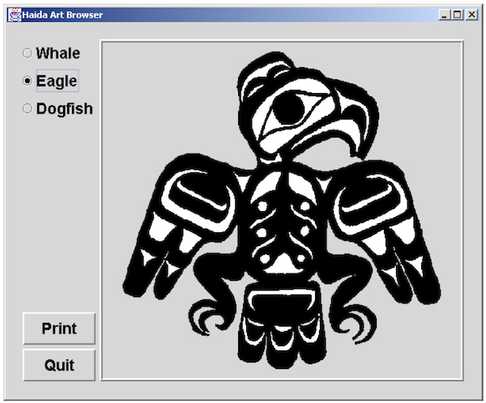

~+


+~slide
**Code for Image Browser Structured into Procedures**

<div style="font-size:0.7em">
  <div style="position:absolute;top:100px;left:16px;width:320px;">
  <pre><code class="C">main () {
draw_label(“Art Browser”)
   m = radio_menu(
      {“Whale”, “Eagle”, 
       “Dogfish”})
   q = button_menu({“Quit”})
   while ( !check_buttons(q) ) {
      n = check_buttons(m)
      draw_image(n)
   }
}
  </code></pre></div>

  <div style="position:absolute;top:280px;left:16px;width:320px">
  <pre><code class="C">set_x (x) {
   current_x = x
}
  </code></pre></div>

  <div style="position:absolute;top:350px;left:16px;width:320px;">
  <pre><code class="C">draw_circle (x, y, r) {
   %%primitive_oval(x, y, 1, r)
}
  </code></pre></div>

  <div style="position:absolute;top:420px;left:16px;width:320px;">
  <pre><code class="C">set_y (y) {
   current_y = y
}
  </code></pre></div>


  <div style="position:absolute;top:100px;left:352px;width:320px;">
  <pre><code class="C">radio_menu(labels) {
   i = 0
   while (i < labels.size) {
      radio_button(i)
      draw_label(labels[i])
      set_y(get_y()
         + RADIO_BUTTON_H)
      i++
   }
}
  </code></pre></div>

  <div style="position:absolute;top:280px;left:352px;width:320px;">
  <pre><code class="C">radio_button (n) {
   draw_circle(get_x(),
      get_y(), 3)
}
  </code></pre></div>

  <div style="position:absolute;top:370px;left:352px;width:320px;">
  <pre><code class="C">get_x () {
   return current_x
}
  </code></pre></div>

  <div style="position:absolute;top:440px;left:352px;width:320px;">
  <pre><code class="C">get_y () {
   return current_y
}
  </code></pre></div>


  <div style="position:absolute;top:100px;left:686px;width:320px;">
  <pre><code class="C">draw_image (img) {
   w = img.width
   h = img.height
   do (r = 0; r < h; r++)
      do (c = 0; c < w; c++)
         WINDOW[r][c] = img[r][c]
}
  </code></pre></div>

  <div style="position:absolute;top:230px;left:686px;width:320px;">
  <pre><code class="C">button_menu(labels) {
   i = 0
   while (i < labels.size) {
      draw_label(labels[i])
      set_y(get_y()
         + BUTTON_H)
      i++
   }
}
  </code></pre></div>

  <div style="position:absolute;top:400px;left:686px;width:320px;">
  <pre><code class="C">draw_label (string) {
   w = calculate_width(string)
   print(string, WINDOW_PORT)
   set_x(get_x() + w)
}
  </code></pre></div>

</div>

+~footer
**Try to identify which method calls which method!**

~+

~+

In this case, the code is structured, but the procedures are not! It is hard, if not nearly impossible, to  maintain or even extend this code.

+~slide
**Structured Programming with Style**

<div style="font-size:0.65em">

	<div style="position:absolute;top:100px;left:352px;width:320px;">
		<pre><code class="C">main()
	</code></pre></div>
	
	<div style="position:absolute;top:150px;left:16px;width:320px;">
	<pre><code class="C">gui_radio_button(n)
	</code></pre></div>

	<div style="position:absolute;top:190px;left:16px;width:320px;">
	<pre><code class="C">gui_button_menu(labels)
	</code></pre></div>

	<div style="position:absolute;top:230px;left:16px;width:320px;">
	<pre><code class="C">gui_radio_menu(labels)
	</code></pre></div>


	<div style="position:absolute;top:150px;left:352px;width:320px;">
	<pre><code class="C">graphic_draw_image (img)
	</code></pre></div>

	<div style="position:absolute;top:190px;left:352px;width:320px;">
	<pre><code class="C">graphic_draw_circle (x, y, r)
	</code></pre></div>

	<div style="position:absolute;top:230px;left:352px;width:320px;">
	<pre><code class="C">graphic_draw_label (string)
	</code></pre></div>

	<div style="position:absolute;top:150px;left:686px;width:320px;">
	<pre><code class="C">state_set_y (y)
	</code></pre></div>

	<div style="position:absolute;top:190px;left:686px;width:320px;">
	<pre><code class="C">state_get_y ()
	</code></pre></div>

	<div style="position:absolute;top:230px;left:686px;width:320px;">
	<pre><code class="C">state_set_x (x)
	</code></pre></div>

	<div style="position:absolute;top:270px;left:686px;width:320px;">
	<pre><code class="C">state_get_x ()
	</code></pre></div>

</div>

~+

Group procedures by the functionality they implement and the state they access, e.g. by naming conventions …

Advantages:

* The code is closer to what we want to express.  
"main calls gui, gui calls graphic to draw, …“
* The code is easier to understand, debug and change.


##Designing with Modular Programming Languages

+~[Designing with Modular Programming Languages]slide

Designing with Modular Programming Languages
===

```C
module gui {
    exports:
        radio_menu(labels)
        button_menu(labels)
        check_buttons(menu)
}	
```

~+


Modular programming introduced modules, higher-level units/modules introduce higher-level abstractions! One can handle a whole module as if it was its interface.
Programming language mechanisms for supporting information hiding: interface hides module internals.

+~[Module-based Abstraction]slide
Module-based Abstraction
===

<svg xmlns="http://www.w3.org/2000/svg" version="1.1" width="100%" height="100%" style="font-size: 36px; font-family: Courier New;">
	<defs>
	   <marker id='head' orient='auto' markerWidth='10' markerHeight='10' refX='0.1' refY='2'>
	     <path d='M0,0 V4 L2,2 Z' fill='black' />
	   </marker>
	</defs> 
	
	<rect x="360" y="15" width="305" height="55" fill="rgb(255,255,180)" />
	<text x="370" y="50" fill="#000066">image_browser</text>
 	 
 	<rect x="40" y="135" width="475" height="160" fill="rgb(255,255,180)" />
	<text x="50" y="170" fill="#000066">gui:
		<tspan x="70" y="205">radio_menu(labels)</tspan>
		<tspan x="70" y="240">button_menu(labels)</tspan>
		<tspan x="70" y="275">check_buttons(menu)</tspan>
	</text>
 	
    	<rect x="640" y="135" width="195" height="55" fill="rgb(255,255,180)" />
	<text x="650" y="170" fill="#000066">graphics</text>	

 	<line x2="300" y2="130" x1="475" y1="70" style="stroke:rgb(0,0,100);stroke-width:8"  marker-end="url(#head)" />
	<line x1="510" y1="70" x2="630" y2="140" style="stroke:rgb(0,0,100);stroke-width:8"  marker-end="url(#head)" />
	<line x1="515" y1="260" x2="630" y2="185" style="stroke:rgb(0,0,100);stroke-width:8"  marker-end="url(#head)"/>
</svg>

~+

Abstraction enables us to:

* look at the overall structure of the system (architectural thinking).
* zoom in on individual units as needed
* with more or less details

Hence, abstraction is the key to managing complexity.

+~[Abstraction]slide

^Abstraction mechanisms enable us to code and design simultaneously!

**"Write what you mean."**

>"The significant problems we face cannot be solved at the same level of thinking we were at when we created them."
>
>Einstein

~+


* Makes the code easier to understand, debug and change.
* Allows structured organization of code.
* Ability to ignore details.
Makes the code closer to what we want to express. 

+~slide

Let’s “develop” application families with sophisticated GUIs with uniform look and feel with modular programming…

  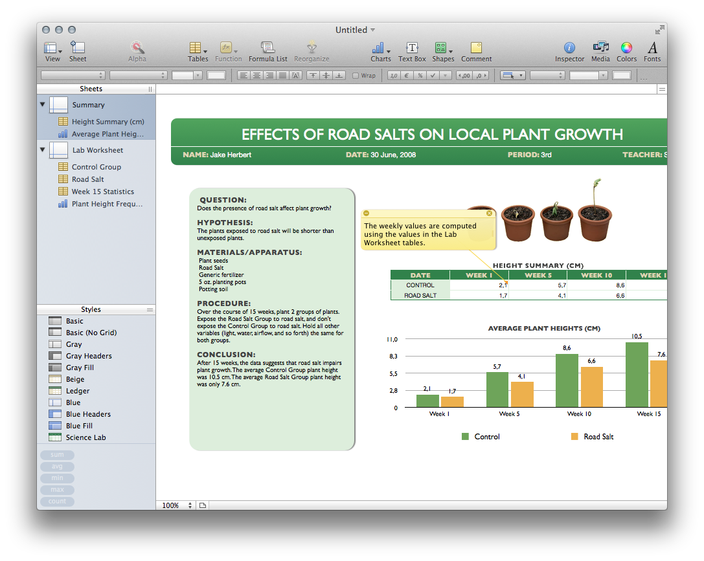
  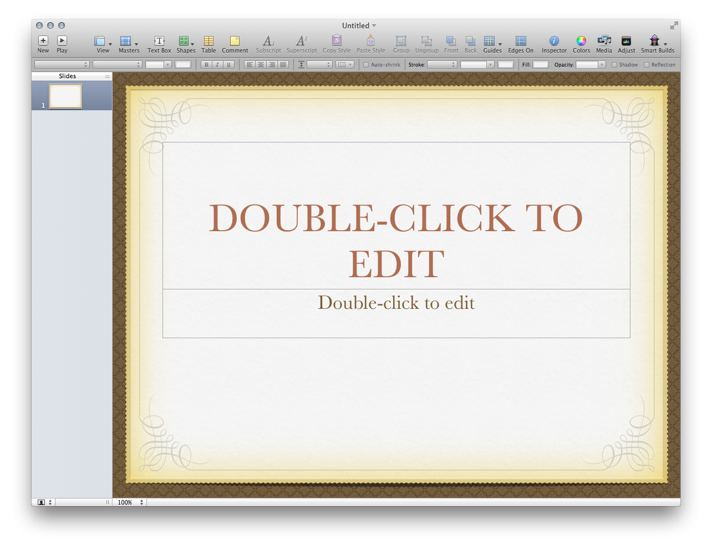
  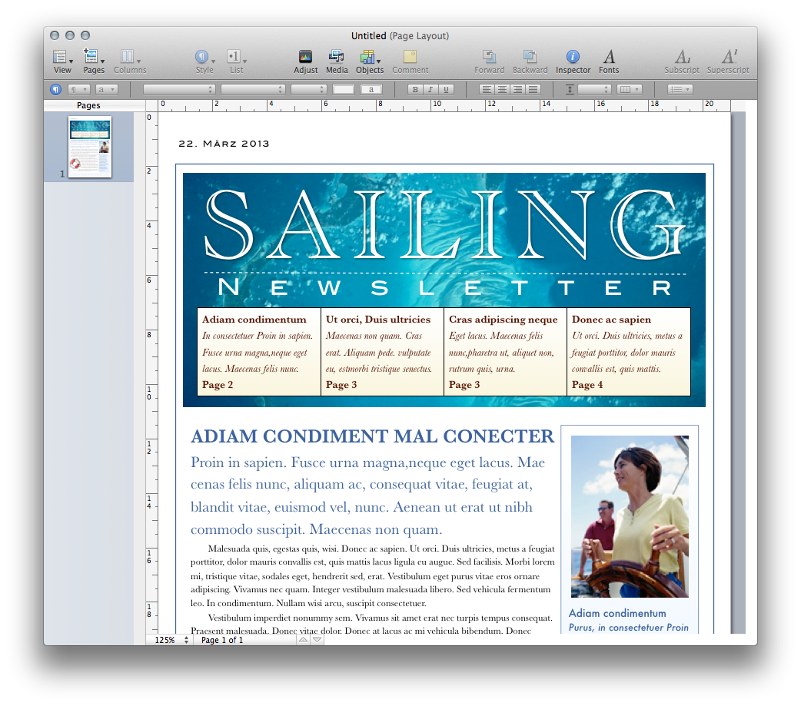

<div style="position:absolute;top:300px;width:524px;left:225px;background-color:rgba(255,255,255,.8);padding:25px;font-size:1.25em">Great variability:<br>   
checkbox button, toolbar button, toggle button, radio button … 
</div>

~+


Modeling variability with modular programming languages appeared complex…


##Designing with Object-Oriented Programming Languages


+~[Designing with Object-Oriented Programming Languages]slide
Designing with Object-Oriented Programming Languages
===

Object-oriented programming languages introduce new abstraction mechanisms:
* classes, 
* inheritance, 
* subtype polymorphism.


^(Still) Dominating Programming Paradigm

~+

+~slide
**The roots of object-oriented programming languages are in the sixties.**

Dahl and Nygaard, Simula 64, 68  
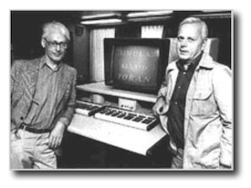  

Allan Kay, Smalltalk 70 - 80  
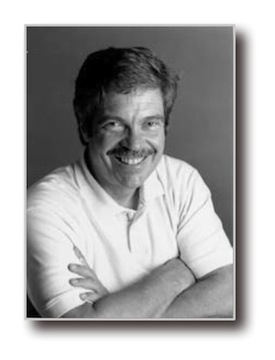  

~+

Object-oriented languages are popular because they make it easier to design software and program at the same time.

They allow us to more directly express high level information about design components abstracting over differences of their variants.

Make it easier to produce the design, and easier to refine it later.

With stronger type checking, they also help the process of detecting design errors. 

Result in a more robust design, in essence a better engineered design.

+~slide
> […] improvements in programming techniques and programming languages in particular are overwhelmingly more important than anything else in the software business […] 
> […] programmers are interested in design […] when more expressive programming languages become available, software developers will adopt them. 
> 
> Jack Reeves,  To Code is to Design, C++ Report 1992

~+

##Designing with Functional, Object-Oriented Programming Languages

+~[Designing with Functional, Object-Oriented Programming Languages]slide
Designing with Functional, Object-Oriented Programming Languages
===
By fusing object-oriented and functional programming we are provided with further means to raise our abstraction level. This enables us to better express our intention.

**Example**  
Creating an abstraction to express that we want to repeat something n times.

```scala
def repeat[T: scala.reflect.ClassTag](times: Int)(f: ⇒ T): Array[T] = {
  val array = new Array[T](times)
  var i = 0
  while (i < times) { array(i) = f; i += 1 }
  array
}
```

**Usage**
Now, we can express that we want to read in two values from the command line.

```scala
val values = repeat(2) { System.in.read() }
```

~+

+~aside

The complete code: [Repeat.scala](Code/src/pl/scala/Repeat.scala)

~+

##Programming Languages are not a Panacea

+~[Programming Languages are not a Panacea]slide
Programming Languages are not a Panacea
===

  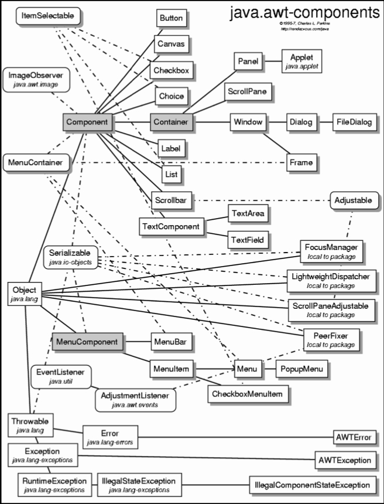

~+

* Accessibility of object-oriented programming drives more complex designs!
* Programming languages are powerful tools, but cannot and will never guarantee good designs.
* Programming always needs to be done properly to result in good code.
* Human _creativity_ remains the main factor.

+~[The Imperative of Good Style]slide
**We need good style to cope with complexity!**

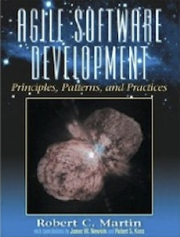
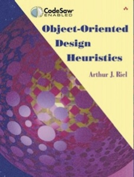
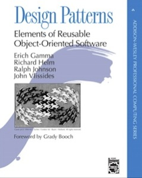
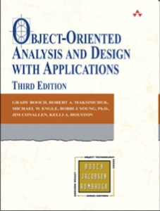
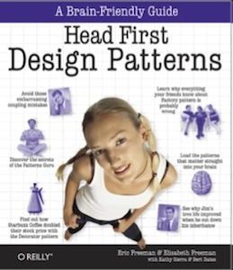
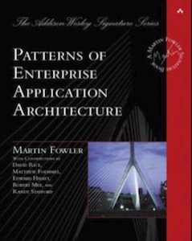
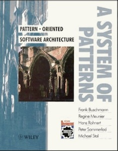
...

~+

Help is provided through established practices and techniques, design patterns and principles.

**Good style can only be recommended, not enforced!**

Eventually style rules will have to be turned into language features to be really effective. 

+~[General Design Principles]slide
General Design Principles
===
 
The following principles apply at various abstraction levels:
 
* Keep it short and simple
* Don't repeat yourself (also just called "DRY-Principle")
* High Cohesion
* Low Coupling
* No cyclic dependencies
* Make it testable
* Open-closed Design Principle
* Make it explicit/use Code
* Keep related things together
* Keep simple things simple
* Common-reuse/Common-closure/Reuse-release principles

~+

+~[Object-Oriented Design Principles]slide
Object-Oriented Design Principles
===

* Liskov Substitution Principle
* Responsibility Driven Design
* ...

Design Constraints
===

* **Conway's Law:**  
> A system's design is constrained by the organization's communication structure.

~+

