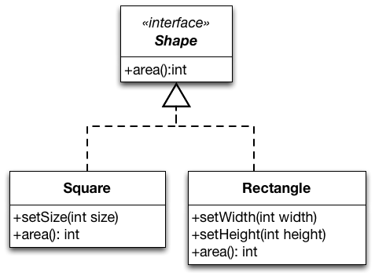
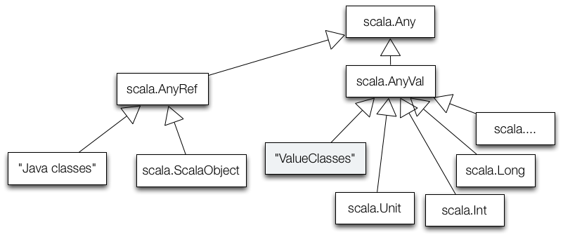
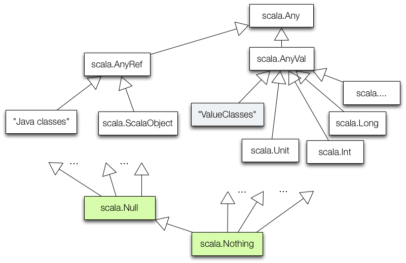

##Liskov Substitution Principle (LSP)

External resource: [The Liskov Substitution Principle: www.objectmentor.com/resources/articles/lsp.pdf](http://www.objectmentor.com/resources/articles/lsp.pdf)

###The Essence of the Liskov Substitution Principle

+~[Liskov Substitution Principle]slide

Liskov Substitution Principle
===

^Subtypes must be behaviorally substitutable for their base types.

Barbara Liskov, 1988  
(received the ACM Turing Award)

~+


+~[The Essence of the Liskov Substitution Principle]slide

> We identified class inheritance and subtype polymorphism as primary mechanisms for supporting the open-closed principle in object-oriented designs. 

---
The Liskov Substitution Principle:
* gives us a way to **characterize good inheritance hierarchies**,  
* increases our awareness about traps that will cause us to create hierarchies that do not conform to the open-closed principle.

~+

### Substitutability in object-oriented programming languages

+~[Substitutability in object-oriented programming languages]slide

Substitutability in object-oriented programms
===


```java
void clientMethod(SomeClass sc) {
  …
  sc.someMethod();
  …
}
```

~+

In object-oriented programs, subclasses are substitutable for superclasses in client code: In `clientMethod`, `sc` may be an instance of `SomeClass` or any of its subclasses.   
Hence, if `clientMethod` works with instances of `SomeClass`, it does so with instances of any subclass of `SomeClass`. They provide all methods of `SomeClass` and eventually more. 


+~[LSP by Example]slide

Liskov Substitution Principle by Example
===

Assume, we have implemented a class `Rectangle` in our system. 

```java
class Rectangle {
  public void setWidth(int width) {
    this.width = width;
  }
  public void setHeight(int height) {
    this.height = height;
  }
  public void area() {return height * width;}
  …
}
```

Let's now assume that we want to implement a class `Square` and want to maximize reuse.

~+

Since a square is a rectangle (mathematically speaking), we decided to implement `Square` as a subclass of `Rectangle`. 

We override `setWidth` and `setHeight` and can reuse the implementation of `area`.

+~slide
**Implementing `Square` as a subclass of `Rectangle`:**

```java
class Square extends Rectangle {
  public void setWidth(int width) {
  	super.setWidth(width);
  	super.setHeight(width);
  }
  public void setHeight(int height) {
  	super.setWidth(height);
  	super.setHeight(height);
  }
  …
}
```
  

With this overriding of `setHeight` and `setWidth` – to set both dimensions to the same value – instances of `Square` remain mathematically valid squares.

This model is self-consistent!

We can pass `Square` wherever `Rectangle` is expected.

+~footer
What do you think of this design?

~+

~+

A square does comply to the mathematical properties of a rectangle: A square has four edges and only right angles and is therefore a rectangle.

We can indeed pass `Square` wherever `Rectangle` is expected, as far as the Java type system is concerned. 

But, by doing so we may break assumptions that clients of `Rectangle` make about the “behavior” of a `Rectangle`.

+~slide
**A client that works with instances of `Rectangle`, but breaks when instances of `Square` are passed to it:**

```java
void clientMethod(Rectangle rec) {
  rec.setWidth(5);
  rec.setHeight(4);
  assert(rec.area() == 20);
}
```
  


~+

The `clientMethod` method makes an assumption that is true for `Rectangle`: setting the *width* respectively *height* has no effect on the other attribute. This assumption does not hold for `Square`.

The `Rectangle`/`Square` hierarchy violates the Liskov Substitution Principle (LSP)!
`Square` is behaviorally not a correct substitution for `Rectangle`.

A `Square` **does not comply with the behavior** of a rectangle: Changing the height/width of a square behaves differently from changing the height/width of a rectangle. Actually, it doesn't make sense to distinguish between the width and the height of a square.

+~[Software Is All About Behavior]slide

Software Is All About Behavior
===

^Programmers do not define entities that are something, but entities that behave somehow.

~+


+~[Validity is not Intrinsic]slide

Validity is not Intrinsic
===

>Inspecting the Square/Rectangle hierarchy in isolation did not show any problems. In fact it even seemed like a self-consistent design.  
>We had to inspect the clients to identify problems.

---

* A model viewed in isolation can not be meaningfully validated!  
The validity of a model depends on the clients that use it.

* Hence, the validity of a model must be judged against the possible uses of the model.  
We need to anticipate the assumptions that clients will make about our classes.

~+

To get a LSP compliant solution, we make `Rectangle` and `Square` siblings.
We introduce the interface `Shape` to bundle common methods.

+~[Rectangles and Square - LSP Compliant Solution]slide
**Rectangles and Square - LSP Compliant Solution**



~+

* Clients of `Shape` cannot make any assumptions about the behavior of setter methods.
* When clients want to change properties of the shapes, they have to work with the concrete classes.
* When clients work with the concrete classes, they can make true assumptions about the computation of the area.


+~[LSP and Subtyping Rules]slide

^So what does the Liskov Substitution Principle add to the common object-oriented  subtyping rules?

~+


+~slide


It’s not enough that instances of `SomeSubclass1` and `SomeSubclass2` provide all methods declared in `SomeClass`. 
**These methods should also behave like their heirs.**
 
A client method should not be able to distinguish the behavior of objects of `SomeSubclass1` and `SomeSubclass2` from that of objects of `SomeClass`.

^The Liskov Substitution Principle additionally requires behavioral  substitutability. 

~+


+~[Behavioral Subtyping]slide

Behavioral Subtyping
===

^`S` is a behavioral subtype of `T`, if objects of type `T` in a program `P` may be replaced by objects of type `S` without altering any of the properties of `P`.

~+


###Liskov Substitution Principle and Open-closed Principle

+~[The Relation between LSP and OCP]slide

The Relation between LSP and OCP
===

Consider a function `f` parameterized over type `T` 
* `S` is a derivate of `T`. 
* when passed to `f` in the guise of objects of type `T`, objects of type `S` cause `f` to misbehave.
* `S` violates the Liskov Substitution Principle. 

^`f` is fragile in the presence of `S`; i.e.,	`f` is not closed against derivations of `T` anymore.

~+

When a developer encounters such code in a real project, the developer of `f` will most probably put a test to ensure that instances of `S` are treated properly.


+~slide

^Can you think of straightforward examples of violations of the Liskov Substitution Principle?

~+

Straightforward examples of violations of the Liskov Substitution Principle.
* Derivates that override a method of the superclass by an empty method.
* Derivates that document that certain methods inherited from the superclass should not be called by clients.
* Derivates that throw additional (unchecked) exceptions.
* …


###More (Sophisticated) Examples of LSP Violations

In the following, we will mention some “obvious means” of introducing LSP violations (also in Java‘s platform classes) and will consider a more sophisticated example.

+~[LSP Violations in the JDK]slide

**The class Properties inherits from Hashtable**

From the JavaDoc:
>Because `Properties` inherits from `Hashtable`, the `put` and `putAll` methods can be applied to a `Properties` object. Their use is strongly discouraged as they allow the caller to insert entries whose keys or values are not `Strings`. The `setProperty`  method should be used instead. If the store or save method is called on a "compromised" `Properties` object that contains a non-String key or value, the call will fail.

~+


+~[LSP and Persistent Set]slide
Implementing a Persistent Set
===

**Situation:** 
We have implemented a library of container classes, including the interface `Set` (e.g. using Java 1.4). We want to extend the library with support for persistent sets.

A third-party container class capable of persistence, `PersistentSet`, is available. It accepts objects of type `PersistentObject`. 


~+


+~slide
Implementing a Persistent Set
===


+~footer
Do you see a problem?

~+

~+

We implement `PersistentSetAdapter`. It implements `Set`, refers to an object of the class `PersistentSet`, `ps`, and implements `Set` operations by forwarding to `ps`.

Only `PersistentObjects` can be added to `PersistentSet`. Yet, nothing in `Set` states this explicitly.

+~slide
Implementing a Persistent Set
===
A client that breaks our design
---

A client method:

```java
public void fill(Set s) {
  fill-the-set-with-arbitrary-objects
}
```

Somewhere else:

```java
Set s = new PersistentSetAdapter(); // Problem!

fill(s);
```

~+

Assessment:  

* `fill` has no idea whether the set passed to it is persistent and cannot know that the elements to fill must be of type `PersistentObject`.
* Adding an arbitrary object causes the cast in `PersistentSetAdapter` to fail.
* A method that worked fine before `PersistentAdpaterSet` was introduced (`fill`) breaks, when we introduce `PersistentAdpaterSet`.


+~slide
Implementing a Persistent Set
===
A Liskov Substitution Principle compliant solution
---


~+

Conclusion:
`PersistentSetAdapter` does not have a behavioral IS-A relationship to `Set`. Hence, we must separate their hierarchies and make them siblings.

###Mechanisms for Supporting the Liskov Substitution Principle


+~[Mechanisms that support LSP]slide

^What mechanisms can we use to support LSP?

Recall:
>A model viewed in isolation cannot be meaningfully validated with respect to LSP!
>Validity must be judged from the perspective of possible usages of the model. 

~+

Hence, we need to anticipate assumptions that clients make about our models – which is de facto impossible. Most of the times we will only be able to view our model in isolation; we do not know how it will be used and how it will be extended by means of inheritance.

Trying to anticipate them all might yield needles complexity.


####Introduction to Design-by-Contract


+~[Design by Contract]slide

^Design by Contract

Solution to the validation problem: A technique for **explicitly stating what may be assumed**. 

Two main aspects of design-by-contract:
* We can specify **contracts** using Pre-, Post-Conditions and Invariants.  
They must be respected by subclasses and clients can rely on them.
* **Contract enforcement** (behavioral subtyping).  
Tools to check the implementation of subclasses against contracts of superclasses. 

~+

The programmer of a class defines a contract that abstractly specifies the behavior on which clients can rely.

**Pre- and Post-conditions**
* Declared for every method of the class.
* Preconditions must be true for the method to execute.
* Post-conditions must be true after the execution of the method.

**Invariants**
* Properties that are always true for instances of the class.
* May be broken temporarily during a method execution, but otherwise hold.


+~slide
Contract for `Rectangle.setWidth(int)`
===
(one possible)
---

```java
public class Rectangle implements Shape {
  private int width;
  private int height;

  public void setWidth(int w) {
    this.width = w;
  }
}
```

+~[Example Contracts]aside
* **Precondition** for setWidth(int w):	
	* w > 0
* **Post-condition** for setWidth(int w):
	* width = w 
	* height unchanged
	
~+

~+


+~[Contract Enforcement]slide

Contract Enforcement
===

**Subclasses must conform to the contract of their base class!**

This is called behavioral subtyping.

It ensures that clients won’t break when instances of subclasses are used in the guise of instances of their heirs!

+~footer
What would the subtyping rules look like?

What does it mean for a subclass to conform to the contract of the base class? 

~+

~+


+~[Behavioral Subtyping: Rule for Preconditions]slide

Behavioral Subtyping
===
Rule for Preconditions
---

* Preconditions may be replaced by (_equal or) weaker ones_. 
* Preconditions of a class imply preconditions of its subclasses.

~+

Rationale:
* A derived class must not impose more obligations on clients. 
* Conditions that clients obey to before executing a method on an object of the base class should suffice to call the same method on instances of subclasses.


+~[Behavioral Subtyping: Rule for Postconditions]slide

Behavioral Subtyping
===
Rule for Postconditions
---

* Postconditions may be replaced by (_equal or) stronger ones_.
* Postconditions of a class are implied by those of its subclasses.

~+

Rationale:
* Properties assumed by clients after executing a method on an object of the base class still hold when the same method is executed on instances of subclasses.
* The guarantees that a method gives to clients can only become stronger.


+~["Standard" Subtyping]slide

"Standard" Subtyping
===

“Standard” subtyping relies on _contra-variance_ of the argument types and _covariance_ of the return type for enforcing “pre- and post-conditions on signatures”. 

	f:		T1  → T2
	f’:		T1’ → T2’ 
	
	f’ <: f	<=>	T1 <: T1’ and T2’ <: T2  (f' is a subtype of f)

+~footer
In Java, a method `f` that has the same name, the same return type and the same number of arguments as a method `f` defined in a superclass doesn't override the superclass's method if one or more argument types are contra-variant.

~+

~+


+~["Standard" Subtyping in Scala]slide

Scala's Type Hierarchy
===



~+

Value classes are supported since Scala 2.10.

+~["Standard" Subtyping in Scala]slide

Scala's Type Hierarchy
===



~+

When compared to languages such as Java, Scala also has a well-defined least Type, i.e., a type that is the subtype of all other types.


+~slide

"Standard" Subtyping in Scala
===

```scala
val f: (Seq[_]) ⇒ Boolean 
    = (s) ⇒ { s eq null }

val af1: (Object) ⇒ Boolean 
    = null // = f ?

val af2: (List[_]) ⇒ Boolean 
    = null // = f ?

val af3: (Seq[_]) ⇒ Any 
    = null // = f ?

val af4: (Seq[_]) ⇒ Nothing 
    = null // = f ?
```

+~footer
Is it possible to assign a value of type `f` to the variable: `af1`,`af2`,`af3` or `af4`?

~+

+~[Answers]aside
The answers are: 
* 1: no
* 2: yes
* 3: yes
* 4: no (A client that can cope with "Nothing" will certainly not be able to cope with Booleans.)

~+

~+

```scala
(Seq[__]) => Boolean
```
describes a type that is a function that takes a sequence of some type and returns a Boolean value. It is the same as the `Function1[Seq[__],Boolean]`.

The complete source code: [Demo.scala](Code/src/lsp/scala/Demo.scala)

+~[Behavioral and Standard Subtyping in OO]slide

Behavioral and Standard Subtyping in OO
===

**Behavioral subtyping is a _stronger notion_ than subtyping of functions defined in type theory.**

LSP imposes some standard requirements on signatures that have been adopted in OO languages:
* contra-variance/covariance of method argument/return types.
* no new (checked) exceptions should be thrown by methods of the subtype, except for those exceptions that are subtypes of exceptions thrown by the methods of the super-type.

In addition, there are a number of conditions that behavioral subtypes must meet concerning values (rather than types) of input and output.

Behavioral subtyping is undecidable in general.

~+

If `q` is the property "method foo always terminates“ and holds for objects of type `T`, it's generally impossible for a program (compiler) to verify that it holds true for some subtype `S`. 

LSP is useful, however, in reasoning about the design of class hierarchies.

+~[A Simple Store]aside

A small example that demonstrates the use of the type `Nothing`, _(Co)Variance Annotations_ and methods with type parameters.

```scala
trait Store[+A] {

    def v: A
    def +[B >: A](b: B): Store[B]
    def remove: (A, Store[A])

    def contains(a: Any): Boolean

    def isEmpty: Boolean
}

object EmptyStore extends Store[Nothing] {

    override def v(): Nothing = sys.error("the store is empty")

    override def +[B](b: B): Store[B] = new LinkedListStore(b)

    def remove = sys.error("the store is empty")

    def contains(b: Any) = false

    val isEmpty = true
}
class LinkedListStore[+A](val v: A, val rest: Store[A]) extends Store[A] {
    def this(v: A) { this(v, EmptyStore) }

    def +[B >: A](b: B): LinkedListStore[B] = new LinkedListStore(b, this)
    def remove: (A, Store[A]) = (v, rest)

    def isEmpty = false // don't use a "val" here... this would lead to a new field!

    def contains(a: Any): Boolean = this.v == a || (rest contains a)

}

object Main extends App {
    val a : Store[Int] = EmptyStore + 1 + 2
    val b : Store[Any] = a
    println(b.v)
}
```

~+


####Languages and Tools for Design-by-Contract (DbC)


+~[Languages and Tools for Design-by-Contract]slide

Languages and Tools for Design-by-Contract
===

* Contracts as comments in code or in documentation.
* Unit-tests as contracts.
* Formalisms and tools for specifying contracts in a declarative way and enforcing them.

~+

Contracts as comments are easy and always possible, but not machine checkable. Unit test are machine checkable, but not declarative, possibly cumbersome and need to maintained/updated whenever a new subclass is added. The [Eifel](http://eiffel.com) language has built-in support for design-by-contracts (the term was coined by B. Meyer). [Java Modeling Language (JML)](http://www.eecs.ucf.edu/~leavens/JML/index.shtml) uses annotations to specify pre-/post-conditions for Java. Recent languages, e.g., IBMs X10, integrate DbC into the type system by means of dependent types (values in type expressions).

#####Java Modeling Language (JML)

+~[Java Modeling Language]slide

Java Modeling Language
===

A behavioral interface specification language that can be used to specify the behavior of Java modules.

```java
public class Rectangle implements Shape { 
	private int width;
	private int height;
	
	/*@
```
```JML
	  @ requires w > 0;
	  @ ensures height = \old(height) && width = w; 
```	  
```java	  
	  @*/
	public void setWidth(double w)  {
		this.width = w;
	} 	
} 
```

~+

In JML, specifications are written as Java annotation comments to the Java program, which hence can be compiled with any Java compiler.

To process JML specifications several tools exist:

* an assertion-checking compiler (jmlc) which performs runtime verification of assertions, 
* a unit testing tool (jmlunit), 
* an enhanced version of javadoc (jmldoc) that understands JML specifications and 
* an extended static checker ([ESC/Java](http://en.wikipedia.org/wiki/ESC/Java))  a static verification tool that uses JML as its front-end.

####Contracts in Documentation


+~[Contracts in Documentation]slide

Contracts in Documentation
===	

^One should document any restrictions on how a method may be overridden in subclasses.

~+


+~[The Method java.lang.Object.equals(Object o)]slide
The Contract of `Object.equals(...)`
===

The documentation consists almost entirely of restrictions on how it may be overridden. 


+~article
>`public boolean equals(Object obj)`
>
>Indicates whether some other object is "equal to" this one.
>
>The equals method **implements an equivalence relation** on non-null object references:
> * It is reflexive: for any non-null reference value x, x.equals(x) should return true.
> * It is symmetric: for any non-null reference values x and y, x.equals(y) should return true if and only if y.equals(x) returns true.
> * It is transitive: for any non-null reference values x, y, and z, if x.equals(y) returns true and y.equals(z) returns true, then x.equals(z) should return true.
> * It is consistent: for any non-null reference values x and y, multiple invocations of x.equals(y) consistently return true or consistently return false, provided no information used in equals comparisons on the objects is modified.
> * For any non-null reference value x, x.equals(null) should return false.
>
>The equals method for class Object implements the most discriminating possible equivalence relation on objects...

~+

~+

The method `equals` in Object implements identity-based equality to mean: Each instance of a class is equal only to itself. Java classes may override it to implement logical equality. This method is a real “hot spot” and it is overridden frequently. Violations of the restrictions may have dire consequences and it can be very difficult to pin down the source of the failure. Many classes, _including all collection classes_, depend on the objects passed to them obeying the equals contract.

+~[The Contract of Object.equals(Object o)]slide
The Contract of `Object.equals(...)`
===

  

In the following, we will discuss two restrictions on overriding equals from chapter 3 of the [book](http://java.sun.com/developer/Books/effectivejava/Chapter3.pdf).

~+

+~slide
Example Implementation of `Object.equals(Object o)`
===

```java
/** 
* Case-insensitive string. Case of the original string is 
* preserved by toString, but ignored in comparisons. 
*/ 
public final class CaseInsensitiveString { 
   private String s; 
   public CaseInsensitiveString(String s) { 
        if (s == null) throw new NullPointerException(); 
        this.s = s; 
   } 
  
   public boolean equals(Object o) { 
      if (o instanceof CaseInsensitiveString) 
         return s.equalsIgnoreCase(((CaseInsensitiveString)o).s); 
      if (o instanceof String)  
         return s.equalsIgnoreCase((String)o); 
      return false; 
   } 
...// Remainder omitted 
}  
```
+~footer
What do you think?

~+

~+

This implementation violates the defined contract. The requirement that the implementation has to be symmetric is violated:

```java
s1 = new CaseInsensitiveString("Hello");
s2 = "hello"; 
s1.equals(s2) == true;
s2.equals(s1) == false; 
```


+~slide

Example Usage of CaseInsensitiveString
===

```java
CaseInsensitiveString cis = new CaseInsensitiveString("Polish"); 
List list = new ArrayList(); 
list.add(cis);

return list.contains("polish"); // true or false ?
```

~+

Nobody knows what `list.contains(s) would return. The result may vary from one Java implementation to another. The result changes when we check the equality of the parameter against the element or vice versa!

+~slide

^Once you have violated `equals`'s contract, you simply don’t know how other objects will behave when confronted with your object.

~+


+~slide

The Implementation of `java.net.URL.equals`
===

+~article
>`public boolean equals(Object obj)`

>Compares this URL for equality with another object.
>
>If the given object is not a URL then this method immediately returns false.
>
>Two URL objects are equal if they have the same protocol, reference equivalent hosts, have the same port number on the host, and the same file and fragment of the file.
>
>Two hosts are considered equivalent if both host names can be resolved into the same IP addresses; else if either host name can't be resolved, the host names must be equal without regard to case; or both host names equal to null.
>
> Since hosts comparison requires name resolution, this operation is a blocking operation.
>
> …
~+

+~footer
What do you think?

~+

~+

Assessment:
* `java.net.URL`’s `equals` method violates the consistent part of equals contract.
* The implementation of that method relies on the IP addresses of the hosts in URLs being compared. 
* Translating a host name to an IP address can require network access, and it isn’t guaranteed to yield the same results over time. 
* This can cause the URL equals method to violate the equals contract, and it has caused problems in practice.  
(Unfortunately, this behavior cannot be changed due to compatibility requirements.)

+~aside

Later on the problems with the implementation were documented:

>Note: The defined behavior for equals is known to be inconsistent with virtual hosting in HTTP.
~+


+~[Enforcing Documented Contracts]slide

Enforcing Documented Contracts
===

* Maybe hard when done manually …
* May require very powerful tooling (theorem proving) …  
* Is un-decidable in general.

~+


+~[The Imperative of Documenting Contracts]slide

The Imperative of Documenting Contracts
===

^It is necessary to carefully and precisely document methods that may be overridden because one cannot deduce the intended specification from the code. 

**Example:**
```java
package java.lang;
class Object {
  public boolean equals(Object ob ) { return this == ob; }
}
```

(Recall `equals`'s contract!)

~+

+~slide

The Imperative of Documenting Contracts
===

^RFC (Request for Comments) 2119 defines keywords - may, should, must, etc. – which can be used to express so-called „subclassing directives“. 

**Example:**

```java
/** 
 * Subclasses should override... 
 * Subclasses may call super...
 * New implementation should call addPage...
 */ 
 public void addPages() {...}
```

~+

+~section story
Contracts can also be regarded as a way of recording details of method responsibilities.

Writing contracts...

**… helps to avoid constantly checking arguments.**  
 
(E.g. consider the complexity of checking that a given array is sorted (precondition) vs. finding a value in a sorted array (functionality of a method)).

**… helps to determine who is responsible:**

```java
/*@ requires x >= 0.0; 
  @ ensures JMLDouble.approximatelyEqualTo(x, 
  @               \result * \result, eps); 
  @*/ 
public static double sqrt(doublex) {…} 
```

Here, the client has the obligation to pass a non-negative number and can expect to get an approximation of the square root. The implementor has the obligation to compute and return square roots. It can assume that the argument is non-negative.

~+


+~[On the Quality of the Documentation]slide

On the Quality of the Documentation
===

^When documenting methods that may be overridden, one must be careful to document the method in a way that will **make sense for all potential overrides** of the function.

~+

Investigations we have done with documentations of stable, intensively used frameworks in the context of the [CodeRecommenders](http://www.eclipse.org/recommenders/) project show that often there is a discrepancy between documentation and the actual overriding. Two possible reasons: 
* outdated documentation, 
* framework designer cannot foresee all possible extension/usage scenarios.


+~[Generating API Documentation with JAutoDoc]slide excursion

Generating API Documentation with JAutoDoc
===

The complete documentation was auto-generated.

```java
/**
 * The number of questions.
 */
private int numberOfQuestions;


/**
 * Sets the number of questions.
 * 
 * @param numberOfQuestions the number of questions
 * @throws IllegalArgumentException the illegal argument exception
 */
public void setNumberOfQuestions(int numberOfQuestions) 
      throws IllegalArgumentException {
    if (numberOfQuestions < 0) {
        throw new IllegalArgumentException("numberOfQuestions < 0");
    }
    this.numberOfQuestions = numberOfQuestions;
}
```

+~[What People Say About JAutoDoc]aside

What People Say About JAutoDoc
===

* User: Anonymous (2009-08-02 11:32:37)  
Rating: 9	
Wow exactly what I needed!
* User: Anonymous (2009-02-13 19:58:32)  
Rating: 9	
Thank you... this plugin rocks!
* User: Anonymous (2009-02-13 19:58:32)  
Rating: 9  
**Works perfectly. Smarter than I expected!**

~+

~+

###Takeaway

+~[Takeaway]slide

Takeaway
===

^Subtypes must be behaviorally substitutable for their base types.

* **Behavioral subtyping extends “standard” OO subtyping.**  
Additionally ensures that assumptions of clients about the behavior of a base class are not broken by subclasses.

* **Behavioral subtyping helps with supporting OCP.**  
Only behavioral subclassing (subtyping) truly supports open-closed designs.  

* **Design-by-Contract is a technique for supporting LSP.**    
Makes the contract of a class to be assumed by the clients and respected by subclasses explicit (and checkable).

~+


