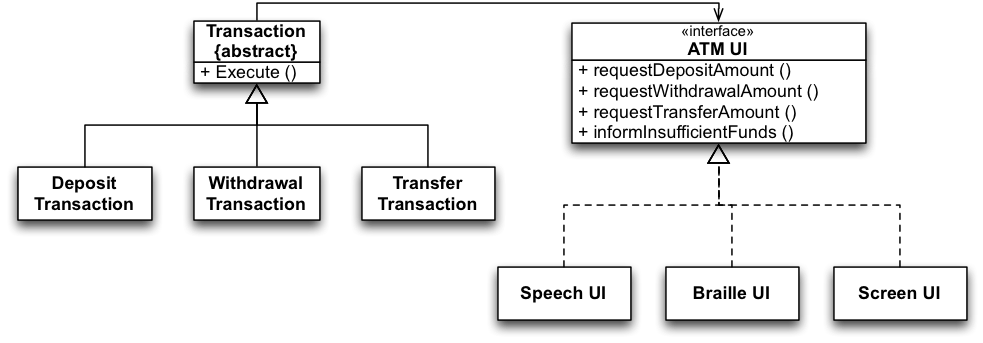

##Interface Segregation Principle (ISP)

+~[Interface Segregation Principle]slide

Interface Segregation Principle
===

^Clients should not be forced to depend on methods that they do not use.

~+

###Introduction by Example

+~[Introduction by Example]slide

Introduction by Example
===
Consider the development of software for an automatic teller machine (ATM):
* Support for the following types of transactions is required: withdraw, deposit, and transfer
* Support for different languages and support for different kinds of UIs is also required
* Each transaction class needs to call methods on the GUI  
E.g., to ask for the amount to deposit, withdraw, transfer.

+~footer
What do you think?
~+

~+

**Assessment:**

ISP tells us to avoid this. Each transaction class uses a part of the interface, but depends on all others. Any change affects all transactions.

+~[A Polluted Interface]slide

A Polluted Interface
===

`ATM UI` is a polluted interface:
* It declares methods that do not belong together.
* It forces classes to depend on unused methods and therefore depend on changes that should not affect them.
* ISP states that such interfaces should be split.

~+

###The Rationale Behind ISP

+~[The Rationale Behind ISP]slide

The Rationale Behind ISP
===

^When clients depend on methods they do not use, they become subject to changes forced upon these methods by other clients.

This causes coupling between all clients.

~+

+~[How does an ISP compliant solution look like?]slide

How does an ISP compliant solution look like?
===

~+

+~[An ISP Compliant Solution]slide

An ISP Compliant Solution
===

~+

###Proliferation of Interfaces

+~[Proliferation of Interfaces]slide

Proliferation of Interfaces
===

^Try to group possible clients of a class and have an interface for each group.

---
**But:**
Segregating interfaces should not be overdone! 

~+

If you overdue the application of the interface segregation principle, you will end up with 2n-1 interfaces for a class with n methods.

Recall that, in general, a class implementing many interfaces may be a sign of a violation of the single-responsibility principle.

###Takeaway

+~[Takeaway]slide

Takeaway
===

^Clients should not be forced to depend on methods that they do not use.

~+
