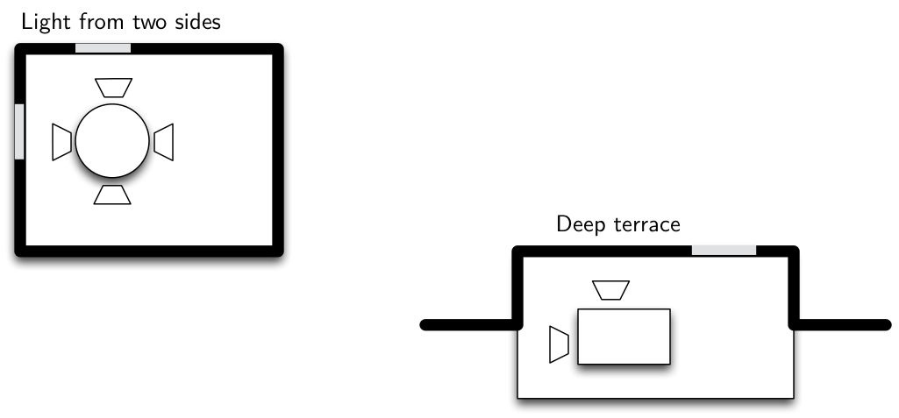

#Design Patterns

##Introduction to Design Patterns

+~[What is a Design Pattern]slide

What is a Design Pattern
===

>A design pattern describes:
> * A problem that occurs over and over again in our environment.
>
> * The core of the solution to that problem, 
> * in such a way that you can use this solution a million times over, without ever doing it the same way twice.
> 
> **Christopher Alexander, professor of architecture.**
~+

+~slide

What is a Design Pattern
===

^Aggressive disregard for originality.

**Rule of three:**
 * Once is an event.
 * Twice is an incident.
 * Thrice is a pattern. 

~+

+~[Motivation for Software Design Patterns]slide

Motivation for Software Design Patterns
===

  
  
* **Designing reusable software is hard!**  
(Originality is Overrated)

* **Some design solutions reoccur; understanding their core is beneficial**

* **Systematic software-development**

~+

* Designing reusable software is hard! (Originality is Overrated)  
	* Novices are overwhelmed.
	* Experts draw from experience.

* Some design solutions reoccur. Understanding their core is beneficial.
	* Know when to apply.
	* Know how to establish them in a generic way.
	* Know the consequence (trade-offs).

* Systematic software-development
	* Documenting expert knowledge.
	* Use of generic solutions.
	* Use of shared vocabulary.
	* Raising the abstraction level.
	

+~[Design Patterns and Change]slide

Design Patterns and Change
===

  
  
* **Most patterns address issues of software change.**

	* Most patterns allow some part of the system to vary independent of the other parts.

	* We often try to identify what varies in a system and encapsulate it.

~+

+~[Elements of Design Patterns]slide

Elements of Design Patterns
===

  
  
* **Pattern Name**

* **Intent**

* **Solution**

* **Consequences**

~+

* **Pattern Name**: A short mnemonic to increase your design vocabulary.
* **Intent**: Description when to apply the pattern (conditions that have to be met before it makes sense to apply the pattern).
* **Solution**: The elements that make up the design, their relationships, responsibilities, and collaborations.
* **Consequences**: Costs and benefits of applying the pattern. Language and implementation issues as well as impact on system flexibility, extensibility, or portability.  
The goal is to help understand and evaluate a pattern.

+~[R. Martin's Chess Analogy]slide

R. Martin's Chess Analogy
===

* When people begin to play chess they learn the rules and physical requirements of the game.

* As they progress, they learn the principles.

* However, to become a master of chess, one must study games of other masters.

---

* So it is with software. First one learns the rules. The algorithms, data structures, and languages of software.  

* Later, one learns the principles of software design.  

* But to truly master software design, one must study the designs of other masters. 

~+

+~story
R. Martin‘s Chess Analogy
===

When people begin to play chess they learn the rules and physical requirements of the game. They learn the names of the pieces, the way they move and capture, the board geometry and orientation. 
At this point, people can play chess, although they will probably not be very good players. 

As they progress, they learn the principles. They learn the value of protecting the pieces and their relative value. They learn the strategic value of the center squares and the power of a threat…

At this point, they can play a good game. They know how to reason through the game and can recognize “stupid” mistakes.

However, to become a master of chess, one must study games of other masters. Buried in those games are patterns that must be understood, memorized, and applied repeatedly until they become second nature. 

There are thousands upon thousands of these patterns. Opening patterns are so numerous that there are books dedicated to their variations. Midgame patterns and ending patterns are also prevalent, and the master must be familiar with them all. 

So it is with software. First one learns the rules. The algorithms, data structures, and languages of software. 
At this point, one can write programs, albeit not very good ones. 

Later, one learns the principles of software design. One learns the 
importance of cohesion and coupling, of information hiding and dependency management. 

But to truly master software design, one must study the designs of other masters. Deep within those designs 
are patterns that can be used in other designs. Those patterns must be understood, memorized, and applied 
repeatedly until they become second nature. 

~+

+~[Software Patterns]slide

Software Patterns
===

Some selected books:

(And many more books!)

~+

+~[Patterns in Architecture]slide

Patterns in Architecture
===

~+

In architecture there are also rules (e.g., specification of required amount of light in a room) as in software design (e.g., low coupling, high cohesion, number of parameters per method), but in both cases these rules allow to judge an existing configuration but do not generate solutions. Patterns are working solutions and represent solutions that obey design rules and, moreover, suggest a specific solution (dining corner with light from three sides, curved entry path).

^Patterns are ubiquitous.

+~[Patterns Taught in SED&C]slide

Patterns Taught in SED&C
===

* Quick warm up with the Template Method Pattern
* The Strategy Pattern
* The Decorator Pattern
* The Proxy Pattern
* The Visitor Pattern
* The Bridge Pattern
* The Adapter Pattern
* The Builder Pattern
* The Command Pattern

+~[Patterns You Should Know]aside
Patterns You Should Know:
===

* The Factory Pattern
* The Abstract Factory Pattern
* The Observer Pattern
* The Composite Pattern
~+

~+

