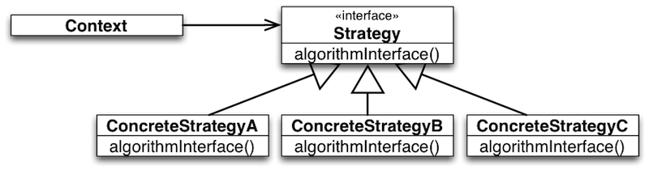
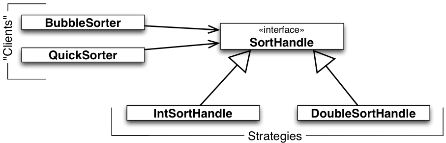
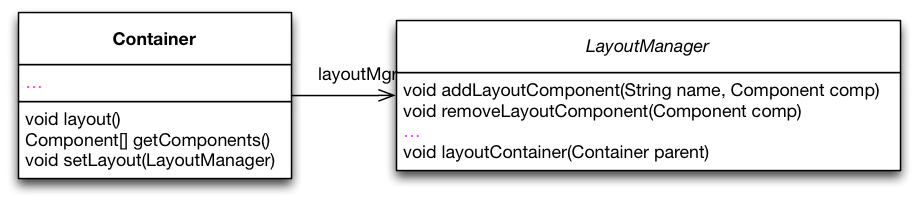
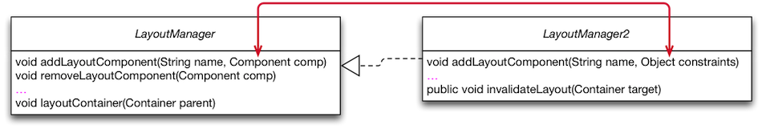

##Strategy Design Pattern

###The Strategy Pattern in a Nutshell

+~[The Strategy Pattern in a Nutshell]slide

The Strategy Pattern in a Nutshell
===



_Intent_:
* Define a family of algorithms,
* Encapsulate each one,
* Make them interchangeable at runtime.

~+

+~slide

The Strategy Pattern in a Nutshell
===


^Strategy lets the algorithm vary dynamically and independently from clients that use it.

~+
 
+~[When to Use the Strategy Pattern]slide

When to Use the Strategy Pattern
===


* You need different variants of an algorithm.

* You need to select the variant of an __algorithm dynamically__.

~+

**You need different variants of an algorithm.**
* Strategies can be used when variants of algorithms are implemented as a class hierarchy.
* Many related classes differ only in their behavior rather than implementing different related abstractions (types).
* Strategies allow to configure a class with one of many behaviors.

**You need to select the variant of an algorithm dynamically.**
* There are classes in your design that define many behaviors that appear as multiple conditional statements in its operations.
* Move related conditional branches into a strategy.

+~[Strategy as an Alternative to Inheritance]slide

Strategy as an Alternative to Inheritance
===

The Strategy Pattern represents an alternative to modeling different algorithms (sub-behaviors) as subclasses of a usage Context.

Inheritance mixes an algorithm‘s implementation with that of the Context. __The Context may become harder to understand, maintain, extend.__

Inheritance results in many related classes which only differ in the algorithm or behavior they employ.

When using subclassing we cannot vary the algorithm dynamically.

~+

Encapsulating the algorithm in a Strategy:
* Lets you vary the algorithm independently of its usage context.
* Makes it easier to switch, understand, and extend the algorithm.


+~[Sorting Example with Strategy]slide

Sorting Example with Strategy
===



~+

`BubbleSorter` and `QuickSorter` embody different high-level policies for sorting the elements of a list. They outsource to `SortHandle` the decision about the concrete mechanisms for element ordering and for swapping. `SortHandle` declares the common interface of low-level sorting mechanisms. `IntSortHandle` and `DoubleSortHandle` implement this interface in different ways.

Not only are sorting policies reusable with (independent of) different ordering and swapping mechanisms; the latter become reusable with (independent of) different high-level sorting policies. 

Furthermore, it is possible to customize the mechanisms dynamically.

**Recall the dependency-inversion principle: High-level policies should not depend on low-level mechanisms. Both should depend on abstractions.**

+~[Example: LayoutManager in Swing]slide

Concrete Example: LayoutManager in Swing
===



```Java
class Container extends Component{
  LayoutManager layoutMgr;
  … 
  public LayoutManager getLayout() {
    return layoutMgr;
  }
  
  public void layout() {
    layoutMgr.layoutContainer(this);
  }
  … 
}  
```

~+

For illustration, consider Java Containers with dynamically customizable strategies for laying out its components.

To keep the design open for future extensions, we „outsource“ the variable layout functionality to a strategy object of type `LayoutManager`. 

Container objects hold a reference `layoutMgr` to a Container object and implement operations for managing this reference. 

All operations, whose implementations depend on layout functionality, call specific methods in the interface of `LayoutManager`.

+~[Functional Counterpart of Strategies]slide

Functional Counterpart of Strategies
===

One can look at the Strategy pattern as a style for emulating first-class functions available in functional programming languages.

+~[First-class Functions]aside
First-class functions are values that can be passed as parameters and returned as results.

~+ 

**Strategy objects** encapsulate sub-computations in first-class values that can be passed as parameters and returned as results of other computations (methods).

~+

###The Cost of the Strategy Pattern

There are trade-offs to be made to profit from the advantages of the Strategy pattern.

These trade-offs must be known and carefully considered when using the Strategy. 

+~[Footprint of Variations in Base Functionality]slide

Footprint of Variations in Base Functionality
===

```Java
class Container extends Component{
  LayoutManager layoutMgr;
  … 
  public LayoutManager getLayout() {
    return layoutMgr;
  }
  
  public void layout() {
    layoutMgr.layoutContainer(this);
  }
  … 
}  
```

* The field `layoutMgr`
* Methods to manage strategy objects; e.g., `setLayout`
* Facade methods forwarding functionality to strategy, e.g., `layout`

~+

There may be clients which are not interested in layout functionality. Hence, this can be considered as a violation of the Single-Responsibility Principle and the Interface-Segregation Principle.


+~[ Structural Variation is not Supported]slide

Structural Variation is not Supported
===

* The Strategy interface must **fit the needs of all possible variations** of the outsourced feature.

* This may lead to bloated („One Size Fits All“) interfaces.   
The interfaces might be too complicated for some clients not interested in sophisticated variations of a feature.

* Careful anticipation of the needs of future variations is needed when designing the interface. 
* Aggravates extensibility.

~+


+~[An Example „One Size Fits All“-Interface]slide

An Example „One Size Fits All“-Interface
===


```Java
interface ListSelectionModel { 
  int SINGLE_SELECTION = 0; 
  int SINGLE_INTERVAL_SELECTION = 1; 
  int MULTIPLE_INTERVAL_SELECTION = 2; 

  /** … 
   * In {@code SINGLE_SELECTION} selection mode, 
   * this is equivalent to calling {@code setSelectionInterval}, 
   * and only the second index is used. 
   * In {@code SINGLE_INTERVAL_SELECTION} selection mode, 
   * this method behaves like {@code setSelectionInterval}, 
   * unless the given interval is immediately 
   * adjacent to or overlaps the existing selection, 
   * and can therefore be used to grow the selection. 
   * … 
   */ 
   void addSelectionInterval(int index0, int index1); 
   … 
} 
```


~+

Consider the list selection feature in Java’s Swing library. This feature is outsourced to the class `ListSelectionModel`. The interface of `ListSelectionModel` is designed to satisfy the needs of the most flexible selection model (multiple interval selection). As a result, the interface is too complicated for clients of simpler selection models. See the comments of the methods in the interface. 

Yet, the design is not flexible enough, e.g., to cover the needs of extensions of the selection model with arbitrary cell range selection.


+~[When the „One Size Fits All“-Interface doesn't fit!]slide

When the „One Size Fits All“-Interface Doesn't fit!
===
Example from Java Swing's `JComponent`
---

  

```Java
// javax.swing.JComponent - OpenJDK / 6-b14
1804  public float getAlignmentY() {
1805    float yAlign;
1806    if (layoutMgr instanceof LayoutManager2) {
1807      synchronized (getTreeLock()) {
1808        LayoutManager2 lm = (LayoutManager2) layoutMgr;
1809        yAlign = lm.getLayoutAlignmentY(this);
1810      }
1811    } else {
1812      yAlign = super.getAlignmentY();
1813    }
1814    return yAlign;
1815  }
```

~+

At some point, the designers of the `LayoutManager` were forced to evolve the interface to satisfy new/additional requirements posed by tool builders. This required a new interface that inherits from the original interface. Eventually, type checks and typecasts become necessary and significantly hamper code comprehension, maintainability, testability, and extensibility.


+~[Communication Overhead]slide

Communication Overhead
===

* Some concrete strategies won't use all information passed to them.
	* Simple concrete strategies may use none of it.
	* Context creates/initializes parameters that never get used.
	
* If this is an issue, consider using a tighter coupling between Strategy and Context. Let Strategy know about Context.  
**Two Ways of Strategy-Context Interaction:**
	1. Pass the needed information as a parameter.  
	**+** Context and Strategy decoupled.  
	**-** Interaction overhead.  
	**-** Algorithm can’t be adapted to specific needs of context.
	2. Context passes itself as a parameter or Strategy has a reference to its Context.  
	**+** Reduced interaction overhead.  
	**-** Context must define a more elaborate interface to its data.  
	**--** Closer coupling of Strategy and Context.

~+


+~[Variations with Fixed Interface]slide

Variations with Fixed Interface
===

^Strategy objects are effective in modeling features of an object with dynamically **varying implementations but fixed interfaces**.

~+


+~[Increased Number of Objects]slide

Increased Number of Objects
===

Potentially many strategy objects need to be instantiated.

---

To alleviate this problem you may use **Stateless Strategies** (_Services_):
* The number of strategy objects can sometimes be reduced by stateless strategies that several Contexts can share.
* Any state is maintained by Context.
* Context passes it in each request to the Strategy object.  
(No / less coupling between Strategy implementations and Context.)
* Shared strategies should not maintain state across invocations.
* Such strategies are **Services**.

~+


+~[Composition of Multiple Variations]slide

Composition of Multiple Variations
===

^Strategy objects cannot be effectively used to model interdependent variations. 

**Illustrative example**:

+~story
The `JTable` class in Java’s Swing library uses the interface `TableCellRenderer` to abstract from different ways in which table cells can be rendered.

But, cell rendering may depend on other kinds of variations of table functionality, e.g., on the presence of selection or drag-and-drop functionality.
Usually, selected cells and drag-and-drop targets are rendered in a special way. 

~+

Such interdependencies between different variation dimensions cannot be properly modularized using strategy objects only. 

~+

###Takeaway


+~[Takeaway]slide

Takeaway
===

The core of the Strategy Pattern is to model variability of object features by 
outsourcing the implementation of these features in “helper” (strategy) objects
Exploiting “implementation to interfaces” and subtype polymorphism for abstracting over variations of the outsourced feature. 

The Strategy pattern addresses two problems of inheritance:
* Variations become reusable. 
* Dynamic variations of features becomes possible.

~+

Technically, a combination of object composition and inheritance is used instead of inheritance only.

**The Strategy pattern has its costs**:
* Variations leave a footprint in the base implementation of the object.
* Structural variations are not supported.
* Careful planning of a one-size-fits-all interface is needed.
* Bloated interfaces and interaction overhead between strategy objects and their usage contexts.
* Increased number of objects.
* Multiple interdependent variations not properly supported. 

##Filing the Design Space between Template and Strategy


+~[Filing the Design Space between Template and Strategy]slide

**Using mixin-composition and self-type annotations widens the design space.**

```Scala
trait Component

trait LayoutEngine {
    def layout(components: Array[Component])
}

trait BasicLayoutEngine extends LayoutEngine {
    def layout(components: Array[Component]) { /*Basic means nothing..*/ }
}

class Container(private val components: Array[Component]) { 
  this: LayoutEngine ⇒ // <= Self-type annotation
  def doLayout() {
    layout(components);
  }
}

object LayoutEngineDemo extends App {
    val c : Container = new Container(Array()) with BasicLayoutEngine
    //c.layout (won't compile!)
    c.doLayout 
    println(c)
}
```
~+

Using this approach the solution is type-safe and variations are (still) reusable. However, dynamic variations of features are no longer possible. 

Overall, we have the following advantages:
* LayoutEngine (low-level mechanism) is well modularized and reusable
* Basically no overhead, because we do not have an additional object (as in case of Template Method)
* The interface of `Container` is not polluted (conforms to the ISP)

and the following disadvantage:
* "strategy" is not dynamically exchangeable
