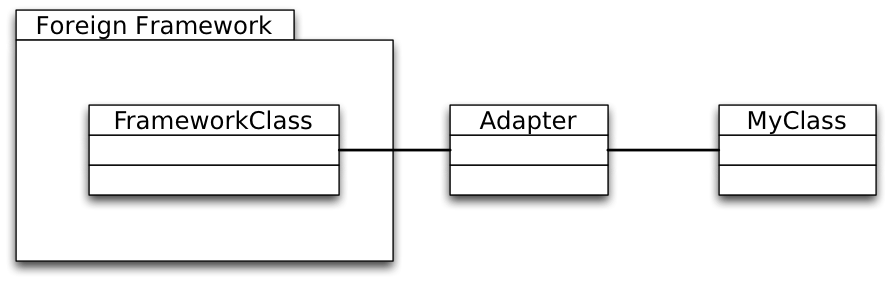
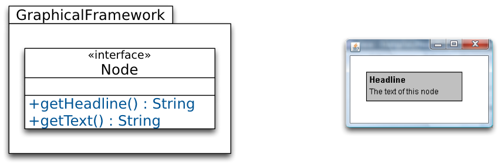
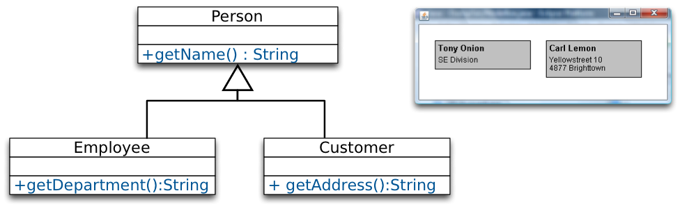
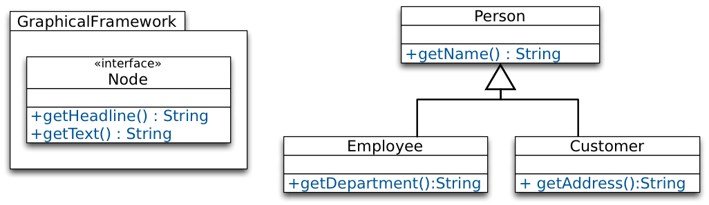
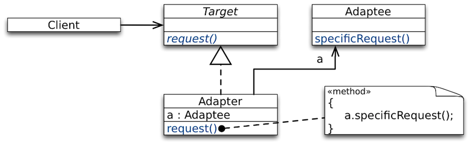
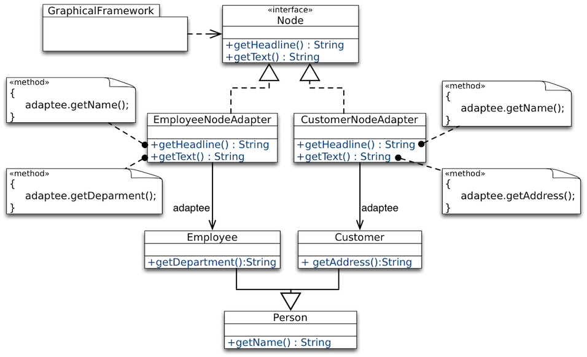
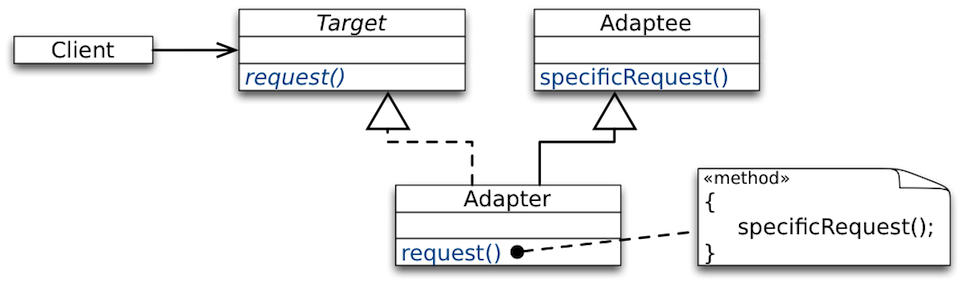
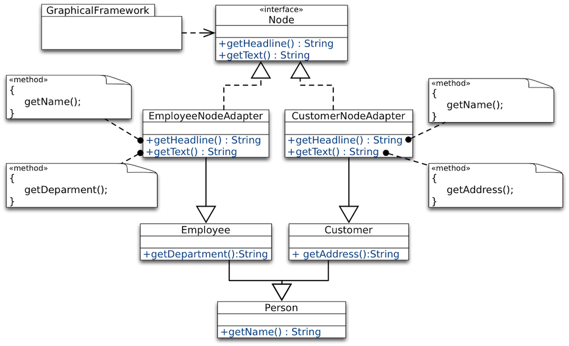

##Adapter Design Pattern

###Intent

+~[The Adapter Design Pattern]slide

The Adapter Design Pattern
===

Intent
---

Intent: Fit foreign components into an existing design.



~+

We want to reuse existing frameworks or libraries in our software, even if they do not match with our design.

We do not want to change our design to adhere to the structure of the reused components.

###Case Study

+~[The Adapter Design Pattern - Illustrated]slide

The Adapter Design Pattern - Illustrated
===




~+
We have acquired the framework `GraphicalFramework`.

`GraphicalFramework` provides the interface `Node` to draw rectangles with a headline and text to the screen.

Drawing is done by the framework, we just need to provide the data via the interface `Node`.

+~slide

Desired Usage of the Framework
===



~+

Our own design represents different kinds of persons.
We want to draw our data to the screen:
* Name and department of `Employee`.
* Name and address of `Customer`.

+~slide

Adapting the Framework
===



~+

We will create adapters to use the functionality of `GraphicalFramework`  for our classes.

We have to adapt `Employee` and `Customer` to fit with `Node`.

###Two Kinds of Adapters

####Object Adapter

+~[Object Adapter]slide

Object Adapter
===



~+

* `Adaptee` is wrapped by `Adapter` to fit in the interface of `Target`.
* `Adapter` forwards calls of `Client` to `request()` to the specific methods of `Adaptee` (e.g, `specificRequest()`).


+~slide

Using Object Adapter
===



~+


**Advantages**:
* `Adapter` works with `Adaptee` and any subclass of it.
* `Adapter` can add functionality to `Adaptee` and its subclasses.

**Disadvantages**:
* Cannot override methods in `Adaptee`.
* Cannot reuse `Adapter` with subclasses of `Target`.
* `Adapter` and `Adaptee` are different objects.  
(Need to maintain relation between `Adaptee` and his `Adapter`)


####Class Adapter

+~[Class Adapter]slide

Class Adapter
===




~+

Instead of having `Adaptee` as an attribute, `Adapter` inherits from `Adaptee`.


+~slide

Using Class Adapter
===



~+

**Advantages**:
* Behavior of `Adaptee` can be overridden.
* Adapter and `Adaptee` are the same object, no forwarding.

**Disadvantages**:
* `Adapter` cannot be used with subclasses of `Adaptee` or `Target`. 
* `Multiple` inheritance may be required.  
In Java: At least one of `Target` and `Adaptee` must be an Interface.

###Takeaway


+~[Takeaway]slide

Takeaway
===

Adapter is an effective means to adapt existing behavior to the expected interfaces of a reusable component or framework.

Two variants: **Object and Class Adapter**
* Both have their trade-offs.
* Both have problems with the reusability of the adapter.

~+


###Pimp My Library (Scala)
+~[Pimp My Library (Scala)]slide

Pimp-my-Library Idiom/Pattern (Scala)
===

Goal
---
Solve the problem that you can change or extend your own code, but if you use other libraries you have to take them as they are.

Solution Idea
---
Define a conversion function to convert your object into the required object and make this conversion `implicit` to let the compiler automatically perform the conversion when needed.  
(_Transparent_ generation of object adapters.)

~+

####Example Scenario

We want to be able to repeat a certain operation multiple times and want to store the result in some given mutable store.

But, Scala's (2.10) mutable collections do not define a common method to add an element to them.

In the following we develop a generalization of the previously shown `repeat` method. This variant enables the developer to specify the target data store.

+~slide

Implementing a `repeatAndStore` method **(naïve approach)**.

```Scala
object ControlFlowStatements {
  import scala.collection.mutable.Set
```
+~{anim-step:1}
```Scala  	
  abstract class MutableCollection[T, C[T]](val underlying: C[T]) {
    def +=(elem: T): Unit
  }
```
~+
+~{anim-step:2}
```Scala
  implicit def setToMutableCollection[T](set: Set[T]) =
    new MutableCollection(set) { def +=(elem: T) = set += (elem) }
```
~+
```Scala
  def repeatAndStore[T, C[T]]
      (times: Int)(f: ⇒ T)(collection: MutableCollection[T, C]): C[T] = {
    var i = 0; while (i < times) { collection += f; i += 1 }
    collection.underlying
  }
```
```Scala  
}
```

+~[Example Usage]aside

```Scala
object CFSDemo extends App {
  import ControlFlowStatements._

  val nanos =
    repeatAndStore(5) {
      System.nanoTime()
    }(new scala.collection.mutable.HashSet[Long]())

}
```
What is the type of `nanos`?

~+

~+

The previous solution has two issues:
1. The `repeatAndStore` method requires a `MutableCollection` which is basically an implementation-internal type.
2. It returns the original collection to make the usage easier, but important type information is lost (the `HashSet` has become a `Set`).


+~slide
Implementing a `repeatAndStore` method.

```Scala
object ControlFlowStatementsBase {
  trait Mutable[-C[_]] {
    def add[T](collection: C[T], elem: T): Unit
  }

  implicit object Set extends Mutable[Set] {
    def add[T](collection: Set[T], elem: T) { collection += elem }
  }

  implicit object MutableBuffer extends Mutable[Buffer] {
    def add[T](collection: Buffer[T], elem: T) { collection += elem }
  }

  def repeatWithContextBound[T, X[T] <: AnyRef: Mutable]
  (times: Int)
      (f: ⇒ T)(collection: X[T]): collection.type = {
    var i = 0
    while (i < times) { 
	    implicitly[Mutable[X]].add(collection, f); i += 1 
    }
    collection
  }
}
```

+~[Example Usage]aside
```Scala
object CFSDemo extends App {
  import ControlFlowStatements._

  val nanos_1: HashSet[Long] = 
    repeatWithContextBound(5){ System.nanoTime() }(new HashSet[Long]())

  val nanos_2: ArrayBuffer[Long] = 
    repeatWithContextBound(5){ System.nanoTime() }(new ArrayBuffer[Long]())

  val nanos_3: nanos_1.type = 
    repeatWithContextBound(5) {System.nanoTime() }(nanos_1)

  def stricterEquals[X <: AnyRef](a: X)(b: a.type) = a == b
  stricterEquals(nanos_1)(nanos_3)
  // /* correctly won't compile */ stricterEquals(nanos_2)(nanos_3)
}
```

~+

~+

