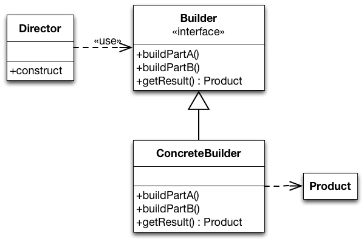

###Builder Design Pattern

###Intent


+~[Builder - Intent]slide

Builder - Intent
===

^Divide the construction of multi-part objects in different steps, so that different implementations of these steps can construct different representations of objects.


~+


###Structure

+~[Builder - Structure]slide

Builder - Structure
===



~+

`Builder` defines the individual steps of the construction of `Product`.

`Director` knows in which order to construct `Product`.

`ConcreteBuilder` implements the steps of construction.


###Example
We want to construct different types of cars.

In this example, cars have an engine and an interior.

+~[Builder - A Car Builder]slide

Builder - A Car Builder
===


~+


+~slide

Builder - A Car Builder
===


~+

`CarBuilder` defines the two methods to construct car parts. Concrete builders must implement these methods. For convenience, the instantiation of cars (buildCar()) is implemented in `CarBuilder`.

`CarConstructionDirector`  is configured with a `CarBuilder` and calls the construction methods in the correct order.


+~slide

Two Possible Car Builders
===

```Java
class CheapCarBuilder extends CarBuilder {
  void buildEngine() {
    car.setEngine(Engine.SMALL_ENGINE);
  }

  void buildInterior() {
    car.setInterior(Interior.PLASTIC_INTERIOR);
  }
}
```


```Java
class LuxuryCarBuilder extends CarBuilder {
  void buildEngine() {
    car.setEngine(Engine.SPORT_ENGINE);
  }

  void buildInterior() {
    car.setInterior(Interior.WOODEN_INTERIOR);
  }
}
```


~+


###Discussion

**Assessment of the Builder Pattern**:

* **Advantages**:
	* Creation of objects can be configured at runtime.
	* Concrete builders can use complex logic.  
E.g. a car builder creating cars depending on available parts in storage.
	* Good way to create composite structures.

* **Disadvantages**:
	* May yield many classes.
	* Only works if all objects can be constructed using the same order.

**Builder vs. Abstract Factory Pattern**:

* Abstract Factory focuses on creating multiple objects of a common family.
	* Abstract Factory knows what object to create.
	* Configuration is fixed after deployment of the software.

* Builder focuses on creating complex objects step by step.
	* The director knows how to construct the object.
	* Configuration is chosen at runtime via the concrete builder.

+~[Takeaway]slide

Takeaway
===

Use _Abstract Factory_ for creating objects depending on finite numbers of factors you know in advance.  
E.g. if there are only three kinds of cars.

Use _Builder_ for creating complex objects depending on unbound number of factors that are decided at runtime.  
E.g. if cars can be configured with multiple different parts.


~+


