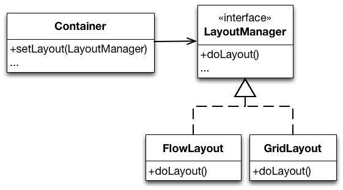
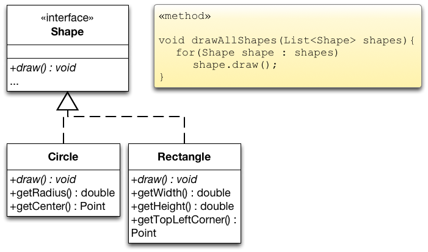
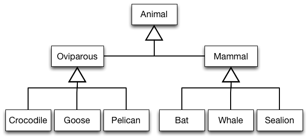

##Open-Closed Principle

+~[Open-Closed Principle]slide
Open-Closed Principle
===

^Software entities (classes, modules, functions, components, etc.) should be open for extension, but closed for modifications.

**Extension**: Extending the behavior of a module.

**Modification**: Changing the code of a module.

~+

###Extension and Modification

+~[Extension and Modification]slide

^Why is it important to be closed for modifications?

~+

_Open for extension_ means that when requirements of the application change, we can extend the module with new behaviors that reflect those changes. We change what the module does.

_Closed for modification_ means that changes in behavior do not result in changes in the module's source or binary code.

Several reasons for closing modules against changes:
* The module was delivered to customers and a change will not be accepted. If you need to change something later, hopefully you opened your module for extension!
* The module is a third-party Library/Framework and only available as binary code. If you need to change something, hopefully the third-party opened the module for extension!
* **Most importantly**: not changing existing code means modular compilation, testing and debugging. 

###Abstraction is the Key

+~[Abstraction is the Key]slide
Abstraction is the Key
===

^To enable extending an entity without modifying it, abstract over subparts of its behavior.

>Many programming languages allow to create abstractions that are fixed and yet represent an unbounded group of possible behaviors!

~+

Different kinds of abstraction mechanisms exist:
* Object-oriented languages:
	* abstractions are encoded in abstract base classes resp. interfaces.
	* unbounded group of possible behaviors is represented by all the possible derivative classes resp. implementations.

* Functional languages:
	* abstractions are encoded in function types.
	* unbounded group of possible behaviors is represented by all the possible first-class functions of the declared type.

In the following, we shortly discuss the two main ways of abstracting over variability in object-oriented programs.

+~[Abstracting Over Variations]slide
Abstracting Over Variations
===


~+

* `Container` declares the layout functionality but does not implement it. The rest of `Container` is implemented against the abstraction.
* Concrete subclasses fill in the details over which `Container`’s implementation abstract.


+~[Abstracting Over Variations]slide
Abstracting Over Variations
===



~+

* `Container` delegates the layout functionality to an abstraction. The rest of its functionality is implemented against this abstraction.
* To change the behavior of an instance of `Container` we configure it with the `LayoutManager` of our choice.
* We can add completely new behavior by implementing our own `LayoutManager`.

###Understanding the Open-Closed Principle

+~[Drawable Shapes - Initial Design]slide
A Possible Design for Drawable Shapes
===


+~footer
Drawing is implemented in separate methods (e.g., of class `Application`).

~+

~+

* Each `Shape` identifies itself via the enumeration `ShapeType`.
* Realizations of `Shape` declare specialized methods for the shape type they represent.

+~slide
**Consider an application that draws shapes - circles and rectangles – on a standard GUI.**


~+


+~slide
**Implementation of the drawing functionality:**

```java
class Application {
  public void drawAllShapes(List<Shape> shapes) {
    for(Shape shape : shapes) {
      switch(shape.getType()) {
      case Circle:
        drawCircle((Circle)shape);
        break;
      case Rectangle:
        drawRectangle((Rectangle)shape);
        break;
  } } }

  private void drawCircle(Circle circle) { ... }

  private void drawRectangle(Rectangle rectangle) { ... }
}
```

Does this design conform to the open-closed design principle?

~+

**Evaluating the proposed design:**
* Adding new shapes is hard, we need to:
	* Implement a new realization of `Shape`.
	* Add a new member to `ShapeType`.  
This possibly leads to a recompile of all other realizations of `Shape`.
	* `drawAllShapes` (and every method that uses shapes of different types) must be changed.  
We have to hunt for every place that contains conditional logic that distinguishes between types of shapes and we have to add code to it.
* `drawAllShapes` is hard to reuse!  
When we reuse it, we have to bring along `Rectangle` and `Circle`.

+~[Rigid, Fragile, Immobile Designs]slide
Rigid, Fragile and Immobile Designs
=== 

* **Rigid designs** are hard to change – every change causes many changes to other parts of the system.

* **Fragile designs** tend to break in many places when a single change is made. 

* **Immobile designs** contain parts that could be useful in other systems, but the effort and risk involved with separating those parts from the original system are too big.

When we evaluate our design, does it show signs of rigidity, fragility or immobility?

~+

+~slide
Evaluating the Design
===
* Our design is rigid, fragile and immobile.

* The proposed design **violates the open-closed design principle** with respect to extensions with new kinds of shapes.

* We need to close our module against this kind of change by building appropriate abstractions.

~+

Assessing our design w.r.t. its rigidity, fragility and immobility:
* Our example design **is rigid**: Adding a new shape causes many existing classes to be changed.
* Our example design **is fragile**: Many switch/case (if/else) statements that are both hard to find and hard to decipher.
* Our example design **is immobile**: `drawAllShapes` is hard to reuse.

+~[Drawable Shapes - Refined Design]slide
Refined Design for Drawable Shapes
===


~+

* Makes adding new shapes possible without modification.  
We just need to implement a new realization of `Shape`.

* `drawAllShapes` only depends on `Shape`.  
We can reuse it unchanged.


+~slide
Evaluating the Extensibility
===

^This solution complies to the open-closed design principle.

+~footer
Is this unconditional statement correct?

~+

~+

This unconditional statement is – of course – not correct. It is not possible to be open for all kinds of extension and also be closed for modification.

+~slide
Other Kinds of Changes
===


These abstractions are more of an hindrance to several other kinds of changes.

~+

* Consider extending the design with further shape functions:
	* shape transformations, shape dragging, …
	* calculating the intersection or union of shapes, etc.
* Consider adding support for different operating systems.  
The implementation of the drawing functionality varies for different operating systems.


+~slide

^Abstractions May **Support** or **Hinder** Change!

~+

* Change is easy if change units correspond to abstraction units.  
In our example, adding a new type of `Shape` is easy as it is directly supported by inheritance and subtyping.
* Change is tedious if change units do not correspond to abstraction units.

+~aside

Consider again the Scala-based implementation of our SmartHome scenario. In the given design it is easily possible to add support for a new type of `Location`, but adding new functionality – while still being possible – is harder as seen in the previous example.

For example, adding support for a new type of `Room` is straightforward:

```scala
trait Estate extends Building {
   trait Garage extends TLocation
}

trait EstateWithLightsAndShutters extends Estate with LightsAndShutters {
   trait Garage extends super.Garage with super[LightsAndShutters].TLocation
}

object EstatesWithLightsAndShutters extends EstateWithLightsAndShutters {

   type Location = TLocation
   type Room = TRoom
   type Floor = TFloor
   type House = THouse

   def createRoom(): Room = new Room { 
         var lights: List[Light] = Nil
         var shutters: List[Shutter] = Nil }
   def createFloor(rooms: List[Room]): Floor = new Floor { val locations = rooms }
   def createHouse(floors: List[Floor]): House = new House { val locations = floors }

   class Garage(
      val lights: List[Light] = Nil, 
      val shutters: List[Shutter] = Nil) extends super.Garage

   val garage = new Garage(Nil, Nil)
   garage.turnLightsOff
   garage.turnLightsOn
}
```

~+


###Abstractions Reflect a Viewpoint

+~[Abstractions Reflect a Viewpoint]slide

Abstractions Reflect a Viewpoint
===

^No matter how “closed” a module is, there will always be some kind of change against which it is not closed.

+~footer
There is no model that is natural to all contexts.

~+

~+


+~[On the "Natural" Model Structure]slide

On the "Natural" Model Structure
===

Imagine: Development of a "Zoo Software".

Three stakeholders:
* Veterinary surgeon: **What matters is how animals reproduce!**
* Trainer: **What matters is the intelligence!**
* Keeper: **What matters is what they eat!**

~+


+~slide
**One Possible Class Hierarchy When Modeling Animals**



+~footer
Do you see a problem?

~+

~+

When we consider the classes `Oviparous` and `Mammal` it is obvious that the class hierarchy reflects the veterinary surgeon's understanding.

+~slide
**The Animal World From a Trainer's Viewpoint**

> “The show shall start with the pink pelicans and the African geese **flying** across the stage. They are to land at one end of the arena and then **walk** towards a small door on the side. At the same time, a killer whale should **swim** in circles and **jump** just as the pelicans fly by. After the jump, the sea lion should **swim** past the whale, **jump** out of the pool, and **walk** towards the center stage where the announcer is waiting for him.”


~+

+~slide

**Models Reflecting Different Viewpoints Overlap**


~+

* Elements of a category in one model correspond to several categories in the other model (and vice versa).
* Adopting the veterinary viewpoint hinders changes concerning trainer’s viewpoint (and vice versa). 


+~[Limitations of Current Programming Languages When Modeling Co-Existing Viewpoints]slide

^Current programming languages and tools do not well support modeling the world based on co-existing viewpoints.

+~footer
No matter how “closed” a module is, there will always be some kind of change against which it is not closed.

~+

~+

Using a programming language which offers more advanced modeling mechanisms, it may be possible to create a design that more closely models the presented world. 

###Strategic and Agile Closure

+~[OCP - Strategic Closure]slide
Strategic Closure
===

* Choose the kinds of changes against which to close your module.
	* Guess at the most likely kinds of changes.
	* Construct abstractions to protect against those changes.

* Prescience derived from experience:
	* Experienced designers hope to know the user and an industry well enough to judge the probability of different kinds of changes.
	* Invoke open-closed principle against the most probable changes.

~+

+~[OCP - Be Agile]slide
Be Agile
===
>Recall that guesses about the likely kinds of changes to an application over time will often be wrong. 

Conforming to the open-closed principle is expensive:
* Development time and effort to create the appropriate abstractions 
* Created abstractions might increase the complexity of the design.
	* Needless, Accidental Complexity. 
	* Incorrect abstractions supported/maintained even if not used.

**Be agile: Wait for changes to happen and close against them.**

~+

+~[OCP - Takeaway]slide
Takeaway
===
>Software entities (classes, modules, functions, etc.) should be open for extension, but closed for modifications.  
>
>Bertrand Meyer, 1988

* Abstraction is the key to supporting the open-closed design principle.
* No matter how “closed” a module is, there will always be some kind of change against which it is not closed.

~+


