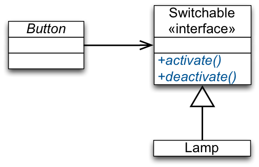
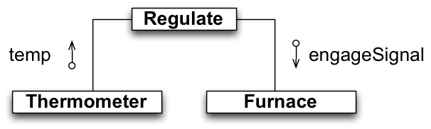
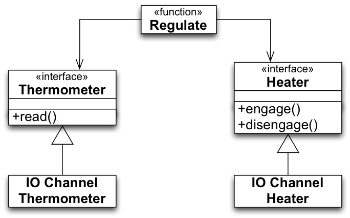
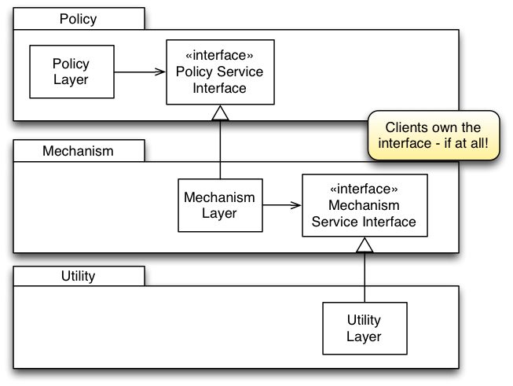

##Dependency Inversion Principle (DIP)

+~[Dependency-Inversion Principle]slide

Dependency-Inversion Principle
===

^ High-level modules should not depend on low-level modules. Both should depend on abstractions.

---

^ Abstractions should not depend on details. Details should depend on abstractions.

~+

###Example

+~[Introduction by Example]slide

Introduction by Example
===

A small design excerpt from the smart-home scenario:

Behavior of `Button`:
* The button is capable of “sensing” whether it has been activated/deactivated by the user.
* Once a change is detected, it turns the Lamp on, respectively off.

+~footer
Do you see any problem with this design?

~+

~+

**Assessment:**
* We cannot reuse `Button` since it depends directly on `Lamp`.
(But there are plenty of other uses for `Button`.)
* `Button` should not depend on the details represented by `Lamp`.

These are symptoms of the real problem (Violation of the Dependency-Inversion Principle).  
The **high-level policy** (detection of on/off gestures) underlying this (mini) design depends on the low-level details.

_The underlying abstraction is the detection of on/off gestures and their delegation to a server object that can handle them._

If the interface of `Lamp` is changed, `Button` has to be at least tested or even adjusted, even though the policy that `Button` represents is not changed!

To make the high-level policy independent of details we should be able to define it independent of the details of `Lamp` or any other specific device.

+~[A Dependency-Inversion Principle Compliant Solution]slide

A Dependency-Inversion Principle Compliant Solution
===

~+

Now `Button` only depends on abstractions; it can be reused with various classes that implement `Switchable`.

Changes in `Lamp` will not affect `Button`.

The dependencies have been inverted: `Lamp` now has to conform to the interface defined by `Button`.

**Actually: both depend on an abstraction!**

###The Rationale behind the Dependency-Inversion Principle

+~[The Rationale]slide

The Rationale
===

High-level, low-level modules. Good software designs are structured into modules.

* **High-level modules** contain the important policy decisions and business models of an application – The identity of the application.

* **Low-level modules** contain detailed implementations of individual mechanisms needed to realize the policy.

^ **High-level policy:** 
The abstraction that underlies the application; 
the truth that does not vary when details are changed; the system inside the system; 
the metaphor.

~+

_High-level policies and business processes is what we want to reuse._ If high-level modules depend on the low-level modules changes to the lower level details will force high-level modules to be tested again/to be changed. Additionally, it becomes harder if not practically impossible to use them in other contexts. It is the high-level modules that should influence the low-level details.

###Advanced Example

+~[Example - Regulating the Temperature]slide

Example - Regulating the Temperature
===

+~footer
Is it compliant with the Dependency-Inversion Principle?

If not, what would you do?

~+

~+

We have three modules where `Regulate` uses the other two:
* `Regulate` pulls data about the current temperature from the `Thermometer` component and 
* `Regulate` signals the `Furnace` component to increase or decrease heat.

+~slide

Example - Regulating the Temperature
===

~+

###Layers and Dependencies

+~[Layers and Dependencies]slide

Layers and Dependencies
===

>„…all well-structured object-oriented architectures have clearly defined layers, with each layer providing some coherent set of services through a well-defined and controlled interface…“  
>Grady Booch

**A possible Interpretation:**

  

The higher the module is positioned in a layered architecture, the more general the function it implements.

The lower the module, the more detailed the function it implements.

+~footer
What do you think of this interpretation?

~+

~+

This interpretation clearly **violates DIP**. Higher-level modules depend on lower-level modules. 

This is actually a typical structure of a layered architecture realized with structured programming (e.g., using "C").

+~slide

Layers and Dependencies 
===
Inverted Layer Dependencies
---

~+

* An upper-layer declares (owns) interfaces for services it needs.
* Lower-layer implements these interfaces.
* Upper-layer uses lower-layer by the interface.  
The upper layer does not depend on the lower-layer.
* Lower-layer depends on the interface declared by the upper-layer.

Usually, we think of utility libraries as owning their own interfaces. (A relict from structured programming era.) Due to ownership inversion, `Policy` is unaffected by changes in `Mechanism` or `Utility`.

###Naive Heuristic for Ensuring DIP

+~[Naive Heuristic for Ensuring DIP]slide

Naive Heuristic for Ensuring DIP
===

^DO NOT DEPEND ON A CONCRETE CLASS.

All relationships in a program should terminate on an abstract class or an interface.

* No class should hold a reference to a concrete class.
* No class should derive from a concrete class.
* No method should override an implemented method of any of its base classes.

~+

This heuristic is usually violated at least once in every program:
* Some class will have to create concrete classes.
* Subclass relationships do often terminate at a concrete class. 

The heuristic seems naive for concrete stable classes, e.g., `String` in Java. But, concrete application classes are generally volatile and you should not depend on them. Their volatility can be isolated by keeping them behind abstract interfaces owned by clients.

###Takeaway

+~[Takeaway]slide

Takeaway
===

**High-level modules should not depend on low-level modules. Both should depend on abstractions.**

- - -

* Traditional structural programming creates a dependency structure in which policies depend on details.
(Policies become vulnerable to changes in the details.)
* Object-orientation enables to invert the dependency:
	* Policy and details depend on abstractions.
	* Service interfaces are owned by their clients.
	* Inversion of dependency is the hallmark of good object-oriented design.    
	(Implies an inversion of interface ownership.)

~+

