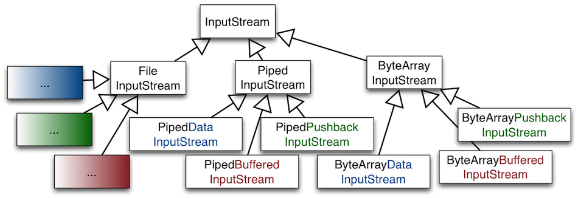

#Inheritance


+~[A Critical View On Inheritance]slide

A Critical View On Inheritance
===

^Inheritance is the main built-in variability mechanism of OO languages.

Common functionality can be implemented by a base class and each variation can be implemented by a separate subclass. 

~+


* In the following, we analyze the strengths and deficiencies of inheritance with respect to supporting variability. 
* Many design patterns that we will discuss in the following sections propose solutions to compensate for deficiencies of inheritance.
* This section serves as a bridge between the block on design principles and the blocks about design patterns and advanced languages.  

##Desired Properties Of Inheritance


+~[Desired Properties]slide

Desired Properties
===

---

Built-in support for OCP.
---

---

Good Modularity.
---

---

Support for structural variations.
---

---

Variations can be represented in type declarations. 
---

---

~+

A good support for OCP, reduces the need to anticipate variations. Inheritance allows replacing the implementation of arbitrary methods of a base class (unless it is explicitly forbidden, e.g., in Java methods can be declared as `final`).

Of course, support for variability in a class is conditioned by the granularity of its methods and the abstractions built-in.

When we achieve good modularity, the base class can remain free of any variation-specific functionality; each variation is implemented in a separate subclass. 

In general, inheritance allows to design the most suitable interface for each variation.
Different variations of a type may need to extend the base interface with variation-specific fields and methods. (In addition to varying the implementation of the inherited base interface.)

The property that variations can be represented in type declarations is necessary for type-safe access of variation-specific interfaces. 


+~[Desired Properties By Example]slide

Desired Properties By Example
===

Variation of selection functionality of table widgets.
---


```Java
class TableBase extends Widget { 
  TableModel model; 
  String getCellText(int row, int col){return model.getCellText(row, col);}
  void paintCell(int r, int c){getCellText(row, col) … } 
}
abstract class TableSel extends TableBase { 
  abstract boolean isSelected(int row, int col); 
  void paintCell(int row, int col) { if (isSelected(row, col)) … }
}
class TableSingleCellSel extends TableSel { 
  int currRow; int currCol; 
  void selectCell(int r, int c){currRow = r; currCol = c;} 
  boolean isSelected(int r, int c){return r == currRow && c == currCol;} 
} 
class TableSingleRowSel extends TableSel { 
  int currRow; 
  void selectRow(int row) { currRow = row; } 
  boolean isSelected(int r, int c) { return r == currRow;} 
} 
class TableRowRangeSel extends TableSel { … } 
class TableCellRangeSel extends TableSel { … } 
```

~+

The modularization of these variations by inheritance is illustrated by the given (pseudo-)code: 
* TableBase implements basic functionality of tables as a variation of common functionality for all widgets, e.g., display of tabular data models. 
* The abstract class `TableSel` extends `TableBase` with functionality that is common for all types of table selection, e.g., rendering of selected cells. 
* `TableSingleCellSel`, `TableSingleRowSel`, `TableRowRangeSel`, and `TableCellRangeSel` implement specific types of table selections. 

**Assessment**

**Built-in support for OCP**:  
The implementation of paintCell in `TableSel` can be overridden.

**Good modularity**:  
Each table selection model is encapsulated in a separate class.

**Support for structural variations:**  
* Different operations and variables are declared and implemented by `TableSingleCellSel` and `TableSingleRowSel`: `currRow`, `currCel`, `selectCell` and `currRow`, `selectRow`, respectively.
* Can design the most suitable interface for each type of table selection. 
* Do not need to design a base interface that fits all future variations.

**Variations can be represented in type declarations:**
* We know that a variable declared with type `TableSingleRowSel` would always refer to a table supporting single row selection.

##Deficiencies of Inheritance

###Non-Reusable, Hard-to-Compose Extensions


+~[Non-Reusable, Hard-to-Compose Extensions]slide

Non-Reusable, Hard-to-Compose Extensions
===

An Extract from Java’s Stream Hierarchy


~+

Consider an extract from `java.io` package that consists of classes for reading from a source. Streams abstract from concrete data sources and sinks:
* `InputStream` is root of stream classes reading from a data source.
* `FileInputStream` implements streams that read from a file.
* `PipedInputStream` implements streams that read from a PipedOutputStream.  
	Typically, a thread reads from a `PipedInputStream` data written to the corresponding `PipedOutputStream` by another thread.
* `ByteArrayInputStream` implements streams that read from memory.

+~[Non-Reusable, Hard-to-Compose Extensions]slide

Non-Reusable, Hard-to-Compose Extensions
===

An Extract from Java’s Stream Hierarchy --  **A Simple Variation**


~+

Need a variation of `ByteArrayInputStream` capable of reading whole sentences and not just single bytes.
We could implement it as a subclass of `ByteArrayInputStream`. The blue part in the name of the class denotes the delta (`DataInputStream`) needed to implement this variation.

Further Variations that are conceivable:
* Reading whole sentences with other kinds of streams:
	* FileInputStream objects that are able to read whole sentences.
	* PipedInputStream should read whole sentences too.
	…
* Writing the given data back (“red” in the following slide)
* Buffering content (“green” in the following slide),
* Counting the numbers of lines processed,
* …	

+~[Non-Reusable, Hard-to-Compose Extensions]slide

Non-Reusable, Hard-to-Compose Extensions
===

An Extract from Java’s Stream Hierarchy --  **A Simple Variation**



>Each kind of variation would have to be re-implemented 
>for all kinds of streams,
>for all meaningful combinations of variations


~+

Assessment: The design is complex and suffers from a huge amount of code duplication.


+~[Non-Reusable, Hard-to-Compose Extensions]slide

Non-Reusable, Hard-to-Compose Extensions
===

^Extensions defined in subclasses of a base class cannot be reused with other base classes.

Result:
* Code duplication
* Maintenance nightmare

~+

A particular type of variation needs to be re-implemented for all siblings of a base type which results in code duplication.

Large number of independent extensions are possible:
* For every new functionality we want.
* For every combination of every functionality we want.

Maintenance nightmare: exponential growth of number of classes.


###Weak Support for Dynamic Variability


+~[Weak Support for Dynamic Variability]slide

Weak Support for Dynamic Variability
===

^Variations supported by an object are fixed at object creation time and cannot be (re-)configured dynamically.

~+


+~[Dynamic Variability Illustrated]slide

Dynamic Variability Illustrated (I)
===

The configuration of an object’s implementation may depend on values from the runtime context. 
---

**Potential Solution:**  
Mapping from runtime values to classes to be instantiated can be implemented by conditional statements.

**Issue:** 
Such a mapping is error-prone and not extensible.  
When new variants of the class are introduced, the mapping from configuration variables to classes to instantiate must be changed.

~+

**Example:**
Table widget options may come from some dynamic configuration panel; depending on the configuration options, different compositions of table widget features need to be instantiated.


+~slide

Dynamic Variability Illustrated (II)
===

The behavior of an object may vary depending on its state or context of use. 
---

**Potential Solution:**  
Mapping from runtime values to object behavior can be implemented by conditional statements in the implementation of object’s methods.

**Issue:**    
Such a mapping is error-prone and not extensible.  
When new variants of the behavior are introduced, the mapping from dynamic variables to implementations must be changed.

~+

**Example:**
An account object’s behavior may vary depending on the amount of money available. The behavior of a service then may need to vary depending on the client’s capabilities.


###The Fragile Base Class Problem

Cf. `Item 17` of Joshua Bloch's, **Effective Java**.


####The Fragile Base Class Problem Illustrated

+~[The Fragile Base Class Problem Illustrated]slide

The Fragile Base Class Problem Illustrated
===

An Instrumented HashSet
---

```Java
import java.util.*;
public class InstrumentedHashSet<E> extends HashSet<E> {
  private int addCount = 0;    
  public InstrumentedHashSet() {    } 
  public InstrumentedHashSet(int initCap, float loadFactor) {
    super(initCap, loadFactor);
  }    

  @Override public boolean add(E e) { addCount++; return super.add(e); }
  @Override public boolean addAll(Collection<? extends E> c) {
    addCount += c.size();
    return super.addAll(c);
  }
  public int getAddCount() { return addCount; }

  public static void main(String[] args) {
    InstrumentedHashSet<String> s = new InstrumentedHashSet<String>();
    s.addAll(Arrays.asList("aaa", "bbb", "ccc"));
    System.out.println(s.getAddCount());
  }
}
```

+~footer
What is printed on the screen?

~+

~+

Suppose we want to implement `HashSets` that know the number of their elements.

We implement a class `InstrumentedHashSet` that inherits from `HashSet` and overrides methods that change the state of a `HashSet` … 

The answer to the question is 6 because the implementation of `addAll` in `HashSet` internally calls `this.add(...)`.  Hence, added elements are counted twice.

+~slide

The Fragile Base Class Problem Illustrated
===

An Instrumented HashSet
---

```Java
import java.util.*;
public class InstrumentedHashSet<E> extends HashSet<E> {
  private int addCount = 0;    
  public InstrumentedHashSet() {    } 
  public InstrumentedHashSet(int initCap, float loadFactor) {
    super(initCap, loadFactor);
  }    

  @Override public boolean add(E e) { addCount++; return super.add(e); } 
  // @Override public boolean addAll(Collection<? extends E> c) {
  //  addCount += c.size();
  //  return super.addAll(c);
  // }
  public int getAddCount() { return addCount; }

  public static void main(String[] args) {
    InstrumentedHashSet<String> s = new InstrumentedHashSet<String>();
    s.addAll(Arrays.asList(“aaa", “bbb", “ccc"));
    System.out.println(s.getAddCount());
  }
}
```

+~footer
Is the counting problem solved, by not overriding `addAll`?

~+

~+

**For the moment** yes. But, not principally. 

What if in the future the designers of `HashSet` decide to re-implement `addAll` to insert the elements of the parameter collection as a block rather than by calling `add` on each element of the collection? Might be necessary for efficiency reasons.


####The Fragile Base Class Problem in a Nutshell


+~[The Fragile Base Class Problem in a Nutshell]slide

The Fragile Base Class Problem in a Nutshell
===

^Changes in base classes may lead to unforeseen problems in subclasses. 


**“Inheritance Breaks Encapsulation”**

~+

_You can modify a base class in a seemingly safe way_. But this modification, when inherited by the derived classes, might cause them to malfunction.

You can't tell whether a base class change is safe simply by examining the base class' methods in isolation. You must look at (and test) all derived classes as well.
You must check all code that uses the base class and its derived classes; this code might also be broken by the changed behavior.

A simple change to a key base class can render an entire program inoperable.

+~slide
The Fragile Base Class Problem in a Nutshell
===

Fragility by dependencies on the self-call structure
---

* The fragility considered so far is caused by dependencies on the self-call structure of the base class.
* Subclasses make assumptions about the calling relationship between `public` and `protected` methods of the base class. 
* These assumptions are implicitly encoded in the overriding decisions of the subclass.
* If these assumptions are wrong or violated by future changes of the structure of superclass’ self-calls, the subclass’s behavior is broken.

+~footer
Is it possible to solve the fragile-base class problem by avoiding assumptions about the self-call structure of the base class in the implementations of the subclasses?

~+

~+


+~slide
The Fragile Base Class Problem in a Nutshell
===

Fragility by addition of new methods.
---

Another kind of fragility is caused by extensions of the base class with new methods that were not there when the class was subclassed. 

**Example:**
* Consider a base collection class.
* To ensure some (e.g., security) property, we want to enforce that all elements added to the collection satisfy a certain predicate.
* We override _every method_ that is relevant for ensuring the security property to consistently check the predicate.
* Yet, the **security may be defeated unintentionally** if a new method is added to the base class which is relevant for the (e.g., security) property.

~+

Several holes of this nature had to be fixed when `Hashtable` and `Vector` were retrofitted to participate in the Java Collection Frameworks.

+~slide
The Fragile Base Class Problem in a Nutshell
===

Fragility by addition of new methods.
---

**Accidental method capture**: A new release of the base class accidentally includes a method with the same name.

Your code does not compile because the new method in the base class has the same signature but a different return type.

Your methods get involved in things you never thought about because the added method has the same signature and return type.

~+


###Taming Inheritance


+~[Taming Inheritance]slide

Taming Inheritance
===

^**Implementation inheritance** (`extends`) is a powerful way to achieve code reuse.

---

^But, if used inappropriately, it leads to fragile software.

~+

Next, we discuss rules of thumb for making "good use" of inheritance.


+~[Dos and Don'ts]slide

Dos and Don'ts
===

* It is always safe to use inheritance within a package.  
The subclass and the superclass implementation are under the control of the same programmers.

* It is also OK to extend classes specifically designed and documented for extension.

* Avoid inheriting from concrete classes not designed and documented for inheritance across package boundaries.

~+


+~[Document for Inheritance]slide

^Design and document for inheritance or else prohibit it.

**Joshua Bloch, Effective Java**

~+


+~[Documenting Self-Use]slide

Classes Must Document Self-Use
===

* Each public/protected method/constructor must indicate self-use:
	* Which overridable methods it invokes.
	* In what sequence.
	* How the results of each invocation affect subsequent processing.
* A class must document any circumstances under which it might invoke an overridable method.  (Invocations might come from background threads or static initializers.)

~+


+~slide

Common Conventions for Documenting Self-Use
===
* The description of self-invocations to overridable methods is given at the end of a method’s documentation comment.

* The description starts with “This implementation …”.   
Indicates that the description tells something about the internal working of the method. 

~+

Overridable method = non-final and either public or protected


+~[Example of Documentation On Self-Invocation]slide

Example of Documentation On Self-Invocation
===

Taken from: `java.util.AbstractCollection`
---

```Java
public boolean remove(Object o)
```

>Removes a single instance of the specified element from this collection.  
>…  
> **This implementation removes the element from the collection using the iterator's remove method.**
> Note that this implementation throws an UnsupportedOperationException if the iterator returned by this collection's iterator() method does not implement the remove(…) method.

+~footer
This documents the contract.

~+

~+

The documentation makes explicit that overriding `iterator()` will affect the behavior of `remove` and what the effect would be.


+~[Documenting Self-Use In API Documentation]slide

Documenting Self-Use In API Documentation
===

^Do implementation details have a rightful place in a good API documentation?

~+

The answer is simple: It depends!
* Keep in mind: There are two kinds of clients of an extensible class:
	* Ordinary clients create instances of the class and call methods in its interface (black-box use).
	* Clients that extend the class via inheritance.

* Ordinary clients should not know such details.  
… At least as long as a mechanism for LSP is in place.
* Subclassing clients need them. That’s their "interface".

**Current documentation techniques and tools lack proper means of separating the two kinds of API documentations.**


+~[Provide And Document Hooks To Internals]slide

Provide And Document Hooks To Internals
===

Example taken from: `java.util.AbstractList`
---

```Java
protected void removeRange(int fromIndex, int toIndex)
```

>Removes from a list …
>  
>This method is called by the clear operation on this list and its sub lists. Overriding this method to take advantage of the internals of the list implementation can substantially improve the performance of the clear operation on this list and its sub lists…  
>This implementation gets a list iterator positioned before `fromIndex` and repeatedly calls `ListIterator.next` and `ListIterator.remove`. Note: If `ListIterator.remove` requires linear time, this implementation requires quadratic time.

~+

A class must document the supported hooks to its internals. These internals are irrelevant for ordinary users of the class. But, they are crucial for enabling subclasses to specialize the functionality in an effective way.


+~[Carefully Design and Test Hooks To Internals]slide

Carefully Design and Test Hooks To Internals
===

* Provide **as few protected methods and fields as possible**
* Each of them represents a commitment to an implementation detail.
* Designing a class for inheritance places limitations on the class.
* Do not provide too few hooks.  
A missing protected method can render a class practically unusable for inheritance.

+~footer
How to decide about the protected members to expose?

~+

~+

W.r.t. designing the internal hooks and making decisions about the kind and number of internal hooks, no silver bullet exists. You have to think hard, take your best guess, and test.

Test your class for extensibility before releasing them. By writing test subclasses (At least one subclass should be written by someone other than the superclass author).


+~[Constructors Must Not Invoke Overridable Methods]slide

^Constructors Must Not Invoke Overridable Methods

~+


+~slide

**Constructors Must Not Invoke Overridable Methods**

- - -

**Java Example**

```Java
class JavaSuper {
  public JavaSuper() { printState(); }

  public void printState() { System.out.println("no state"); }
}

class JavaSub extends JavaSuper {
    private int x = 42; // the result of a tough computation

    public void printState() { System.out.println("x = " + x); }
}

class JavaDemo {
    public static void main(String[] args) {
        JavaSuper s = new JavaSub();
        s.printState();
    }
}
```

+~footer
What is printed? (`printState` is called two times.)

~+

~+

The result is ([The complete code.](Code/src/inheritance/constructors/JavaSuper.java)):
	x = 0
	x = 42

**Problem**: 
An overridable method called by a constructor may get invoked on a non-initialized receiver.
As a result a failure may occur.

**Reason**: 
* The superclass constructor runs before the subclass constructor. 
* The overridden method will get invoked before the subclass constructor has been invoked. 
* The overridden method will not behave as expected if it depends on any initialization done by the subclass constructor.


+~slide

**Constructors Must Not Invoke Overridable Methods**

- - -

**Scala Example (One-to-one translation of the Java code)**

<div style="position:absolute;bottom:20px;right:50px;background:#bbb;padding:1em">
Result:
  <code><pre>
  <strong><s>x = 0</s></strong>
  x = 42
  </pre></code>
</div>

<div style="position:absolute;bottom:245px;right:50px;background:#ffffaa;padding:1em">
Not idiomatic Scala code!
</div>

```Scala
class ScalaSuper {

    // executed at the end of the initialization
    printState();

    def printState() {
        println("no state")
    }
}

class ScalaSub extends ScalaSuper {
    var y: Int = 42 // What was the question?

    override def printState() { println("y = "+y) }
}

object ScalaDemo extends App {
    val s = new ScalaSub
    s.printState() // after initialization
}
```
~+

The complete code: [SuperSubNonIdiomatic.scala](Code/src/inheritance/constructors/SuperSubNonIdiomatic.scala).

For further details: [Scala Language Specification](http://www.scala-lang.org/docu/files/ScalaReference.pdf)


+~slide

**Constructors Must Not Invoke Overridable Methods**

- - -

**Scala Example (Refined using an early field definition clause.)**

<div style="position:absolute;bottom:20px;right:50px;background:#bbb;padding:1em">
Result:<code><pre>
<strong>x = 42</strong>
x = 42
</pre></code></div>

<div style="position:absolute;bottom:200px;right:50px;background:#ffffaa;padding:1em">
Idiomatic Scala code!<br>
An <em>early field definition clause</em><br> is used to define the field value<br> before the supertype<br> constructor is called.
</div>

```Scala
class Super {

    // executed at the end of the initialization
    printState();

    def printState() {
        println("no state")
    }
}

class Sub(var y: Int = 42) extends Super {
    override def printState() {
        println("y = "+y)
    }
}

object Demo extends App {
    val s = new Sub
    s.printState() // after initialization
}
```

~+

The complete code: [SuperSub.scala](Code/src/inheritance/constructors/SuperSub.scala).

For further details: [Scala Language Specification (5.1.6 Early Definitions)](http://www.scala-lang.org/docu/files/ScalaReference.pdf)


Recommended reading: [How Scala Experience Improved Our Java Development]( http://spot.colorado.edu/~reids/papers/how-scala-experience-improved-our-java-development-reid-2011.pdf)

###Variations At The Level Of Multiple Objects


+~[Variations at the Level of Multiple Objects]slide

Variations at the Level of Multiple Objects
===

So far:  
**We considered variations, whose scope are individual classes.**

^But, no class is an island!

~+

Examples of class groupings:
* data structures such as trees and graphs,
* sophisticated frameworks,
* the entire application.

Classes in a group may be related in different ways: 
* by references to each other, 
* by signatures of methods and fields, 
* by instantiation, 
* by inheritance, 
* by shared state and dependencies. 

####Illustrative Example: Window Menus

+~[Illustrative Example: Window Menus]slide

Illustrative Example: Window Menus
===

  


~+

For illustration, we will consider variations of menu structures:
* A menu is a GUI component consisting of a list of menu items corresponding to different application-specific actions. 
* Menus are usually organized hierarchically: a menu has several menu items.
* There may be different variants of menus (popup, menu bar).
* There may be different variants of menu items.
* A menu item can be associated with a cascade menu which pops up when the item is selected.

Menu and menu item objects are implemented by multiple classes that are organized in inheritance hierarchies to represent variations of the elements of the object structure.
* A menu represented by class `Menu` maintains a list of menu items. 
* Subclasses of `Menu` implement specialized menus.
* A `PopupMenu` is a subclass of `Menu` implementing pop-up menus. 
* `MenuBar` is a subclass of `Menu`, implementing a menu bar which is usually attached at the top edge of a window and serves as the top level menu object of the window.
* Simple menu items are implemented by class `MenuItem``
* Subclasses of `MenuItem` implement specialized menu items: 
	* class `CheckMenuItem` for check-box menu items, 
	* class `RadioMenuItem` for radio-button menu items, 
	* `CascadeMenuItem` for menu items that open cascade menus. It contains a reference to an instance of a `PopupMenu`, a subclass of `Menu` implementing pop-up menus. 


+~slide

Different Kinds of Menus
===

```Java
abstract class Menu { 
  List<MenuItem> items; 

  MenuItem itemAt(int i) { 
    return items.get(i); 
  } 

  int itemCount() { return items.size(); } 
  void addItem(MenuItem item) { items.add(item); } 
  void addAction(String label, Action action) { 
    items.add(new MenuItem(label, action)); 
  } 
   ... 
} 

class PopupMenu extends Menu { ... } 

class MenuBar extends Menu { ... } 
```

~+

Classes involved in the implementation of menu functionality refer to each other in the declarations and implementations of their fields and methods. 


+~[Different Kinds of Menu Items]slide

Different Kinds of Menu Items
===

```Java
class MenuItem { 
  String label; 
  Action action; 

  MenuItem(String label, Action action) {
    this.label = label; 
    this.action = action; 
  } 

  String displayText() { return label; } 

  void draw(Graphics g) { … displayText() … }
} 

class CascadeMenuItem extends MenuItem { 
  PopupMenu menu; 

  void addItem(MenuItem item) { menu.addItem(item); } 
  …
} 

class CheckMenuItem extends MenuItem { … }  

class RadioMenuItem extends MenuItem { … }
```

~+


+~[Inheritance for Optional Features of Menus]slide

Inheritance for Optional Features of Menus
===

* Variations of menu functionality affect multiple objects constituting the menu structure.
* Since these objects are implemented by different classes, we need several new subclasses to express variations of menu functionality.
* **This technique has several problems**, which will be illustrated in the following by a particular example variation: Adding accelerator keys to menus. 

~+


Various optional features related to functionality of menus: 
* Support for accelerator keys for a quick selection of a menu item using a specific key stroke, 
* Support for multi-lingual text in menu items,
* Support for context help, 


+~[Menu Items with Accelerator Keys]slide

Menu Items with Accelerator Keys
===

```Java
class MenuItemAccel extends MenuItem { 
  KeyStroke accelKey; 

  boolean processKey(KeyStroke ks) { 
    if (accelKey != null && accelKey.equals(ks)) {  
      performAction(); 
      return true; 
    } 
    return false; 
  } 

  void setAccelerator(KeyStroke ks) { accelKey = ks; }

  void draw(Graphics g) { 
    super.draw(g); 
    displayAccelKey(); 
  }  
  … 
} 
```


~+

The extension of menu items with accelerator keys is implemented in class `MenuItemAccel`, a subclass of `MenuItem`. 

The extension affects both the implementation of existing methods as well as the structure and interface of menu items. E.g., the implementation of the `draw` method needs to be extended to display the accelerator key besides the label of the item.

New attributes and methods are introduced 
* to store the key associated to the menu item, 
* to change this association, 
* to process an input key,
* to display the accelerator key 


+~[Menus with Accelerator Keys]slide

Menus with Accelerator Keys
===

```Java
abstract class MenuAccel extends Menu {

  boolean processKey(KeyStroke ks) { 
    for (int i = 0; i < itemCount(); i++) { 
      if (((MenuItemAccel) itemAt(i)).processKey(ks)) return true;  
    } 
    return false; 
  }

  void addAction(String label, Action action) { 
    items.add(new MenuItemAccel(label, action));
  } 
  …
} 
```

~+

`MenuAccel` implements the extension of menus with accelerator keys: 
* adds the new method `processKey` for processing keys
* overrides method `addAction` to ensure that the new item added for an action supports accelerator keys

####Non-Explicit Covariant Dependencies


+~[Non-Explicit Covariant Dependencies]slide

Non-Explicit Covariant Dependencies
===

**Covariant dependencies between objects:**  
The varying functionality of an object in a group may need to access the corresponding varying functionality of another object of the group.

The type declarations in our design do not express covariant dependencies between the objects of a group. 

References between objects are typed by invariant types, which provide a fixed interface.

_Covariant dependencies are emulated by type-casts_.

```Java
abstract class MenuAccel extends Menu {

  boolean processKey(KeyStroke ks) { 
    for (int i = 0; i < itemCount(); i++) { 
      if (((MenuItemAccel) itemAt(i)).processKey(ks)) return true;  
    } 
    return false; 
  }
  …
} 
```
  

~+

The method `processKey` in a menu with accelerator keys needs to call `processKey` on its items.
* Items of a menu are accessed by calling the method `itemAt`. 
* The method `itemAt` is inherited from class `Menu`, where it was declared with return type `MenuItem`. 
* Thus, to access the extended functionality of menu items, **we must cast the result** of `itemAt` to `MenuItemAccel`. 


The design **cannot guarantee that such a type cast will always be successful**, because items of `MenuAccel` are added over the inherited method `addItem`, which accepts all menu items, both with and without the accelerator functionality.

**Potential for LSP violation!**


####Instantiation-Related Reusability Problems

+~[Instantiation-Related Reusability Problems]slide

Instantiation-Related Reusability Problems
===

**Code that instantiates the classes of an object group cannot be reused with different variations of the group.**

```Java
abstract class Menu { 

  void addAction(String label, Action action) { 
    items.add(new MenuItem( // <= Creates a MenuItem
      label, action
    )); 
  } 
  … 
} 
```

```Java
abstract class MenuAccel extends Menu { 

  void addAction(String label, Action action) { 
    items.add(new MenuItemAccel( // <= Creates a MenuItemAccel
    	label, action
    ));
  } 
  …
}
```

**Instantiation code can be spread all over the application.**

~+

* `MenuItem` is instantiated in `Menu.addAction(...)`. 
* In `MenuAccel`, we override `addAction(...)`, so that it instantiates `MenuItemAccel`. 

A menu of an application can be built from different reusable pieces, provided by different menu contributors.


+~[Menu Contributor for Operations on Files]slide

Menu Contributor for Operations on Files
===
**A menu of an application can be built from different reusable pieces, provided by different menu contributors.**

```Java
interface MenuContributor { 
   void contribute(Menu menu); 
} 
```

```
class FileMenuContrib implements MenuContributor { 

  void contribute(Menu menu) { 
    CascadeMenuItem openWith = new CascadeMenuItem(”Open With”);       
    menu.addItem(openWith);
    MenuItem openWithTE = 
	 new MenuItem(”Text Editor”, createOpenWithTEAction());        
    openWith.addItem(openWithTE);

    MenuItem readOnly = 
        new CheckMenuItem(”Read Only”, createReadOnlyAction()); 
    menu.addItem(readOnly) 
    …  
   } 
   …  
}
```

~+

The code shows the implementation of a menu contributor for operations on files. It implements the method contribute, which extends the given menu object with menu items to open files with different text editors, to change the read-only flag of the file, and so on. Since the menu items are created by directly instantiating the respective classes, this piece of code cannot be reused for menus with support for key accelerators or any other extensions of the menu functionality. 


+~slide

Instantiation-Related Reusability Problem
===

* In some situations, overriding of instantiation code can cause a cascade effect. 
* An extension of class C mandates extensions of all classes that instantiate C.
* This in turn mandates extensions of further classes that instantiate classes that instantiate C. 

+~footer
Can you imagine a workaround to address instantiation-related problems?

~+

~+


+~[Abstract Factory Pattern]slide

Abstract Factory Pattern
===


~+


+~[Factories for Instantiating Objects]slide

Factories for Instantiating Objects
===

```Java
interface MenuFactory { 
  MenuItem createMenuItem(String name, Action action); 
  CascadeMenuItem createCascadeMenuItem(String name); 
  … 
} 
```

The _Abstract Factory design pattern_ enables abstraction from group variations by late-bound instantiation of the classes of the group’s objects.

~+


+~slide

Factories for Instantiating Objects
===

```Java
class FileMenuContrib implements MenuContributor { 

  void contribute(
      Menu menu, 
      MenuFactory factory // <= we need a reference to the factory
  ) { 
    MenuItem openWith = 
        factory.createCascadeMenuItem(”Open With”);
    menu.addItem(openWith); 
    MenuItem openWithTE = factory.createMenuItem(...); 
    openWith.addItem(openWithTE); 
    … 
    MenuItem readOnly = factory.createCheckMenuItem(...);
    menu.addItem(readOnly) 
    … 
  } 
  … 
} 
```

~+


The code of `FileMenuContrib` can be reused with different variations of menu functionality, by using it with different factory implementations.


+~slide

Factories for Instantiating Objects
===

```Java
class BaseMenuFactory implements MenuFactory { 

  MenuItem createMenuItem(String name, Action action) {     
    return new MenuItem(name, action);  
  }

  CascadeMenuItem createCascadeMenuItem(String name) { 
    return new CasadeMenuItem(name); 
  } 
  …
} 
```

---

```Java
class AccelMenuFactory implements MenuFactory { 

  MenuItemAccel createMenuItem(String name, Action action) { 
    return new MenuItemAccel(name, action); 
  } 

  CascadeMenuItemAccel createCascadeMenuItem(String name) {
    return new CasadeMenuItemAccel(name); 
  } 
  …
} 
```

~+


+~[Deficiencies Of The Factory Pattern]slide

Deficiencies Of The Factory Pattern
===

* The infrastructure for the design pattern must be implemented and maintained. 
* Increased complexity of design.
* Correct usage of the pattern cannot be enforced: 
	* No guarantee that classes are instantiated exclusively over factory methods, 
	* No guarantee that only objects are used together that are instantiated by the same factory. 

* Issues with managing the reference to the abstract factory. 
	* The factory can be implemented as a Singleton for convenient access to it within entire application.  
	This solution **would allow to use only one specific variant** of the composite within the same application. 
	* A more flexible solution requires explicit passing of the reference to the factory from object to object.  
	**Increased complexity of design.**

~+

Several studies have shown that the comprehensibility of some code/framework  significantly decreases, when it is no longer possible to directly instantiate objects.

####Combining Composite & Individual Variations

+~[Combining Composite & Individual Variations]slide

Combining Composite & Individual Variations
===

^Problem: How to combine variations of individual classes with those of features of a class composite.


Feature variations at the level of object composites (e.g., accelerator key support).

Variations of individual elements of the composite (e.g., variations of menus and items).

~+


+~[Menu Items with Accelerator Keys]slide

Menu Items with Accelerator Keys
===

```Java
class MenuItemAccel extends MenuItem { 
```
```no-highlight
    KeyStroke accelKey; 
    boolean processKey(KeyStroke ks) { 
      if (accelKey != null && accelKey.equals(ks)) {  
        performAction(); 
        return true; 
      } 
      return false; 
    } 
    void setAccelerator(KeyStroke ks) { accelKey = ks; } 
    void draw(Graphics g) { super.draw(g); displayAccelKey(); }  
    …
```    
```Java  
} 

class CascadeMenuItemAccel extends ???
class CheckMenuItemAccel extends ???
class RadioMenuItemAccel extends ???
```

+~footer
How to extend subclasses of `MenuItem` for different variants of items with the accelerator key feature? 

We need subclasses of them that also inherit the additional functionality in `MenuItemAccel`.

~+

~+

+~[Menus with Accelerator Keys]slide

Menus with Accelerator Keys
===

```Java
abstract class MenuAccel extends Menu { 
```
```no-highlight
  boolean processKey(KeyStroke ks) { 
    for (int i = 0; i < itemCount(); i++) { 
      if (((MenuItemAccel) itemAt(i)).processKey(ks)) return true;  
    } 
    return false; 
  } 

  void addAction(String label, Action action) { 
    items.add(new MenuItemAccel(label, action));
  } 
  …
```
```Java
}

class PopupMenuAccel extends ??? 
class MenuBarAccel extends ???
```


+~footer
How to extend subclasses of Menu with the accelerator key feature? 

We need subclasses of them that also inherit the additional functionality in `MenuAccel`.

~+

~+


+~[Combining Composite & Individual Variations]slide

^In languages with single inheritance, such as Java, combining composite & individual variations is non-trivial and leads to code duplication.

~+


+~[The Problem in a Nutshell]slide
The Problem in a Nutshell
===


* We need to extend `A` (and parallel to it also its subclasses `B` and `C`) with an optional feature (_should not necessarily be visible to existing clients_).
* This excludes the option of modifying `A` in-place, which would be bad anyway because of OCP.

~+


+~slide

Alternative Designs
===

 

---


~+


There are two possibilities ( (I) creating a parallel hierarchy or (II) creating additional subclasses of `B` and `C`) to add an optional feature to `A` incrementally without affecting clients in a single inheritance setting. 

In both cases, code needs to be duplicated which leads to a maintenance problem.


+~slide

Combining Composite and Individual Variations
===
Using some form of multiple inheritance
---

```Java
class PopupMenuAccel extends PopupMenu, MenuAccel { } 
class MenuBarAccel extends MenuBar, MenuAccel { }
```

```Java
class CascadeMenuItemAccel extends CascadeMenuItem, MenuItemAccel {    
  boolean processKey(KeyStroke ks) { 
    if (((PopupMenuAccel) menu).processKey(ks) ) return true;  
    return super.processKey(ks); 
  } 
} 

class CheckMenuItemAccel extends CheckMenuItem, MenuItemAccel { ... }
class RadioMenuItemAccel extends RadioMenuItem, MenuItemAccel { ... }
```

+~footer
Does this solve our problem?

~+

~+

^The design with multiple inheritance has its problems.

It requires additional class declarations that explicitly combine the extended element class representing the composite variation with sub-classes that describe its individual variations. 
* Such a design produces an excessive number of classes.
* The design is also not stable with respect to extensions with new element types.
* The developer must not forget to extend the existing variations of the composite with combinations for the new element types. 

####Summary


+~[Summary]slide

Summary
===

* General agreement in the early days of OO:  
**Classes are the primary unit of organization.**
	* Standard inheritance operates on isolated classes.
	* Variations of a group of classes can be expressed by applying inheritance to each class from the group separately. 

* Over the years, it turned out that sets of collaborating classes are also units of organization. In general, extensions will generally affect a set of related classes.

~+

+~slide
^(Single-) Inheritance does not appropriately support OCP with respect to changes that affect a set of related classes!


^Almost all features that proved useful for single classes are not available for sets of related classes.

~+

Mainstream OO languages have only insufficient means for organizing collaborating classes: packages, name spaces, etc. These structures have serious problems:
* No means to express variants of a collaboration.
* No polymorphism.
* No runtime semantics.


+~[Desired Features]slide

Desired Features
===

* **Incremental programming at the level of sets of related classes.**  
In analogy to incremental programming at the level of individual classes enabled by inheritance. _(I.e., we want to be able to model the accelerator key feature by the difference to the default menu functionality.)_

* **Polymorphism at the level of sets of related classes → Family polymorphism.**  
In analogy to subtype polymorphism at the level of individual classes.
_(I.e., we want to be able to define behavior that is polymorphic with respect to the particular object group variation.)_

~+


+~[Family Polymorphism]slide

"Family Polymorphism"
===


We want to avoid:
* code duplication
* casts
* the necessity to re-implement methods (e.g. `addAction`)

**Ideally would like to have several versions of class definitions - one per responsibility - which can be mixed and matched on-demand.**

   <div style="position:absolute;bottom:0;right:0;background:#bbb;border:0 0;margin: 0 0;padding: 0.5em 0.5em">
Recall the SmartHome example.
   </div>

~+

The question may arise whether this is this a real problem or not. As we will see in the following it is a very real problem which even shows up in mature deployed software.

####Case Study: Java AWT and Swing

Some of the material used in the following originally appeared in the paper: Bergel et al, _Controlling the Scope of Change in Java_, **International Conference on Object-Oriented Programming Systems Languages and Applications 2005**

AWT is a GUI framework that was included in the first Java release and which directly interfaces the underlying operating system. Therefore, only a small number of widgets are supported to make code easier to port.

Swing extends AWT core classes (by subclassing) with functionality such as: "pluggable look and feel" and "double buffering". The Swing-specific support for double buffering to provide smooth flicker-free animation is implemented, among others, in the methods `update()`, `setLayout()`, etc.. Furthermore, Swing adds more widgets.


+~[The Design of AWT and Swing]slide

The Design of AWT and Swing
===

  

A small subset of the core of AWT (`Component`, `Container`, `Frame`, `Window`) and Swing.

~+

**Issues:**
* Features defined in `JWindow` are duplicated in `JFrame`. Due to the absence of an inheritance link between `JFrame` and `JWindow` (`JWindow`: 551 LOC; `JFrame`: 829 LOC, 241 lines of code are duplicated; 43% of `JWindow` reappears as 29% of `JFrame`.
* While a `Window` is a `Component` in AWT, a `JWindow` is not a `JComponent` in Swing.
* While a `Button` is a Component and `JButton` is a `JComponent`, a `JButton` is not a `Button`!
* A Swing `Component` is a `Container` for other components.  
_Feature inherited from `Container` (`JComponent extends Container`)._
* Types of subcomponents in `Container` are `Component` not `JComponent`.
* Ubiquitous runtime type checks and type casts are the result!


+~[AWT Code]slide

AWT Code
===

```Java
public class Container extends Component {
  int ncomponents;
  Component components[] = new Component[0];
   
  public Component add (Component comp) {
    addImpl(comp, null, -1);
    return comp;
  }

  protected void addImpl(Component comp, Object o, int ind) {
    …
    component[ncomponents++] = comp;
    …
  }

  public Component getComponent(int index) {
    return component[index];
  }
}
```

+~footer 
The code contains no type checks and/or type casts.

~+

~+


+~[Swing Code]slide

Swing Code
===

```Java
public class JComponent extends Container {

  public void paintChildren (Graphics g) {
    …
    for (; i > = 0 ; i--) {
      Component comp = getComponent (i);
      isJComponent = (comp instanceof JComponent); // type check
      …
      ((JComponent)comp).getBounds(); // type cast
      …
    }
  }
}
```

+~footer 
The code contains (many) type checks and/or type casts.

~+

~+


+~[About the Development of Swing]slide

About the Development of Swing
===

>“In the absence of a large existing base of clients of AWT, Swing might have been designed differently, with AWT being refactored and redesigned along the way.
>
>Such a refactoring, however, was not an option and we can witness various anomalies in Swing, such as duplicated code, sub-optimal inheritance relationships, and excessive use of run-time type discrimination and downcasts.”

~+

##Takeaway


+~[Takeaway]slide

Takeaway I
===

* Inheritance is a powerful mechanism for supporting variations and stable designs in presence of change.  
Three desired properties:
	* **Built-in support for OCP** and reduced need for preplanning and abstraction building.
	* **Well-modularized** implementations of variations.
	* **Support for variation of structure/interface** in addition to variations of behavior.
	* **Variations** can participate in **type declarations**.

~+
	
+~slide

Takeaway II
===

* Inheritance has also deficiencies
	* **Variation implementations are not reusable and not easy to compose.**
		* Code duplication.
		* Exponential growth of the number of classes; complex designs.
	* **Inheritance does not support dynamic variations** – configuring the behavior and structure of an object at runtime.
	* **Fragility of designs** due to lack of encapsulation between parents and heirs in an inheritance hierarchy.
	* **Variations that affect a set of related classes are not well supported.**  
	
~+

##Outlook

+~[Outlook]slide
Virtual Classes in Scala
===
(Work in Progress)
---


```scala
@virtualContext class Building {
  @virtual abstract class Location { }
  
  @virtual abstract class CompositeLocation extends Location {
    type T <: Location
    var locations: List[T] = List()
  }
  
  @virtual class Room extends Location { }
  
  @virtual class Floor extends CompositeLocation {
    type T = Room
  }
  
  @virtual class Building extends CompositeLocation {
    type T = Floor
  }
}
```
+~footer
Not relevant for the exam.
~+

~+

+~slide
Virtual Classes in Scala 
===
(Work in Progress)
---


```scala
class Light { def turnOn() {  ...  }; def turnOff() { ... }; }

@virtualContext class Lights extends Building {
  @virtual abstract class Location {
    var _lights: List[Light] = List()
    
    def lights: List[Light] = _lights

    def turnLightsOn = lights.foreach(_.turnOn())

    def turnLightsOff = lights.foreach(_.turnOff())
  }
  
  @virtual abstract class CompositeLocation {
    override def lights: List[Light] = 
    	_lights ++ locations.flatMap(location => location.lights)
  }
}
```
+~footer
Not relevant for the exam.
~+

~+

+~slide
Virtual Classes in Scala 
===
(Work in Progress)
---

```scala
class Shutter { def raise() { ... }; def lower() { ... }; }

@virtualContext class Shutters extends Building {
  @virtual abstract class Location {
    var _shutters: List[Shutter] = List()
    def shutters: List[Shutter] = _shutters

    def lower = shutters.foreach(_.lower)

    def raise = shutters.foreach(_.raise)
  }
  
  @virtual abstract class CompositeLocation {
    override def shutters: List[Shutter] = _shutters ++ locations.flatMap(location => location.shutters)
  }
}
```
+~footer
Not relevant for the exam.
~+

~+

+~slide
Virtual Classes in Scala 
===
(Work in Progress)
---

```scala
@virtualContext class LightsAndShutters extends Lights with Shutters { }

@virtualContext class Estate extends Building with Lights with Shutters {
  @virtual class Garage extends Location {
    def Car = "Audi R8"
  }
}
```
+~footer
Not relevant for the exam.
~+

~+


