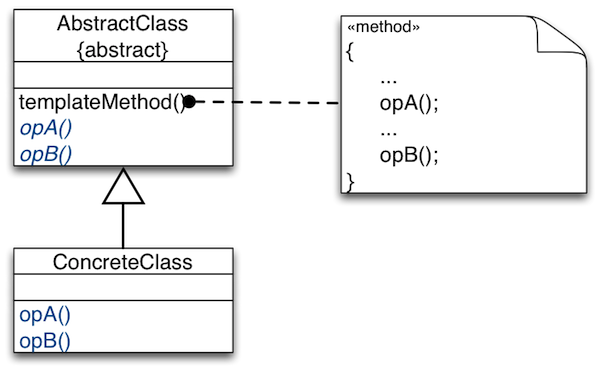

##Template-Method Design Pattern


+~[The Template-Method Pattern in a Nutshell]slide

The Template-Method Pattern in a Nutshell
===

**Intent:**
* Separate high-level policies from detailed low-level mechanisms.
* Separate invariant from variant parts.

  
  
**Solution Idea:**  
Use abstract classes to: 
* Define interfaces to detailed mechanisms and variant parts.
* Implement high-level policies and invariant parts to these interfaces.
* Control sub-class extensions.
* Avoid code duplication.

~+

The Template-Method Pattern plays a key role in the design of object-oriented frameworks.


+~[Example Application of Template Method]slide

Example Application of Template Method
===

**Functional requirements:**
* Need a family of sorting algorithms …
(bubble sort, quick sort, etc.)
* for different kinds of data (int, double, etc.)
* Clients that use sorting algorithms should be reusable with a variety of specific algorithms.

**Non-functional requirements on the design**
* Need to separate the high-level „sorting“ policies from low-level mechanisms.
* Low-level mechanisms are responsible for:
	* deciding when an element is out of order,
	* swapping out-of-order elements.

~+


+~[Separating the Policy of Sorting]slide

Separating the Policy of Sorting
===

  

```Java
public abstract class BubbleSorter {
  protected int length = 0;
```

  _Policy_:  
```Java
  protected void sort() {
    if (length <= 1) return;
      for (int nextToLast = length - 2; nextToLast >= 0; nextToLast--)
        for (int index = 0; index <= nextToLast; index++)
          if (outOfOrder(index)) swap(index);
  }
```

  _Mechanisms_:
```Java
  protected abstract void swap(int index);
  protected abstract boolean outOfOrder(int index);
```

```Java
}
```

~+

Implement the sorting policy in a template method, `sort`. Hide mechanisms needed for implementing the sorting policy behind abstract methods (`outOfOrder` and `swap`), which are called by the template method.

+~[Filling the Template for Specific Algorithns]slide

Filling the Template for Specific Algorithns
===

  

```Code
public class IntBubbleSorter 
  extends BubbleSorter {
	  
  private int[] array = null;

  public void sort(int[] theArray) {
    array = theArray;
	length = array.length;
    super.sort();
  }
  protected void swap(int index) {
    int temp = array[index];
    array[index] = array[index + 1];
    array[index + 1] = temp;
  }
  protected boolean outOfOrder(int index) {
    return (array[index] > array[index + 1]);
  }
}
```

+~footer
What are the advantages and deficiencies of the Template-Method Pattern?

~+

~+

The advantages and deficiencies of the Template-Method Pattern are basically those of inheritance:
**Template method forces mechanisms to extend a specific policy.**
* Implementation of low-level mechanisms depends on the template.
* Cannot re-use low-level mechanisms functionality.  
`swap` and `outOfOrder` implemented in `IntBubbleSorter` may be useful in other contexts as well, e.g., for quick sort.

+~[Template Method Pattern in Log4J]slide

Template Method Pattern in Log4J
===

  

**`interface Appender`**  
Implement this interface for your own strategies for outputting log statements.
[…]  

`public void doAppend(LoggingEvent event)`  
Log in Appender specific way.  

**`abstract class AppenderSkeleton implements Appender`**  
Abstract superclass of the other appenders. This class provides the code for common functionality, such as support for threshold filtering and support for general filters.
[…]  

`protected abstract void append(LoggingEvent event)`  
Subclasses should implement this method to perform actual logging.  

`public void doAppend(LoggingEvent event)`  
This method performs threshold checks and invokes filters before delegating actual logging to the append(LoggingEvent) method.

~+

+~[Functional Counterpart of Template]slide

Functional Counterpart of Template
===

One can look at the Template-Method Pattern as a style for emulating higher-order functions available in programming languages that support functional-style programming.

---

Alternative design for Log4J in Scala**?**

```Scala
class AppenderSkeleton(
  private val append : (LoggingEvent) => Unit
) {
  def doAppend(loggingEvent : LoggingEvent) {
    // filtering, threshold checks, …
    append(loggingEvent)
  }
}
```

+~[Higher-order Functions]aside
**_Higher-order function_: A function parameterized by other functions.**
* _First-order functions_ abstract over variations in data.
* _Higher-order functions_ abstract over variations in sub-computations.
* _First-class functions_ are values that can be passed as parameters and returned as results.
 
~+

~+
 
Whether this is a feasible design or not requires a detailed analysis of the context; i.e., the `AppenderSkeleton` class. In this case, the method `close` indicates that an `Appender` may be in different states which suggests that the standard implementation approach is best suited (also in Scala).


