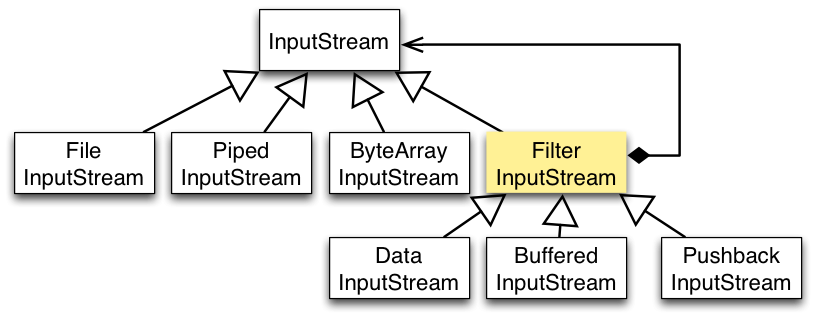

##Decorator Design Pattern

###Intent of the Decorator Pattern


+~[Intent of the Decorator Pattern]slide

Intent of the Decorator Pattern
===

We need to **add functionality to existing objects**
* **dynamically**, i.e., during runtime after the object is created,
* **without having to implement conditional logic** to use the new functionality.

~+

The usual way to add new functionality to an existing design is by means of inheritance. But, as we have already discussed, dynamic extensions are not supported, the extensions are non-reusable, and multiple extensions are hard to combine.

These problems are targeted by Decorator. Decorator is also suggested to solve the fragile base-class problem. 

Decorator can be an alternative to Strategy with different trade-offs.

###The Decorator Pattern in a Nutshell

+~[The Structure of a Decorator-Based Design]slide

The Structure of a Decorator-Based Design
===


~+

* `ConcreteComponent` is a representative for all classes whose objects should be dynamically extensible with new functionality.

* `Component` can be: 
	* an interface that declares all operations of `ConcreteComponent` objects whose functionality we want to extend dynamically (here represented by operation),
	* a common (abstract) superclass of all `ConcreteComponent` classes, which implements common functionality.

* Any `Decorator` is also a `Component`: 
	* Maintains a field `comp` of type `Component`
	* Implements the operations declared in `Component`
	* Default implementation forwards the same operation to `comp`.  
	* Special decorators perform some additional functionality  before or after forwarding to `comp`.


+~[The Decorator Pattern by Example]slide

The Decorator Pattern by Example
===



**Example Code**

```Java
DataInputStream dis = new DataInputStream(new FileInputStream(file));

dis.readUnsignedByte();
```

~+

`java.io` abstracts various data sources and destinations.

It uses Decorator to modularize various processing algorithms that operate on raw data.

###Advantages of Decorator-Based Designs


+~[Each Variation Defined Once: No Code Duplication]slide

Each Variation Defined Once
===
No Code Duplication
---

<div style="background-color:#fcc">
  Using inheritance only:
   
</div>
  
  <div style="clear:both"></div>

---

  
  Using the Decorator Pattern:
  

~+

Decorator-based designs share the desired properties of corresponding designs based on inheritance only that **variations are well modularized**. We define one class per variation of base and decorative functionality.

Unlike inheritance-based designs, decorator-based designs yield **variations that are reusable** with any class in the Component hierarchy. Furthermore, **variations are applied dynamically**.


+~[Improved Flexibility]slide

Improved Flexibility
===

* Decorative functionality can be added / removed at run-time.

* Combining different decorator classes for a component class enables to mix and match responsibilities as needed.
```Java
…
is = new FileInputStream(file);
is.read(…);
…
DataInputStream dis = new DataInputStream(is);
dis.readUnsignedByte();
… 
(new BufferedInputStream(dis)).readLine(…);
```

* Easy to add functionality twice.  
E.g., given a class `BorderDecorator` for a `TextField`, to add a double border, attach two instances of `BorderDecorator`.


~+


+~[Decorator Avoids Incoherent Classes]slide

Decorator Avoids Incoherent Classes
===

No need for feature-bloated classes positioned high up in the inheritance hierarchy to avoid code duplication.

Pay-as-you-go approach: Do not bloat, but extend using fine-grained Decorator classes.
* Functionality can be composed from simple pieces.
* A client does not need to pay for features it does not use.

~+

+~[Advantages of Decorator-Based Designs]slide

Advantages of Decorator-Based Designs
===

^A fine-grained Decorator hierarchy is easy to extend.  

---

^Decorator helps to design software that better supports OCP.

~+

###Problems of Decorator-Based Designs

+~[Problems of Decorator-Based Designs]slide

Problems of Decorator-Based Designs
===

**Lots of Little Objects**

---

**A decorator and its component are not identical (Object identity)**

```Java
FileInputStream fin = new FileInputStream(“a.txt”);
BufferedInputStream din = new BufferedInputStream(fin);
…
fin.read(); // NO BUFFERING
```

---

**No Late Binding**

+~[Forwarding vs. Delegation]aside
<div style="float:left;width:45%">
  <h1>Forwarding</h1>
  
  Forwarding with binding of this to method holder; "ask" an object to do something on its own.
  </div>
  <div style="float:right;width:45%">
  <h1>Delegation</h1>
  
  Binding of this to message receiver: “ask” an object to do something on behalf of the message receiver.
</div>	  
 
~+

~+

* Lots of little objects:
	* A design that uses Decorator often results in systems composed of lots of little objects that all look alike. Objects differ only in the way they are interconnected, not in their interface or in the value of their variables. 
	* Such systems are easy to customize by those who understand them, but can be hard to learn and debug. The responsibility for combining features is put on the shoulders of a library user.
* Object identity (A decorator and its component are not identical!):
	* From an object identity point of view, a decorated component is not identical to the component itself.
	* You should not rely on object identity when you use decorators.
	* Easy to "forget" the "decorative" functionality.
* No late binding:
	* A decorator and its component interact via forward semantics. 
	* Forward semantics does not ensure late binding as we know from inheritance.
	* Delegation semantics is not available in mainstream class-based OO languages.


+~[No Late Binding Illustrated]slide

No Late Binding Illustrated
===

  

**Task**:

_Extend the design to enable online access to accounts._

Decorator seems to be the right choice!

Among other things, we decorate the description of accounts with the label “online”.

The way the history is calculated does not need to be decorated, hence, the decorator just forwards. 

~+

The diagram shows a simplified extract of the design of a banking application:
* There are two kinds of accounts: 
	* Checking accounts for day-to-day bank transactions.
	* Saving accounts for depositing money with a fixed interest rate.
* Accounts know how to return a string that describes them.
* Accounts declare a method for printing a history of recently performed transactions.

+~slide

No Late Binding Illustrated
===


+~footer
Do you see where we hit the "no-late binding" problem?

~+

~+


+~slide

No Late Binding Illustrated
===

Consider the following client code:

  

```Java
…
Account checkingAcc = 
  new CheckingAccount(…);

…
Account onlineAcc = 
  new OnlineAccount(
    checkingAccount);

…
onlineAcc.printHistory();
…
```

+~footer
Does the call to `printHistory` on `onlineAcc` behave as expected?

~+

~+

**Answer**: OnlineDecorator decorates getType(). Yet, since CheckingAccount.printHistory() calls getType() via this, the execution escapes the decoration of getType().
>Call to onlineDec.printHistory().
>
> a) Call to checkingAcc.printHistory() as the result of the forwarding by the call to account.printHistory() in the implementation of OnlineDecorator.printHistory().
>
> b) Execution of CheckingAccount.printHistory(). Call to getType() inherited from Account, not OnlineAccount!


###Implementation Issues


+~[Implementation Issues]slide

Implementation Issues
===

+~highlight 

Keep the common class (Component) lightweight!
---

---

A decorator's interface must conform to the interface of the component it decorates.
---

---

There is no need to define an abstract Decorator class when you only need to add one responsibility.

~+

~+

The common class should focus on defining an interface. Defer defining data representation to subclasses. Otherwise, the complexity of Component might make the decorators too heavyweight to use in quantity.
Putting a lot of functionality into Component makes it likely that subclasses will pay for features they do not need.
These issues require pre-planning. Difficult to apply the decorator pattern to 3rd-party component class.

It is often the case that you do not need to define an abstract Decorator class when you're dealing with an existing class hierarchy rather than designing a new one. In this case, you can merge Decorator's responsibility for forwarding requests to the component into the concrete Decorator.


###Decorator and the Fragile Base-Class Problem


+~[Decorator and the Fragile Base-Class Problem]slide

Decorator and the Fragile Base-Class Problem
===

The Decorator pattern is suggested in several books (e.g., *Effective Java* by Joshua Bloch) as a solution to the fragile base-class problem.

^Does the use of the Decorator Pattern solve the fragile base-class problem?

~+

+~slide
The `InstrumentedHashSet` again…
===

```Java
public class InstrumentedHashSet<E> extends java.util.HashSet<E> {
  private int addCount = 0;    
  …
  @Override public boolean add(E e) {        
    addCount++;
    return super.add(e);
  }    
  @Override public boolean addAll(java.util.Collection<? extends E> c) {
    addCount += c.size();
    return super.addAll(c);
  }
  public int getAddCount() {
    return addCount;
  }
}
…
public static void main(String[] args) {
  InstrumentedHashSet<String> s = new InstrumentedHashSet<String>();
  s.addAll(Arrays.asList("aaa", "bbb", "ccc"));
  System.out.println(s.getAddCount());
}
```

+~footer
Ask yourself (again): What is printed on the screen?

~+

~+


+~[A Decorator-Based `InstrumentedSet`]slide

A Decorator-Based `InstrumentedSet`
===

1. Declare an interface `Set<E>`
2. Let `HashSet<E>` implement `Set<E>`
3. Define `ForwardingSet<E>` as an implementation of `Set<E>`
4. `ForwardingSet<E>` (our root Decorator)
	* Has a field `s` of type `Set<E>`
	* Implements methods in `Set<E>` by forwarding them to `s`
5. `InstrumentedSet<E>` (a concrete Decorator) extends `ForwardingSet<E>` and overrides methods `add` and `addAll`

+~[Recipe For Using Decorator]aside
Instead of inheriting from a class `C` to define `EC`:
* Declare the interface of `C`, `IC`
* Let `C` implement `IC`
* If more than one decoration is planned:
	* Let a class `ForwardingC` implement `IC`.
	* `ForwardingC` has a field `ic` that holds an object of type `IC`.
	* `ForwardingC` implements methods in `IC` by forwarding to `ic`. 
	* Let `EC` extend `ForwardingC` and override methods in `IC` affected by the extension.
* Otherwise:
	* Let `EC` implement `IC`.
	* `EC` has a field ic that holds an object of type `IC`.
	* `EC` implements methods in IC affected by the extension and forwards the rest to `ic`. 
	
~+

~+


+~[A `ForwardingSet<E>`]slide

A `ForwardingSet<E>`
===

```Java
import java.util.*;
public class ForwardingSet<E> implements Set<E> {
  private final Set<E> s;

  public ForwardingSet(Set<E> s) { this.s = s; }
  public void clear() { s.clear();}
  public boolean contains(Object o) { return s.contains(o); }
  public boolean isEmpty(){ return s.isEmpty();}
  public int size(){ return s.size();}
  public Iterator<E> iterator(){ return s.iterator();}
  public boolean add(E e){ return s.add(e);}
  public boolean remove(Object o) { return s.remove(o);}
  public boolean containsAll(Collection<?> c) { ... }
  public boolean addAll(Collection<? extends E> c) { ... }
  public boolean removeAll(Collection<?> c) {...}
  …
}
```

~+


+~[An Alternative `InstrumentedSet`]slide

An Alternative `InstrumentedSet`
===

```Java
import java.util.*;
public class InstrumentedSet<E> extends ForwardingSet<E> {
  private int addCount = 0;
  public InstrumentedSet(Set<E> s) { super(s); }
  @Override public boolean add(E e) {
    addCount++;
    return super.add(e);
  }
  @Override public boolean addAll(Collection<? extends E> c){
    addCount += c.size();
    return super.addAll(c);
  }
  public int getAddCount() { return addCount; }
}
public static void main(String[] args) {
  InstrumentedSet<String> s =
    new InstrumentedSet<String>(new HashSet<String>());
  s.addAll(Arrays.asList("aaa", "bbb", "ccc"));
  System.out.println(s.getAddCount());
}
```

+~footer
What is printed on the screen?

~+

~+

In this case, the value `3` is printed on the screen. The internal call to add in the implementation of `addAll` in `HashSet` does not come back to the decorater `s`; hence, it does not increase the counter.

**Bloch's Conclusion**:
The Decorator-based solution is better.  
There are only few disadvantages:
* No late binding.
* Tedious to write forwarding methods, „but you do it only once“.
* Efficiency impact of forwarding and memory footprint, but „_neither turns out to have much impact in practice_“


+~[Decorator and the Fragile Base Class]slide

Decorator and the Fragile Base Class
===

^Does the decorator-based design really solve the fragile base-class problem?

~+

**Ask yourself**:

What happens if I add a new method to the interface?  
Doesn‘t the same problems reappear as with inheritance?

* Adding a method to the interface may escape the decoration (e.g., imagine a method `add(Collection,Filter)` is added to `Set<E>` and to `ForwardingSet<E>`; after that all compile-time requirements are satisfied, but `InstrumentedSet<E>` does not override the method and, hence, does not update the counter correctly.)
* "Some logic" needs to be reimplemented. E.g., imagine that a method is added to set a filter (`setFilter(Filter)`) and after that always only those elements are added to the set that pass the filter. Such a change would require to duplicate the logic in our decorator.
* Adding a method to the interface may conflict (signature) with the methods defined by the concrete decorator.


### Decorator and Strategy


+~[Decorator and Strategy]slide

Decorator and Strategy
===

Decorator and Strategy share the goal of **supporting dynamic behavior adaptation**. 


~+

Decorator and Strategy can be used to simulate the effect of each other.


+~[Simulate the Effect of Each Other]slide

Simulate the Effect of Each Other
===

By extending the number of strategies from just one to an open-ended list, we achieve principally the same effect as nesting decorators.


~+


**Example**: 
* We can use Strategy to simulate data processing decoration of streams.
* Different processing steps can be supported by having the component forward data-processing functionality to a `DataProcessing` object, which in turn may encapsulate another `DataProcessing` object. (`DataProcessing` objects encapsulate data-processing strategies.)

+~[Transparent vs. Non-Transparent Change]slide

Transparent vs. Non-Transparent Change
===


**Decorator changes a component from the outside**:  
The component does not know about its decorators.


---

**Strategy changes a component from the inside**:  
Component knows about Strategy-based extensions.


~+


####Changing the Skin versus Changing the Guts

Decorator can be viewed as a skin over an object that changes its behavior.

Strategy can be viewed as guts inside an object that changes its behavior.

####Preferring Decorator over Strategy
**The Decorator has two principal advantages over Strategy:**

1. **Improved modularity**: The Decorator “infrastructure” does not leave any footprint in the implementation of the decorated object.
2. **Extensible interface**: Decorators can extend the interface of the decorated component “on-demand”; No need to plan an “one-size-fits-all” interface.   

Consequently, the decorator is better when:
* We cannot foresee variations. 
* It is hard to design an interface that fits all needs of the variations.

####Preferring Strategy over Decorator
**The Strategy pattern is better when the varying object type is intrinsically heavyweight.**

The Decorator pattern is too costly to apply in this case. A Decorator's interface must conform to Component's interface.

A Strategy can have its own specialized interface. E.g., a strategy for rendering a border need only define the interface for rendering a border (`drawBorder()`, `getWidth()`, …).

Furthermore, a Strategy class can be lightweight even if the Component class is heavyweight.

####Summary

+~[Takeaway Decorator vs. Strategy]slide

Takeaway Decorator vs. Strategy
===

Like the Strategy, the Decorator pattern also uses a combination of object composition and inheritance/subtype polymorphism to support dynamic and reusable variations.

Unlike the Strategy, it adapts object behavior from the outside rather than inside.
Unlike Strategy, variations encapsulated in decorator objects do not leave any footprint in the behavior of the objects being adapted.

In that sense, it has a stronger “inheritance” resemblance than Strategy. 

~+


###Takeaway


+~[Takeaway]slide

Takeaway
===

Decorator has its own trade-offs.

Decorator may lead to error-prone and hard to understand designs.
* Many little objects emulate the behavior of a conceptually single object.
* No object identity.
* No late-binding.

* Not appropriate for modeling the variability of heavy-weight objects with a lot of functionality. 
* Might not be applicable to third-party library objects.

* It does not really solve the fragile base-class problem.

~+


###Delegation and Mixin-Composition


+~[A "Static" Decorator]slide

A "Static" Decorator
===

Using mixins we can statically decorate classes (class composition vs. object composition) and also get delegation semantics. 

```Scala
trait Component {
  def state : String
  def name: String
}
case class AComponent (val id : String) extends Component {
    def state = name+":"+id
    def name = "A"
}
trait ComponentDecoratorA extends Component {
    abstract override def name = "ByADecorated:"+super.name
}
trait ComponentDecoratorB extends Component {
    abstract override def name = "ByBDecorated:"+super.name
}

object DemoStructuralDecorator extends App {
  val c = new AComponent("42")   // static decoration
              with ComponentDecoratorA with ComponentDecoratorB 
  println(c.state)
}
```

+~footer
Output: `ByBDecorated:ByADecorated:A:42`

~+

~+

**Assessment**:

* Each Decorator is well modularized
* We get delegation semantics.
* No overhead (no little objects).
* No dynamic decoration.

**Task**: Apply this example to the `Account` example.
 
Ask yourself: Does **Mixin-Composition** solve the fragile base-class problem?

Further reading: [Stackable Traits](http://www.artima.com/scalazine/articles/stackable_trait_pattern.html)

