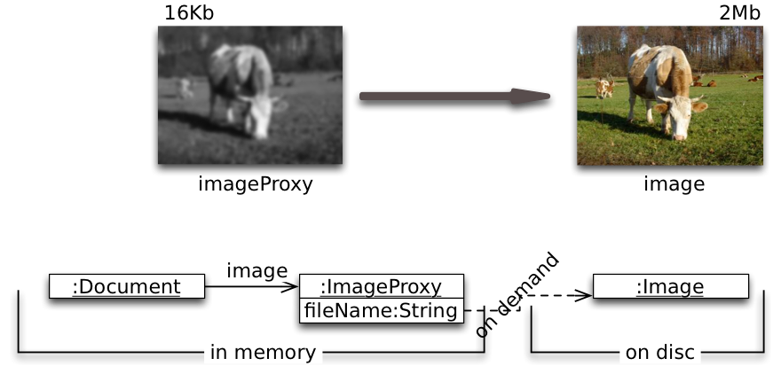

##Proxy Design Pattern

###Intent

+~[Intent]slide

Intent
===

^Provide a surrogate or placeholder for another object to control access to it.

~+

From the client’s point of view, the proxy behaves just like the actual object.

###Typical Variations

####Virtual Proxies: Placeholders (as in image example).
**Idea** 

Create expensive objects only on demand.
Objects associated with a large amount of data in a file or database may only be loaded into memory if the operation on the proxy demands that they are loaded.

**Implementation**

Some subset of operations may be performed without bothering to load the entire object, e.g., return the extent of an image.

####Smart References: Additional functionality.
**Idea**

Replace bare pointer and provide additional actions when accessed.

**Examples**

* Locking / unlocking references to objects used from multiple threads
* Reference counting, e.g., for resource management (garbage collection, observer activities)


####Remote Proxies: Make distribution transparent.
**Idea**

Provide a local interface for communicating with objects in a different address space.
Operations on the proxies are delegated to a remote object and return values are passed through the proxy back to the client.

**Issues**

From the client’s view, the proxy responds just like if the object were local, even though it is actually sending requests over a network.  
(Network failures may be impossible to hide… LSP?)

####Protection Proxies: Rights management.
**Idea** 

Verify that the caller has permission to perform the operation.

**Issues** 

* Different clients may have different access levels for operating on an object
* Read-only objects may be protected from unauthorized modifications this way 
* Exceptions are thrown in such violation cases (LSP?)

###Structure

+~[Structure]slide

Structure
===


~+


###Example

+~[Example]slide
Example
===

  

Imagine, you are developing a browser rendering engine. 
In this case you do not want to handle all elements in a straightforward manner.

E.g., you immediately want to start laying out the page even if not all images are already completely loaded. However, this should be completely transparent to the layout engine.
 
+~footer
How can I hide the fact that loading the image takes time?   
I don't want to complicate the editor's implementation. The optimization shouldn't impact the rendering and formatting code.

~+
 
~+


+~[Lazy Loading of Images]slide

Lazy Loading of Images
===



We use another object, an image proxy, that acts as a stand-in for the real image.

~+

The Image Proxy
* implements the same interface as the real object.  
Client code is unaware that it doesn't use the real object.
* instantiates the real object when required, e.g., when the editor asks the proxy to display itself by invoking its `draw()` operation.  
Keeps a reference to the image after creating it to forward subsequent requests to the image.


+~[Lazy Loading of Images - Solution]slide

Lazy Loading of Images - Solution
===


~+


###Summary


+~[Summary]slide

Summary
===

The Proxy Pattern describes how to replace an object with a surrogate object, 
* without making clients aware of that fact, 
* while achieving a benefit of some kind:
	* lazy creation,
	* resource and/or rights management, or
	* distribution transparency.


~+


###Java's Dynamic Proxy Class


+~[Java's Dynamic Proxy Class]slide

Java's Dynamic Proxy Class
===

>A **dynamic proxy class** is a class that implements a list of interfaces specified at runtime such that a method invocation through one of the interfaces on an instance of the class will be encoded and dispatched to another object through a uniform interface. 
>
>A **proxy interface** is such an interface that is implemented by a proxy class.
> 
>A **proxy instance** is an instance of a proxy class.

Proxy classes, as well as instances of them, are created using the static methods of the class `java.lang.reflect.Proxy`.

~+


+~[Java's Dynamic Proxy Class - Example]slide

Java's Dynamic Proxy Class - Example
===

```Java
public interface Foo { Object bar(Object obj); }
public class FooImpl implements Foo { Object bar(Object obj) { … } }
```

```Java
public class DebugProxy implements java.lang.reflect.InvocationHandler {
  private Object obj;

  public static Object newInstance(Object obj) {
    return Proxy.newProxyInstance(
      obj.getClass().getClassLoader(),obj.getClass().getInterfaces(),
      new DebugProxy(obj));
   }

  private DebugProxy(Object obj) { this.obj = obj; }

  public Object invoke(Object proxy, Method m, Object[] args) 
      throws Throwable {
    System.out.println("before method " + m.getName());
    return m.invoke(obj, args);
  }
}
```

**Usage**:

```Java
Foo foo = (Foo) DebugProxy.newInstance(new FooImpl());
foo.bar(null);
```

~+

###Questions

+~[Questions]slide

Questions
===

* What is the "major" difference between the Proxy and the Decorator Pattern?  
(Think about the structure **and** the behavior.)

* Is the Proxy Design Pattern subject to the "fragile base class" problem? 

* In Java, we only have forwarding semantics, but could it be desirable to have delegation semantics, when implementing the proxy pattern?

~+

Delegation semantics would be desirable for a protection proxy, where the different methods have different protection levels. Without delegation semantics, we need to know the self-call structure of the RealSubject to make sure that we check for sufficient access rights.
  