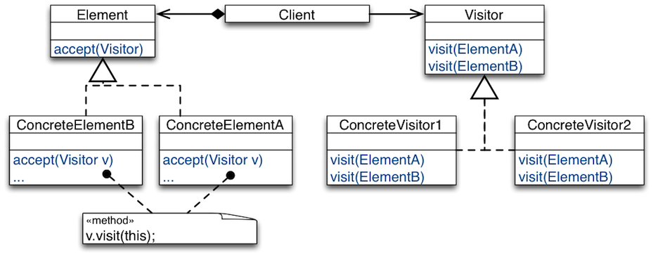
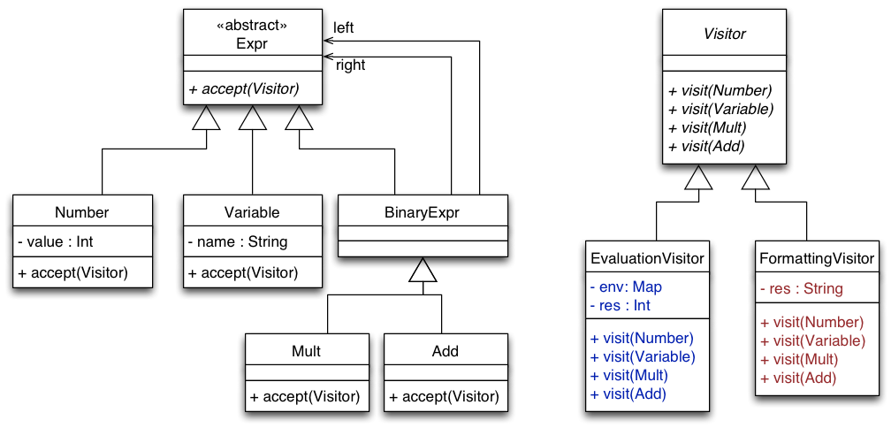
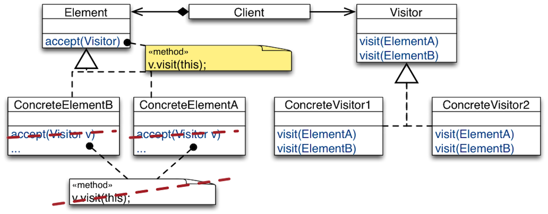
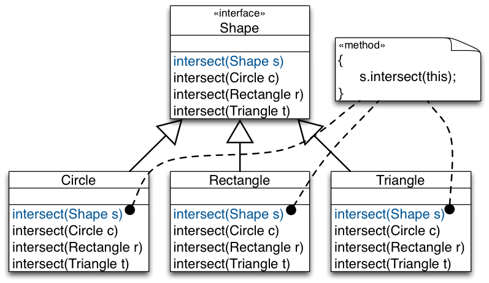
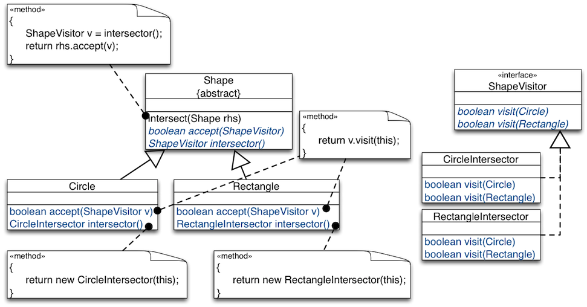
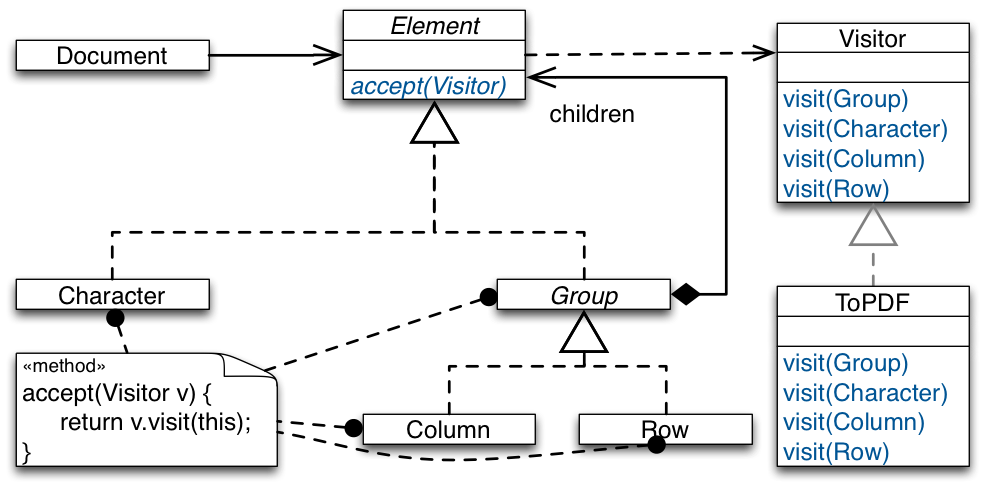
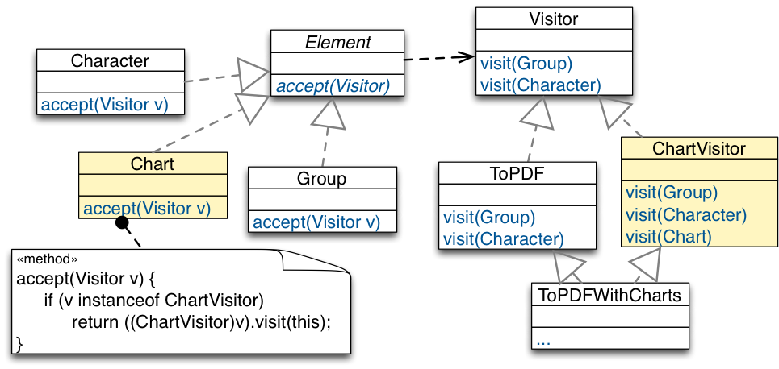
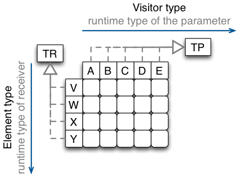

##Visitor Design Pattern

###Intent

+~[Intent]slide

Intent
===

^The Visitor Pattern enables to add new behavior to existing classes in a fixed class hierarchy without changing this hierarchy.

~+

+~[Intent of the Visitor in Context]slide

Intent of the Visitor in Context
===

Recall the problems of inheritance with modeling variations at the level of multiple objects (object composites).
---


~+

Problems:
* Weak support for combining variations at the level of the composite with those at the level of individual elements.
* No support for expressing covariant variations.
* Instantiation problems.


###Solution

+~[Solution Idea]slide

Solution Idea 
===

^Represent the additional operations to be performed on the elements of an object structure (additional features) as objects (of type Visitor).

~+


+~[Structure]slide

Structure
===


Example Usage:

```Java 
Element e = new ConcreteElementA(...);
Visitor v = new ConcreteVisitor1(...);
e.accept(v);
```

~+

The `Visitor` interface declares a `visit` method per element type in the object structure.  

A `Visitor` interface describes how to “treat” the element types.

Concrete visitor classes implement the interface specifically, i.e., treat elements differently.

A concrete visitor class corresponds to a particular feature to be added to the object structure.

Elements in the object structure provide the method accept(`Visitor`).

On being asked to `accept` a visitor passed to it as a parameter, an element asks the visitor to visit it.


+~[Structure (Long Version)]slide

Structure (Long Version)
===


~+


###Case-Study: Arithmetic Expressions


+~[Case-Study: Arithmetic Expressions]slide

Case-Study: Arithmetic Expressions
===


+~footer
Which are the potential design issues?

~+

~+

Requirements:

* A library for (arithmetic) expressions must provide different functionality for:
	* Formatting an expression to a string.
	* Computing the value of an expression.
	* Optimizing an expression.

* The library must be extensible with new functionality:
	* Generate code for different machines,
	* Various refactorings, e.g., rename variables,

* The library must be extensible with new kinds of expressions.

Design Issues:
* Impossible to reuse part of library functionality (product lines).
* Changing one feature can destabilize other features (SRP).
* New features cannot be incrementally added (OCP).


+~[Case Study: Arithmetic Expressions - Visitor-Based Design]slide

Visitor-Based Design
===



+~[Double Dispatch]aside

^Dispatching an operation based on the dynamic type of two objects is called double dispatch.

Double dispatch is not supported in mainstream OO languages, e.g., Java.

~+

+~[Double Dispatch - Alternative View]aside
**Double-Dispatch - Another Point of View**

Method call in an object-oriented program: `receiver.message(param1,param2,...) `  
The function that is called depends on the run-time type of the receiver. 
Double dispatch is a natural extension of this idea, the function that is called is determined from the run-time type of receiver _and_ the run-time type of the first parameter. It is easy to model this behavior (double-dispatch) with a two-dimensional table of pointers to functions:
* The runtime type of the receiving object is used to determine a row in the table, and 
* the runtime type of the first parameter is used to determine a column in the table.


~+

~+


The dispatch of the operations defined in the Element hierarchy depends on two parameters:
1. Dynamic type of the receiver Element determines the class that has the needed method look-up table.
2. Name of the operation being called determines the entry in that table.

For operations that are outsourced to visitors, we need to simulate the same dispatch semantics.  
We need to select an implementation of an operation based on both
1. the dynamic type of the element on which to apply the operation,
2. the dynamic type of the visitor object representing the operation.


###Reflections on the Visitor Structure

+~[Reflections on the Visitor Structure]slide

Reflections on the Visitor Structure
===

**Can we move the implementation of accept higher up the Element hierarchy?**



~+

Answer: No. The method that is called by `v.visit(this)` is determined at compile-time. 

###Case-Study: Calculating Shape Intersection

+~[Case-Study: Calculating Shape Intersection]slide

Case-Study: Calculating Shape Intersection
===


**Task**:
Implement an intersect operation that calculates whether two given shapes intersect.

~+

  <span style="visibility:hidden"> TODO Enable: "anim-step:1" </span> 

+~slide

Case-Study: Calculating Shape Intersection
===


**Task**:
Implement an intersect operation that calculates whether two given shapes intersect.

+~{anim-step:1}

**Sketch of the solution**:

```Java
Shape t = new Triangle(…);
Shape r = new Rectangle(…);
if (t.intersect(r)) {…}
```

~+

~+

For the proposed solution, the implementation of intersect depends on the dynamic type of both the receiver (`t`) and parameter (`r`) shapes. Hence, we need to simulate double dispatch in Java.

+~slide

Case-Study: Calculating Shape Intersection
===
Simulating Double Dispatch
---



+~footer

Do you see how this design simulates double dispatch?

~+

~+

+~slide

Case-Study: Calculating Shape Intersection
===
Simulating Double Dispatch
---

```Java
Shape t = new Triangle(…);
Shape r = new Rectangle(…);
if (t.intersect(r)) {…}
```


+~footer

How do you judge this design?

~+

~+

External call `t.intersect(r)` is dispatched based on dynamic type of `t`.

Internal call `s.intersect(this)` is dispatched based on dynamic type of `r`.

**Assessment**:
* The given design forces every shape class to implement its intersection with every other shape. Adding new shapes means implementing new methods in every other shape.

* The double dispatch approach compromises the semantic-hierarchy concept. 

* This results in an inheritance tree where each derivative is aware of all other derivates.

+~[Case-Study: Shape Intersection Using Visitor]slide

Case-Study: Shape Intersection Using Visitor
===



~+

The Visitor Pattern can be used to eliminate the cross-reference in each shape derivative to each other shape derivative. The key idea is to move the intersect functionality to visitors and to implement one intersection visitor (e.g., `CircleIntersection` or `RectangleIntersector`) per Shape type.


+~slide

Case-Study: Shape Intersection Using Visitor
===

```Java
Shape c = new Circle(…);
Shape r = new Rectangle(…);
if (c.intersect(r)) {…}
```


~+

###Assessment of the Visitor Design Pattern

+~[Advantages of the Visitor Design Pattern]slide

Advantages of the Visitor Design Pattern
===

* **New operations are easy to add** without changing element classes (add a new concrete visitor).  
Different concrete elements do not have to implement their part of a particular algorithm.

* Related behavior focused in a single concrete visitor.

* **Visiting across hierarchies**: Visited classes are not forced to share a common base class.

* **Accumulating state**: Visitors can accumulate state as they visit each element, thus, encapsulating the algorithm and all its data.


~+


+~[Issues of the Visitor-Based Design - Adding Elements]slide

Issues of the Visitor-Based Design
===
Adding Elements
---

Scenario:


+~footer

What happens if we want to add a new element?

~+

~+

Description:
* Visitor visits all elements of a document.
* ToPDF converts documents to PDF.
* Various other concrete visitors may be implemented:  
spell checking, grammar checking, text analysis, speaking text service, ...


+~slide

Issues of the Visitor-Based Design
===
E.g., adding `Chart` (adding Elements)
---


~+

Problem: Since Visitor has no method for `Chart`, it’s objects won’t be processed by any visitor. Our design is not closed against this kind of change.

+~slide

Issues of the Visitor-Based Design
===
E.g., adding `Chart` **and updating Visitor**
---


+~footer
What are the issues?

~+

~+
**Issues**:
* We have to change all visitors for every new element.
* Many visitors will have empty methods to comply to the interface.
* Sometimes data structures are extended, but it‘s optional to process extensions.  
E.g., it doesn’t make sense to spell-check charts, i.e., SpellChecker.visit(Chart) will be empty.

+~slide

Issues of the Visitor-Based Design
===
E.g., adding `Chart` **and keeping Visitor unchanged**
---



+~footer

What are the issues?

~+

~+

+~slide

Issues of the Visitor-Based Design
===
E.g., adding `Chart` **and keeping Visitor unchanged**
---


+~footer

What are the issues?

~+

~+

Try to avoid such visitors as these implementations are extremely fragile; they are maintenance nightmares when more elements are added.


+~[Issues of the Visitor-Based Design - Partial Visiting]slide

Issues of the Visitor-Based Design
===
Partial Visiting Is Not Supported
===

Visitor is like a matrix (cross product of all Visitor and Element classes):



~+

Partial visiting is not supported!

To provide a common abstract `Visitor` interface to `Element`, **every derivative** of `Element` need to be addressed by every derivative of `Visitor`; even if this might not make sense or is not needed.  We have seen this for `SpellChecker.visit(Chart)`


####Takeaway

+~[Takeaway]slide

Takeaway
===

* Visitor brings functional-style decomposition to OO designs. 

* Use Visitor for stable element hierarchies.  
Visitor works well in data hierarchies where new elements are never or at least not very often added.

* Do not use it, if new elements are a likely change.

* Visitor only makes sense if we have to add new operations often! In this case Visitor closes our design against these changes.

~+


###Solving the Expression Problem in Scala

Recommended reading: **Matthias Zenger and Martin Odersky**, _Independently Extensible Solutions to the Expression Problem_, FOOL 2005

The code shown in the following can be downloaded [here](Code/ExpressionsFramework-Visitor.zip).


####Using "Standard" Object-Oriented Features 

+~[Solving the Expression Problem in Scala - Plain OO]slide

Solving the Expression Problem in Scala
===
**The base trait.**

```Scala
trait Expressions {

    type expression <: Expression
    trait Expression {
        def eval: Double
    }

    trait Constant extends Expression {
        val v: Double
        def eval = v
    }
}

```


+~footer

Resembles the solution that we have studied as part of the implementation of the SmartHome Scenario.

~+

~+

To make it possible to extend the `Expression` trait (i.e., to enable an independently developed extension to contribute functionality to `Expression`s ) we have to abstract over the concrete type of Expression.

+~slide

Solving the Expression Problem in Scala
===
**Adding a new data-type.**

```Scala
trait AddExpressions extends Expressions {
    trait Add extends Expression {
        val l: Expression
        val r: Expression
        def eval = l.eval + r.eval
    }
}

```


+~footer

Resembles the solution that we have studied as part of the implementation of the SmartHome Scenario.

~+

~+


+~slide

Solving the Expression Problem in Scala
===
**Adding new functionality.**

```Scala
trait PrefixNotationForExpressions extends AddExpressions {

  type expression <: Expression
  trait Expression extends super.Expression {
    def prefixNotation: String
  }

  trait Constant extends super.Constant with Expression {
    def prefixNotation = v.toString
  }

  trait Add extends super.Add with Expression {
    def prefixNotation = "+"+l.prefixNotation + r.prefixNotation
  }
}

```


+~footer

Resembles the solution that we have studied as part of the implementation of the SmartHome Scenario.

~+

~+


+~slide

Solving the Expression Problem in Scala
===
**Bringing everything together.**

```Scala
object ExpressionsFramework
    extends PrefixNotationForExpressions
    with PostfixNotationForExpressions {
		
  type expression = Expression
  trait Expression
    extends super[PrefixNotationForExpressions].Expression
    with super[PostfixNotationForExpressions].Expression

  case class Constant(v: Double)
    extends super[PrefixNotationForExpressions].Constant
    with super[PostfixNotationForExpressions].Constant
    with Expression

  case class Add(val l: expression, val r: expression)
    extends super[PrefixNotationForExpressions].Add
    with super[PostfixNotationForExpressions].Add
    with Expression
}
``` 

+~footer

Resembles the solution that we have studied as part of the implementation of the SmartHome Scenario.

~+

~+

**Assessment**:
* The solution is open w.r.t. to directly adding new functionality to expressions and w.r.t. adding new data-types that inherit from `Expression`.
* It is easy to add support for new data-types (e.g., `Add`).
* It is possible to add new functionality (in a type-safe way), but this requires a deep-mixin composition.
* The solution is subject to the fragile base-class problem.

####Using the Visitor-Design Pattern

+~[Solving the Expression Problem in Scala - Visitor Pattern]slide

Solving the Expression Problem in Scala
===
**The base trait.**

```Scala
trait Expressions {
    
  trait Expression { def accept[T](visitor: visitor[T]): T }

  class Constant(val v: Double) extends Expression {
    def accept[T](visitor: visitor[T]): T = visitor.visitConstant(v)
  }

  type visitor[T] <: Visitor[T]
  trait Visitor[T] {
    def visitConstant(v: Double): T
  }

  trait EvalVisitor extends Visitor[Double] {
    def visitConstant(v: Double): Double = v
  }
}
```

~+

This solution does not support adding methods/functionality to an expression at runtime or by a third-party extension, i.e., an independently developed extension of the Expressions trait cannot contribute to the `Expression` trait.


+~slide

Solving the Expression Problem in Scala
===
**Adding a new data-type.**

```Scala
trait AddExpressions extends Expressions {

  class Add(
    val l: Expression,
    val r: Expression) extends Expression {
				
    def accept[T](visitor: visitor[T]): T = visitor.visitAdd(l, r)
  }

  type visitor[T] <: Visitor[T]
  trait Visitor[T] extends super.Visitor[T] {
    def visitAdd(l: Expression, r: Expression): T
  }

  trait EvalVisitor extends super.EvalVisitor with Visitor[Double] { 
  this: visitor[Double] ⇒
  def visitAdd(l: Expression, r: Expression): Double =
    l.accept(this) + r.accept(this)
  }
}
```

~+


+~slide

Solving the Expression Problem in Scala
===
Bringing everything together:

```Scala
trait ExtendedExpressions extends AddExpressions with MultExpressions {

  type visitor[T] = Visitor[T] 
  trait Visitor[T]
    extends super[AddExpressions].Visitor[T]
    with super[MultExpressions].Visitor[T]

  object EvalVisitor
    extends super[AddExpressions].EvalVisitor
    with super[MultExpressions].EvalVisitor
    with Visitor[Double] { 
	  this: visitor[Double] ⇒ }
}
```

~+

By making the type visitor concrete (`type visitor[T] = Visitor[T]`) the data-type hierarchy is now fixed; extension is only possible w.r.t. new functionality.

+~slide

Solving the Expression Problem in Scala
===
**Adding new functionality.**

```Scala
trait PrefixNotationForExpressions extends ExtendedExpressions {

  object PrefixNotationVisitor extends super.Visitor[String] { 
    this: visitor[String] ⇒

    def visitConstant(v: Double): String = v.toString+" "

    def visitAdd(l: Expression, r: Expression): String = 
      "+ "+l.accept(this) + r.accept(this)

    def visitMult(l: Expression, r: Expression): String = 
      "* "+l.accept(this) + r.accept(this)

  }
}
```
~+

**Assessment:**
* The solution is open w.r.t. to adding new functionality to expressions by means of a visitor and w.r.t. adding new data-types that inherit from `Expression`.
* It is easy to add new functionality (e.g., `PrefixNotationForExpressions`).
* It is possible to add new data-types (in a type-safe way), but this requires a deep-mixin composition.
* The solution is subject to the fragile base-class problem.

