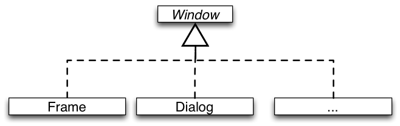
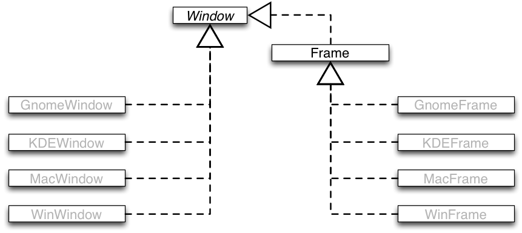

##Bridge Design Pattern

###Intent

+~[The Bridge Design Pattern]slide

The Bridge Design Pattern
===

Intent
---

^Decouple an abstraction from its implementation. 
^So that the two can vary independently.

~+

###Motivation by Example

+~[Motivation by Example]slide

Motivation by Example
===

We want to support multiple operating systems:

We want to provide different types of windows:

~+

+~slide

Motivation by Example
===

**Two dimensions of variability!**

+~footer

Can you imagine a better solution?

~+

~+

Several problems:
* Implementation bound to abstraction
* Code duplication and proliferation of classes

###Structure

+~[Structure]slide

Structure
===

~+

Combine inheritance and object composition:
* Use inheritance to model variations of the abstraction.
* Use object composition to abstract from implementation variations. 

+~[Bridge-Based Designs Illustrated]slide

Bridge-Based Designs Illustrated
===

~+

**The Rationale Underlying the Solution**:

* Object composition and inheritance provide different trade-offs for expressing variations. 
* Object composition is used to implement dynamic variations with a fixed interface.
* Implementation variations are more of this kind; although not always…
* For static variations inheritance is preferred, because it supports structural variations. 
* Abstraction variations are mostly static.
* They often imply variation of structure.

>**Inheritance allows adding of new field and methods.**
>
>**Composition demands a fixed interface.**

###Advantages
Decoupling interface and implementation:
* Implementation can be configured at run-time.
* The implementation in use is hidden inside the abstraction.

Improved extensibility: 
* Both abstractions and their implementations become independently extensible by subclassing without a class proliferation.
* Different abstractions and implementations can be combined.

+~[Takeaway]slide

Takeaway
===

The Bridge Pattern instructs to use object composition to bridge between two inheritance hierarchies when you need to combine two kinds of variations of an object type.

The Bridge Pattern allows to vary an abstraction and its implementation independently of each other.

Works well as long as there is no dependency between the implementation on abstraction variations, i.e., if they do not vary co-variantly.

~+
