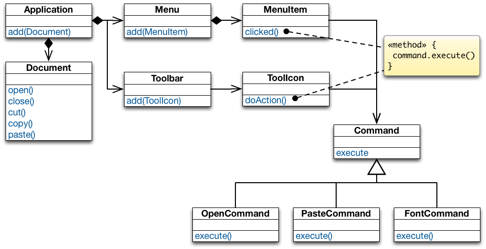
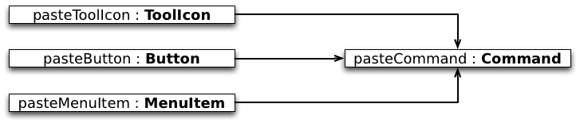
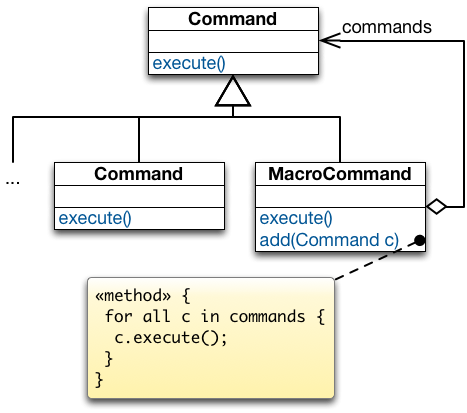

##Command Design Pattern


###Motivating Example: A Document Editor

Given some user operations such as "creating a document", "opening a file", "saving a document", "printing a document", "cutting selected text" and "pasting it back in", we then want to be able to access them from more than one place in the UI (a menu and a toolbar).

+~[Motivating Example: A Document Editor]slide

Motivating Example: A Document Editor
===


+~footer
What do you think?

~+

~+

The implementation of each `MenuItem` subclass is the same as the implementation of one of `ToolIcon` subclasses.
Multiple copies of the same functionality → maintenance problem.

Need a mechanism for `MenuItem` and `ToolIcon` to share implementations.  
Need to separate the user-interface control from it’s implementation so that implementations can be shared.

Want to also support a general undo capability so that the user can reverse previous operations.


+~[Decouple Invoker from Receiver]slide

Solution: Decouple Invoker from Receiver
===



~+

+~[Decouple Invoker from Receiver]slide

Solution: Decouple Invoker from Receiver
===


~+

###In a Nutshell


+~[Command Design Pattern - Intent]slide

Intent
===

**Encapsulate a request to an object, thereby allowing to:**
* Issue requests without knowing the receiver or the operation being requested.
* Parameterize clients with different requests.
* Queue or log requests and support undoable requests.

~+


+~[Command Design Pattern - Structure]slide

Structure
===


~+

* `Command` declares the interface for executing an operation.
* `ConcreteCommand` defines a receiver-action binding by implementing `execute()`.
* `Client` creates a `ConcreteCommand` object, sets its `Receiver`, and configures the command of the `Invoker`.
* `Invoker` asks its command to carry out the request.
* `Receiver` knows how to perform the operations associated with carrying out a request.


+~[Command Design Pattern - Collaboration]slide

Collaboration
===


~+


###Advantages of Command


+~[Command Design Pattern - Implementation Sharing]slide

Implementation Sharing
===



~+

* A command centralizes an operation to a single location so that multiple copies of the code are not necessary.
* Different user-interface controls can share the same implementation  
(e.g., a button, tool icon, and menu item can all perform the same operation).
* Decouples the user interface from the operation being performed.


+~[Command Design Pattern - Supporting Undoable Operations]slide

Supporting Undoable Operations
===


~+

* `Command`s store enough information to undo the performed operation.
* Each command subclass implements its `unexecute()` function;  
when `unexecute()` is called the command reverses its action.


+~slide

Supporting Multiple Levels Of Undo
===

<div style="float:left;width:150px"> 
	Single Level of Undo
</div>


---

<div style="float:left;width:150px"> 
	Multiple Levels of Undo
</div>


~+

* Undoing more than just the last command allows the user to back up farther and farther each time undo is selected from the menu.
* Adding a redo feature: it would also be nice for a user to be able to redo an undone operation.  
Redo should have multiple levels corresponding to the number of undo's issued by the user.


+~slide

Implementing a Command History
===


~+

The command history can be seen as a list of past commands.

As new commands execute they are added to the front of the history.

To **undo** a command, `unexecute()` is called on the command at the front of the list.

The present pointer is moved past that command.

To **undo** the command before that, `unexecute()` is called on the next command in the history.

The present pointer is moved to point before that command.

To **redo** the command that was just undone, `execute()` is called on that command.

The present pointer is moved up past that command.


+~[Command Design Pattern - Macro Commands]slide

Macro Commands
===



~+


###Takeaway


+~[Command Design Pattern - Takeaway]slide

Takeaway
===

* Command allows to decouple the invoker of an operation from the receiver of that operation.

* A `Command` object encapsulates the knowledge about a concrete operation and a concrete receiver of that operation.

As a result:
* the same invoker can be reused with different operation-receiver pairs.
* the same operation-receiver pair can be plugged into different invokers.
* commands can be queued, undone/redone, and composed into macro-commands. 

~+


###Example Implementation

In practice (in GUI applications), you often have multiple instances of the command design pattern which are related to different kinds of actions.
1. The command pattern is used to associate some action with a menu item or a tool bar icon and which (as a second step) then may require some further user input/interacts with the environment. These commands are usually not stored in any command history as it makes no sense to redo/undo them (e.g., "open file", "save file", "copy text to clipboard"). 
2. You have commands that update the state of an application (i.e., manipulates the application's data) and which you may want to store in the command history because you want to be able to undo/redo the corresponding action. These commands then have to offer an `execute` and `unexecute` methods.

Some commands, e.g., "paste clipboard content" are typically triggered by some user interaction, but do not require any further user interaction and, hence, could be regarded as a command of the second type. But, this is deceiving. Imagine that - at some later point in time - the user undos the last editing steps including the pasting of the clipboard content. When the user then redos that step, he expects that the same content is added again as was just removed/originally added – even if the clipboard content has changed in the meantime. Hence, even in this case we want to distinguish between the command that interacts with the environment and the command that directly (after gathering all information) with the document.


+~[Command Design Pattern - Example Implementation]slide

Example Implementation
===
**Supporting multiple-step undo/redo**

The application:

```Scala
object Application { var document: String = "" }
```

The `Command` trait:

```Scala
trait Command { 
  def execute(): Unit
  def unexecute(): Unit
}
```

~+


+~slide

Example Implementation
===
**Supporting multiple-step undo/redo**

A `ConcreteCommand` to manipulate the document:

```Scala
class AddTextCommand(val text: String) extends Command {
  import Application.document
  
  def execute() { document += text }

  def unexecute() {
    document = document.substring(0, document.length - text.length)
  }

  override def toString = "Add text: "+text
}
```

~+


+~slide

Example Implementation
===
**Supporting multiple-step undo/redo**

The command history:

```Scala
object CommandManager {
  private var pastCommands: List[Command] = Nil
  private var futureCommands: List[Command] = Nil

  def execute(command: Command) {
    command.execute()
    pastCommands = command :: pastCommands
    futureCommands = Nil // kill all previous future commands
  }
  def undo() {
    if (pastCommands.nonEmpty) {
      val pastCommand = pastCommands.head; pastCommand.unexecute()
      futureCommands = pastCommand :: futureCommands
      pastCommands = pastCommands.tail
  } }
  def redo() {
    if (futureCommands.nonEmpty) {
      val futureCommand = futureCommands.head; futureCommand.execute()
      pastCommands = futureCommand :: pastCommands
      futureCommands = futureCommands.tail
} } }
```

~+

In this case, the responsibility for calling a `ConcreteCommand`'s `execute` method is delegated to the `CommandManager`.


+~slide

Example Implementation
===
**Supporting multiple-step undo/redo**

Creating a command object and adding it to the history:

```Scala
object askForInput extends (() ⇒ Unit) {

    def apply() {
        import javax.swing.JOptionPane.showInputDialog
        val text = showInputDialog("Please, enter some text.")
        if (text ne null) {
            CommandManager.execute(new AddTextCommand(text))
        }
    }
}
```

~+

The `askForInput` object has the responsibility to ask the user for some input and to add the respective input to the document. This object is also a `ConcreteCommand` where the `execute` method is called `apply`. 


+~slide

Example Implementation
===
**Supporting multiple-step undo/redo**

Example usage:

```Scala
object CommandDemo extends App {
    for (i ← 0 until 3) {
        askForInput()
    }

    CommandManager.undo
    CommandManager.undo
    CommandManager.redo
}
```

~+


